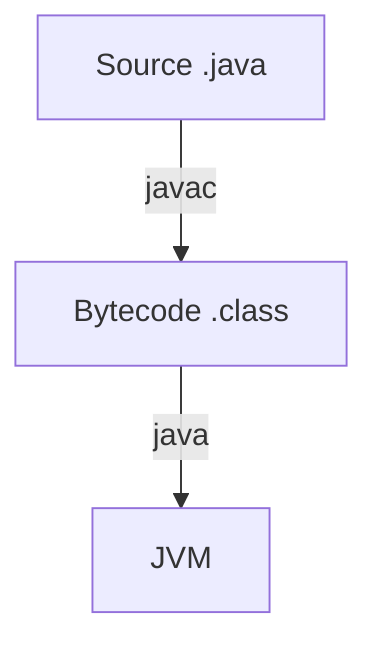

# Authoring Guide — Cortex

The site is organised into **tracks** (subjects). Each track is an isolated module under
`src/modules/<track>/` with its own `content/` and `questions/` folders. To add a topic,
**drop a `.md` file into a category folder inside a track's `content/`** with the
frontmatter below — the sidebar, search, roadmap, and progress tracking pick it up on the
next reload. No code changes needed.

Existing tracks: `java` (populated) plus the coming-soon `dsa`, `oop`, `design-patterns`,
`system-design`, `database`, `multithreading`. To add a brand-new track, see the end of this guide.

## File location & naming

```
src/modules/<track>/content/<NN-category-folder>/<NN-topic-name>.md
```

- The `NN-` numeric prefix controls ordering and is stripped from the URL.
  `src/modules/java/content/03-oop/04-polymorphism.md` → URL `/java/topic/oop/polymorphism`.
- The category folder groups topics into a sidebar module.

## Frontmatter (required, at the very top)

Each value must be on a **single line**, between `---` fences:

```markdown
---
title: Polymorphism
category: Object-Oriented Programming
categoryOrder: 3
order: 4
level: Intermediate
summary: One interface, many implementations — how Java picks the right method at runtime.
tags: oop, overriding, dynamic-dispatch
---
```

| Field | Meaning |
|-------|---------|
| `title` | Page heading (don't repeat it as an `#` in the body) |
| `category` | Display name of the module (same for every file in the folder) |
| `categoryOrder` | Integer — module order in the sidebar |
| `order` | Integer — topic order within the module |
| `level` | `Beginner` \| `Intermediate` \| `Advanced` \| `Expert` |
| `summary` | One sentence shown under the title and in search |
| `tags` | Comma-separated keywords |

## Writing the body

- Use `##` and `###` headings (never `#`). These build the "On this page" table of contents.
- Fence code with a language: ` ```java `. Use modern, compilable, idiomatic Java.
- GFM tables, **bold**, `inline code`, lists, and links all work.

### Callouts

Use directive blocks (the `:::` markers must be on their own lines):

```markdown
:::tip
A helpful tip.
:::
```

Types: `tip`, `note`, `warning`, `gotcha`, `senior` (senior-level insight), `key`
(must-remember), `example`.

### Diagrams (Mermaid)

````markdown

````

Quote any label that contains punctuation: `A["new Foo()"]`. Use `flowchart`,
`classDiagram`, `sequenceDiagram`, or `stateDiagram-v2`.

## Interview questions

Question banks live in `src/modules/<track>/questions/*.ts`. Each file default-exports an array:

```ts
import type { InterviewQuestion } from '../../../types';

const questions: InterviewQuestion[] = [
  {
    id: 'oop-polymorphism-dispatch', // globally unique, kebab-case
    question: 'How does Java decide which overridden method to call?',
    difficulty: 'Medium', // Easy | Medium | Hard
    category: 'OOP',
    tags: ['polymorphism', 'overriding'],
    answer: `Markdown answer. Code fences and :::callouts work here too.`,
  },
];

export default questions;
```

## Adding a brand-new track

1. Create `src/modules/<id>/index.ts` (copy an existing one, e.g. `dsa/index.ts`) and set the
   metadata — `id`, `slug`, `name`, `tagline`, `color`. The `id` doubles as the icon key.
2. Add an icon for that `id` in `src/components/TrackIcon.tsx` (otherwise it falls back to a book icon).
3. Register it in `src/modules/registry.ts` by importing the track and adding it to the `tracks` array.
4. Drop content into `src/modules/<id>/content/...` and questions into `src/modules/<id>/questions/...`.

The track shows a "Coming soon" state until it has at least one topic.

## Interactive components

Drop these into **any** topic's markdown — they're declared as fenced code blocks with a
**YAML** body and work in every track. A malformed block shows a friendly error instead of
breaking the page, so experiment freely.

### Quiz — active recall

````md
```quiz
title: Check yourself        # optional
questions:
  - q: 'What does `a == b` compare for two objects?'   # markdown allowed
    options:
      - 'Their contents'
      - text: 'Their references'
        correct: true          # mark the right option
      - 'Their lengths'
    explain: '`==` compares references; use `.equals()` for content.'
```
````

A shorthand single question works too: top-level `q:`, `options:`, `explain:`.

### Flashcards — memorization

````md
```flashcards
title: Big-O recall
cards:
  - front: '`HashMap.get(key)`'
    back: '**O(1)** average.'
  - front: '`TreeMap.get(key)`'
    back: '**O(log n)** — balanced tree.'
```
````

### Walkthrough — animated step-through (great for algorithms)

`code` highlights the active `line` each step; an optional `array` scene draws boxes with
`highlight` (active), `sorted` (settled), and `pointers` (labels above an index).

````md
```walkthrough
title: Bubble sort — one pass
code: |
  for (int j = 0; j < n - 1; j++)
    if (a[j] > a[j+1]) swap(a, j, j+1);
steps:
  - text: 'Compare 5 and 3 → swap.'
    array: [5, 3, 8]
    highlight: [0, 1]
    pointers: { 0: 'j' }
    line: 2
  - text: 'Now 5 and 8 → in order.'
    array: [3, 5, 8]
    highlight: [1, 2]
    sorted: [0]
    line: 1
```
````

### Tabs — compare side by side

**Use four backticks** for the outer fence, because the bodies contain ```` ```java ```` blocks.

`````md
````tabs
tabs:
  - label: ArrayList
    body: |
      Contiguous array — O(1) random access.
      ```java
      List<String> l = new ArrayList<>();
      ```
  - label: LinkedList
    body: |
      Linked nodes — O(1) at the ends.
````
`````

> Adding a new interactive component? Create it under `src/components/interactive/`, then
> register its fence name in `src/components/interactive/index.tsx`.
