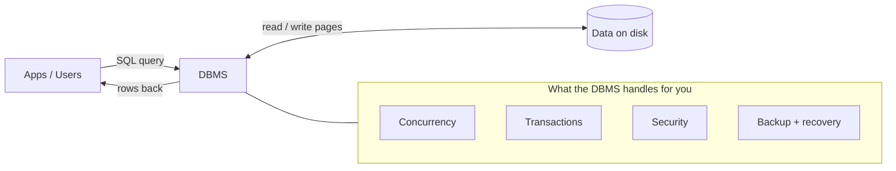
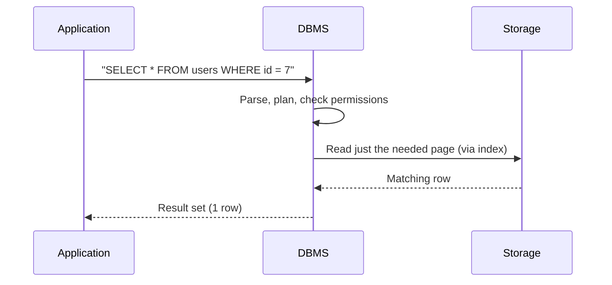

A **database** is an organized collection of data. A **DBMS** is the software that sits between your app and the raw bytes on disk and does all the hard work for you. Picture it as a gatekeeper:



## DBMS vs RDBMS

Both manage data — the **R** ("relational") adds structure and rules.

| | **DBMS** | **RDBMS** |
|---|---|---|
| Data shape | any (files, key-value, docs) | **tables** (rows + columns) |
| Relationships | you wire them up yourself | **keys** link tables |
| Rules | few | types, constraints, referential integrity |
| Language | varies | **SQL** |
| Examples | file stores, simple key-value | PostgreSQL, MySQL, Oracle, SQL Server |

:::note
Nearly every "database" you meet in an interview is an **RDBMS**. This whole track is about the relational model and SQL.
:::

## Why a database beats a pile of flat files

You *could* store data in a CSV or JSON file. Here is what breaks the moment you have more than one user:

| Concern | Flat files (CSV / JSON) | Database (DBMS) |
|---|---|---|
| Find one record | scan the whole file in code | declarative `SELECT`, uses an **index** |
| Two writers at once | corruption / lost updates | **locks + MVCC**, safe |
| Data integrity | nothing stops bad data | **types, keys, constraints** |
| All-or-nothing changes | none | **transactions (ACID)** |
| Crash mid-write | file left half-written | **write-ahead log**, auto-recovers |
| Who can see what | file permissions only | per-**table / column** grants |
| Growth to millions of rows | linear slowdown | index keeps lookups fast |

## What one query actually does

The DBMS parses your request, plans the cheapest way to run it, checks your permissions, then reads only the pages it needs:



## Two worlds: OLTP vs OLAP

The same data serves two very different jobs. Interviewers love this distinction.

| | **OLTP** (transactional) | **OLAP** (analytical) |
|---|---|---|
| Job | *run* the business | *analyze* the business |
| Typical query | tiny `INSERT` / `UPDATE` / `SELECT` | huge aggregate / rollup |
| Rows per query | a handful | millions |
| Speed goal | low latency, high volume | high throughput on scans |
| Schema | **normalized** | **denormalized** / star schema |
| Storage | row-oriented | often **column-oriented** |
| Example | "place this order" | "revenue by region, last 5 years" |

:::key
**OLTP** = many small, fast writes that keep the business running. **OLAP** = few big reads that slice historical data for insight. A DBMS is the software; the *database* is the data it guards; the **R**DBMS organizes that data into related tables.
:::

## Core vocabulary

```flashcards
title: Foundations — key terms
cards:
  - front: 'Database'
    back: 'An organized collection of related data, stored so it can be queried efficiently.'
  - front: 'DBMS'
    back: 'The **software** that stores, secures, and serves the data (e.g. PostgreSQL).'
  - front: 'RDBMS'
    back: 'A DBMS that organizes data into **relational tables** linked by keys, queried with SQL.'
  - front: 'Schema'
    back: 'The blueprint — which tables exist, their columns, types, and constraints.'
  - front: 'Index'
    back: 'A side structure that lets the DBMS find rows **without scanning** the whole table.'
  - front: 'Transaction'
    back: 'A group of statements that succeed or fail as **one atomic unit** (ACID).'
  - front: 'OLTP'
    back: 'Online **Transaction** Processing — many small, fast day-to-day operations.'
  - front: 'OLAP'
    back: 'Online **Analytical** Processing — large read-heavy queries for reporting.'
```

## Check yourself

```quiz
title: What is a database?
questions:
  - q: 'What does the **R** in *RDBMS* add on top of a plain DBMS?'
    options:
      - text: 'It organizes data into related tables linked by keys, with types and constraints.'
        correct: true
      - 'It makes the database run faster on every query.'
      - 'It stores data in the cloud instead of on disk.'
    explain: 'Relational = data lives in **tables** connected by keys, governed by types and constraints, and queried with SQL.'
  - q: 'Which task is a classic **OLAP** workload?'
    options:
      - 'Insert a new customer row when someone signs up.'
      - text: 'Compute total revenue by region for the last five years.'
        correct: true
      - 'Update a single order status to "shipped".'
    explain: 'OLAP = large analytical **reads / aggregations** over history. The other two are small OLTP writes.'
  - q: 'Why are flat files dangerous for concurrent multi-user writes?'
    options:
      - 'They use too much disk space.'
      - text: 'Without locking, simultaneous writes corrupt the file or lose updates.'
        correct: true
      - 'They cannot store numbers, only text.'
    explain: 'A DBMS provides locking / MVCC so concurrent writers do not clobber each other — flat files do not.'
```
