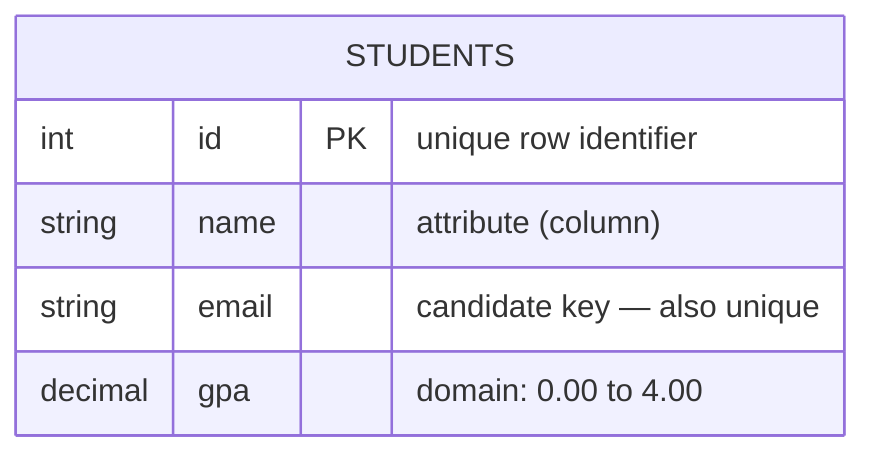
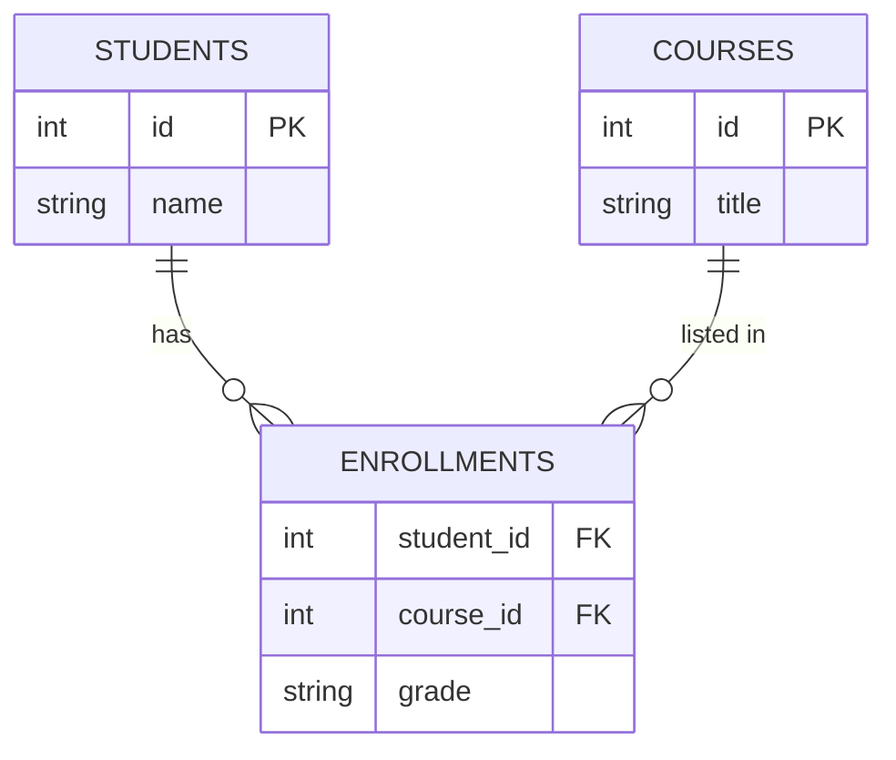

The relational model stores everything in **tables** (formally, *relations*). A table is just a grid: named **columns** describe attributes, and each **row** is one record. Here is the anatomy of a single table:



## An annotated table

This is the `students` relation. Notice the vocabulary hanging off each part:

| `id` (PK) | `name` | `email` | `gpa` |
|:---:|:---|:---|:---:|
| 1 | Ada | ada@u.edu | 3.9 |
| 2 | Bo | bo@u.edu | 3.4 |
| 3 | Cara | cara@u.edu | 3.7 |

- **Relation** -> the whole table, `students`.
- **Attribute** -> a column, e.g. `email`. Its **domain** is the set of legal values (a valid email string).
- **Tuple** -> a row, e.g. `(2, Bo, bo@u.edu, 3.4)`.
- **Degree** -> number of columns = **4**.
- **Cardinality** -> number of rows = **3**.

:::note
Order does not matter. Rows have no built-in position and columns are referenced by name — so a relation is a *set* of tuples, not an ordered list.
:::

## Keys — how rows are identified and linked

Keys are the heart of the model: they enforce uniqueness and stitch tables together.

| Key | What it does |
|---|---|
| **Primary key (PK)** | Uniquely identifies each row. Exactly one per table; never `NULL`. |
| **Candidate key** | Any column(s) that *could* be the PK (unique + minimal). One is chosen as PK. |
| **Composite key** | A key made of **two or more** columns together. |
| **Foreign key (FK)** | A column that **references** another table's PK, enforcing *referential integrity*. |
| **Surrogate key** | A system-generated id (auto-increment / UUID) with no business meaning. |
| **Natural key** | A real-world unique attribute used as the key (e.g. `email`, ISBN). |

## Relations between tables

Keys turn isolated tables into a connected model. Here students enroll in courses — a **many-to-many** relationship resolved by a junction table:



`ENROLLMENTS.student_id` and `ENROLLMENTS.course_id` are **foreign keys**; together they form a **composite primary key** for the junction table.

## Watch a PRIMARY KEY reject a duplicate

The PK constraint is backed by a unique index. Insert a new id and it is accepted; reuse one and the DBMS refuses:

```walkthrough
title: Why a PRIMARY KEY must be unique
code: |
  INSERT INTO students (id, name) VALUES (4, 'Dev');
  -- later, someone tries to reuse an id...
  INSERT INTO students (id, name) VALUES (2, 'Eve');
steps:
  - text: 'The table already holds ids **1, 2, 3**. The PK index tracks every value.'
    array: [1, 2, 3]
    line: 1
  - text: 'Insert id **4** — not in the set, so it is accepted and appended.'
    array: [1, 2, 3, 4]
    highlight: [3]
    sorted: [0, 1, 2]
    line: 1
  - text: 'Now insert id **2** — but 2 is already in the index. Collision!'
    array: [1, 2, 3, 4]
    highlight: [1]
    pointers: { 1: 'taken!' }
    line: 3
  - text: 'The DBMS rejects the row: *duplicate key value violates unique constraint*.'
    array: [1, 2, 3, 4]
    sorted: [0, 1, 2, 3]
    line: 3
```

:::gotcha
A **foreign key** cannot point at nothing. Inserting an enrollment for `student_id = 99` when no student 99 exists fails with a *foreign key violation* — that is referential integrity protecting you from orphan rows.
:::

## Relational vocabulary

```flashcards
title: Relational model terms
cards:
  - front: 'Relation'
    back: 'A **table** — a set of rows with the same columns.'
  - front: 'Tuple'
    back: 'A single **row** / record.'
  - front: 'Attribute'
    back: 'A single **column**.'
  - front: 'Domain'
    back: 'The set of **legal values** an attribute may hold (its type + constraints).'
  - front: 'Degree'
    back: 'The number of **columns** in a relation.'
  - front: 'Cardinality'
    back: 'The number of **rows** in a relation.'
  - front: 'Primary key'
    back: 'Column(s) that **uniquely identify** each row; never NULL.'
  - front: 'Foreign key'
    back: 'Column that **references** another table PK, enforcing referential integrity.'
```

## Check yourself

```quiz
title: The relational model
questions:
  - q: 'In relational terms, a single **row** is called a:'
    options:
      - 'Domain'
      - text: 'Tuple'
        correct: true
      - 'Attribute'
    explain: 'A row is a **tuple**; a column is an **attribute**; the set of legal values for a column is its **domain**.'
  - q: 'Which statement about a **primary key** is true?'
    options:
      - 'It may be NULL as long as the values are unique.'
      - text: 'It uniquely identifies every row and can never be NULL.'
        correct: true
      - 'A table can have several primary keys.'
    explain: 'Exactly one PK per table; it must be **unique and NOT NULL**. Other unique columns are *candidate keys*.'
  - q: 'You resolve a many-to-many between `students` and `courses` with a junction table whose key is `(student_id, course_id)`. That key is a:'
    options:
      - 'Surrogate key'
      - text: 'Composite key'
        correct: true
      - 'Natural key'
    explain: 'A key spanning **two or more columns** is a *composite key*. Here both columns are also foreign keys.'
```

:::key
Table = **relation**, row = **tuple**, column = **attribute**, legal values = **domain**. A **primary key** identifies rows; a **foreign key** links to another table's PK and enforces referential integrity.
:::
