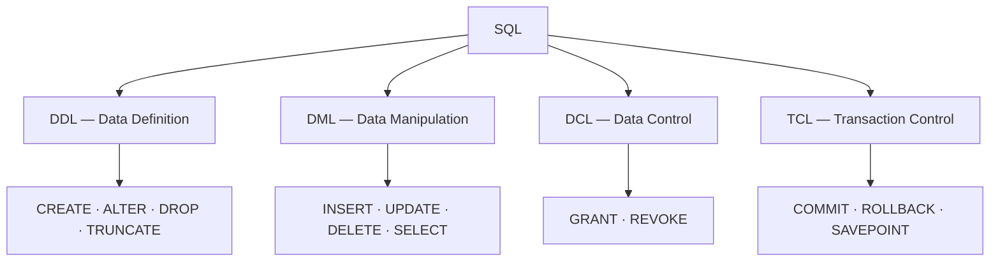

SQL looks like one language, but its commands split into **families** based on *what they touch*: the schema, the rows, the permissions, or the transaction. Learn the map and every command has an obvious home.



## The command map

| Family | Acts on | Commands | Auto-commits? |
|---|---|---|:---:|
| **DDL** — Data Definition | the **schema** (tables, indexes, views) | `CREATE`, `ALTER`, `DROP`, `TRUNCATE` | usually **yes** |
| **DML** — Data Manipulation | the **rows** (the data itself) | `INSERT`, `UPDATE`, `DELETE`, `SELECT` | no |
| **DCL** — Data Control | **permissions** | `GRANT`, `REVOKE` | varies |
| **TCL** — Transaction Control | **transaction** boundaries | `COMMIT`, `ROLLBACK`, `SAVEPOINT` | — |

:::note
Some texts split `SELECT` out into its own family, **DQL** (Data *Query* Language). Most treat it as part of DML — either answer is fine as long as you can explain it.
:::

## One example from each family

````tabs
tabs:
  - label: DDL
    body: |
      Defines or changes **structure**. Here we create a table.
      ```sql
      CREATE TABLE product (
        id    BIGINT PRIMARY KEY,
        name  TEXT NOT NULL,
        price DECIMAL(10,2)
      );
      ```
      Effect: a new empty `product` table now exists in the schema.
  - label: DML
    body: |
      Reads or changes **rows** inside existing tables.
      ```sql
      INSERT INTO product (id, name, price) VALUES (1, 'Pen', 1.50);
      UPDATE product SET price = 1.75 WHERE id = 1;
      SELECT * FROM product;
      ```
      Effect: rows are added, changed, and read — the structure is untouched.
  - label: DCL
    body: |
      Controls **who can do what**.
      ```sql
      GRANT SELECT ON product TO reporting_user;
      REVOKE INSERT ON product FROM intern;
      ```
      Effect: `reporting_user` can now read `product`; `intern` can no longer insert.
  - label: TCL
    body: |
      Marks the **boundaries** of a transaction so a group of DML statements is all-or-nothing.
      ```sql
      BEGIN;
        UPDATE account SET balance = balance - 100 WHERE id = 1;
        UPDATE account SET balance = balance + 100 WHERE id = 2;
      COMMIT;   -- or ROLLBACK to undo both
      ```
      Effect: both updates apply together, or neither does.
````

:::gotcha
`TRUNCATE` and `DELETE` both empty a table but are **different families**. `DELETE` is **DML** — row-by-row, logged, fires triggers, and can be rolled back. `TRUNCATE` is **DDL** — it drops and recreates the storage, is far faster, resets identity counters, and in many engines **cannot be rolled back**.
:::

:::warning
DDL auto-commit is **engine-specific**: Oracle and MySQL implicitly commit around DDL, so a `CREATE` or `DROP` mid-transaction silently commits everything before it — you cannot `ROLLBACK` a dropped table. PostgreSQL (and SQL Server) run DDL transactionally, so a dropped table **can** be rolled back before `COMMIT`. Either way, do schema changes deliberately, not inside a data transaction.
:::

## Command flashcards

```flashcards
title: SQL command families
cards:
  - front: '`CREATE`, `ALTER`, `DROP`, `TRUNCATE`'
    back: '**DDL** — Data Definition. Changes the *schema*.'
  - front: '`INSERT`, `UPDATE`, `DELETE`, `SELECT`'
    back: '**DML** — Data Manipulation. Changes / reads the *rows*.'
  - front: '`GRANT`, `REVOKE`'
    back: '**DCL** — Data Control. Manages *permissions*.'
  - front: '`COMMIT`, `ROLLBACK`, `SAVEPOINT`'
    back: '**TCL** — Transaction Control. Marks transaction *boundaries*.'
  - front: '`DELETE` vs `TRUNCATE`'
    back: '`DELETE` = DML, logged, rollback-able, fires triggers. `TRUNCATE` = DDL, fast, resets identity, often non-rollback.'
  - front: '`SAVEPOINT`'
    back: 'A named marker inside a transaction you can `ROLLBACK TO` without undoing everything.'
```

## Check yourself

```quiz
title: Which sublanguage?
questions:
  - q: '`ALTER TABLE product ADD COLUMN sku TEXT;` belongs to which family?'
    options:
      - text: 'DDL'
        correct: true
      - 'DML'
      - 'TCL'
    explain: '`ALTER` changes the table **structure**, so it is Data Definition (DDL).'
  - q: 'You want to give a role permission to read a table. Which command?'
    options:
      - '`COMMIT`'
      - text: '`GRANT`'
        correct: true
      - '`CREATE`'
    explain: '`GRANT` / `REVOKE` are **DCL** — they control access.'
  - q: 'Which statement is TRUE about `TRUNCATE` vs `DELETE`?'
    options:
      - '`TRUNCATE` fires row-level triggers just like `DELETE`.'
      - text: '`DELETE` is DML and can be rolled back; `TRUNCATE` is DDL and often cannot.'
        correct: true
      - 'Both let you use a `WHERE` clause to remove some rows.'
    explain: '`DELETE` is logged, row-by-row DML (rollback-able, `WHERE` allowed). `TRUNCATE` is DDL — all rows, no `WHERE`, usually non-rollback.'
```

:::key
**DDL** shapes the schema, **DML** moves the rows, **DCL** grants access, **TCL** bounds transactions. Remember the odd ones: `SELECT` is (usually) DML, and `TRUNCATE` is **DDL**, not DML.
:::
