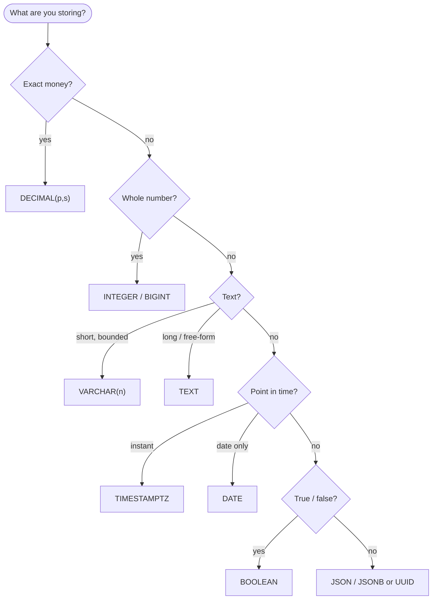

Every column has a **type** that fixes its domain — what values are legal and how many bytes they cost. Picking the right one prevents bugs and keeps tables fast. Here is the landscape:

| Family | Common types | Use it for |
|---|---|---|
| **Numeric — exact** | `SMALLINT`, `INTEGER`, `BIGINT`, `DECIMAL(p,s)` | ids, counts, **money** |
| **Numeric — approximate** | `REAL`, `DOUBLE PRECISION` | measurements, science (never money!) |
| **Character** | `CHAR(n)`, `VARCHAR(n)`, `TEXT` | names, descriptions, free text |
| **Date / time** | `DATE`, `TIME`, `TIMESTAMP`, `TIMESTAMPTZ` | events, logs, schedules |
| **Boolean** | `BOOLEAN` | flags (`is_active`) |
| **Semi-structured** | `JSON`, `JSONB` | flexible / nested attributes |
| **Identifier** | `UUID` | globally unique, distributed ids |

## Choosing a type — a decision tree

Walk down from the top; the first match wins:



## Character types at a glance

| Type | Length | Padding | Reach for it when... |
|---|---|---|---|
| `CHAR(n)` | fixed | space-padded to `n` | values are always the same width (country code `US`) |
| `VARCHAR(n)` | up to `n` | none | short text with a sane cap (a name, `VARCHAR(255)`) |
| `TEXT` | unbounded | none | long or unpredictable text (a blog post) |

:::note
In PostgreSQL, `VARCHAR` and `TEXT` perform identically — the length limit is just a constraint. Use the cap to document intent, not for speed.
:::

## Postgres vs MySQL — same idea, different spellings

The concepts are universal; the type *names* differ. Compare the exact same table:

````tabs
tabs:
  - label: PostgreSQL
    body: |
      ```sql
      CREATE TABLE account (
        id        BIGINT GENERATED ALWAYS AS IDENTITY PRIMARY KEY,
        owner     TEXT NOT NULL,
        balance   NUMERIC(12,2) NOT NULL DEFAULT 0,
        active    BOOLEAN NOT NULL DEFAULT true,
        opened_at TIMESTAMPTZ NOT NULL DEFAULT now(),
        ref       UUID DEFAULT gen_random_uuid(),
        meta      JSONB
      );
      ```
      | Concept | PostgreSQL type |
      |---|---|
      | auto id | `GENERATED AS IDENTITY` / `SERIAL` |
      | money | `NUMERIC(12,2)` |
      | boolean | `BOOLEAN` (a real type) |
      | timestamp + zone | `TIMESTAMPTZ` |
      | uuid | `UUID` (native, 16 bytes) |
      | json | `JSONB` (binary, indexable) |
  - label: MySQL
    body: |
      ```sql
      CREATE TABLE account (
        id        BIGINT AUTO_INCREMENT PRIMARY KEY,
        owner     TEXT NOT NULL,
        balance   DECIMAL(12,2) NOT NULL DEFAULT 0,
        active    TINYINT(1) NOT NULL DEFAULT 1,
        opened_at TIMESTAMP NOT NULL DEFAULT CURRENT_TIMESTAMP,
        ref       CHAR(36) DEFAULT (UUID()),
        meta      JSON
      );
      ```
      | Concept | MySQL type |
      |---|---|
      | auto id | `AUTO_INCREMENT` |
      | money | `DECIMAL(12,2)` |
      | boolean | `TINYINT(1)` (alias `BOOL`) |
      | timestamp + zone | `TIMESTAMP` (stored UTC; no tz type) |
      | uuid | `CHAR(36)` or `BINARY(16)` |
      | json | `JSON` (binary format) |
````

## The money trap: never use FLOAT for cash

Floating-point types store numbers in **binary**, so decimal fractions like `0.1` are only *approximated*. Add enough of them and the error is visible — and now your ledger is wrong.

```walkthrough
title: Why money must be DECIMAL, not FLOAT
code: |
  -- Add ten cents, ten times, as binary floating point:
  SELECT 0.1::float8 + 0.1::float8 + 0.1::float8 + 0.1::float8 + 0.1::float8
       + 0.1::float8 + 0.1::float8 + 0.1::float8 + 0.1::float8 + 0.1::float8;   -- we expect 1.00
steps:
  - text: 'Start at `0.0`. Each `0.1` is stored as a tiny bit *more* or *less* than a real dime.'
    array: ['0.0']
    line: 2
  - text: 'A few additions in, the running total already carries an invisible error tail.'
    array: ['0.1', '0.2', '0.30000000000000004']
    highlight: [2]
    pointers: { 2: 'drift' }
    line: 2
  - text: 'After ten additions the answer is `0.9999999999999999` — **not** `1.00`. A cent is gone.'
    array: ['0.8', '0.9', '0.9999999999999999']
    highlight: [2]
    pointers: { 2: 'wrong!' }
    line: 3
  - text: 'Switch to `DECIMAL(10,2)` and every value is stored **exactly** — the sum is exactly `1.00`.'
    array: ['1.00']
    sorted: [0]
    line: 3
```

:::gotcha
**Money must be `DECIMAL` / `NUMERIC(p,s)`, never `FLOAT` / `REAL` / `DOUBLE`.** Binary floats cannot represent most decimal fractions exactly, so sums drift by fractions of a cent — a rounding scandal waiting to happen. Store cents as an `INTEGER`, or use `DECIMAL(precision, scale)` where `scale` = decimal places.
:::

## More type flashcards

```flashcards
title: Type gotchas
cards:
  - front: 'Money'
    back: '`DECIMAL(p,s)` / `NUMERIC` — exact. **Never** a float.'
  - front: '`CHAR(n)` vs `VARCHAR(n)`'
    back: '`CHAR` is fixed-width, space-padded. `VARCHAR` stores only what you use, up to `n`.'
  - front: '`TIMESTAMP` vs `TIMESTAMPTZ`'
    back: '`TIMESTAMP` has no zone (ambiguous). `TIMESTAMPTZ` normalizes to UTC — prefer it.'
  - front: 'UUID'
    back: 'A 128-bit globally unique id — great when many nodes generate ids independently.'
  - front: '`JSON` vs `JSONB` (Postgres)'
    back: '`JSON` keeps raw text; `JSONB` is parsed binary — faster to query and **indexable**.'
  - front: 'Boolean in MySQL'
    back: 'No true boolean — `BOOLEAN` is an alias for `TINYINT(1)` (0 / 1).'
```

## Check yourself

```quiz
title: Pick the right type
questions:
  - q: 'Which type should store a product **price**?'
    options:
      - '`DOUBLE PRECISION`'
      - text: '`DECIMAL(10,2)`'
        correct: true
      - '`REAL`'
    explain: 'Money needs **exact** decimal arithmetic. `DECIMAL` / `NUMERIC` store it precisely; floats drift.'
  - q: 'You need a column for a short, capped username. Best choice?'
    options:
      - '`CHAR(255)`'
      - text: '`VARCHAR(50)`'
        correct: true
      - '`TEXT`'
    explain: '`VARCHAR(n)` stores only what is used up to a sensible cap. `CHAR(255)` wastes space padding; `TEXT` is unbounded.'
  - q: 'Why prefer `TIMESTAMPTZ` over `TIMESTAMP` for an event time?'
    options:
      - 'It stores more decimal places.'
      - text: 'It is timezone-aware and normalizes to UTC, avoiding ambiguity.'
        correct: true
      - 'It is the only type that includes the date.'
    explain: 'Plain `TIMESTAMP` has no zone, so "10:00" is ambiguous. `TIMESTAMPTZ` anchors instants in UTC.'
```

:::key
Match the type to the **domain**: `DECIMAL` for money (never float), `INTEGER`/`BIGINT` for counts, `VARCHAR(n)`/`TEXT` for text, `TIMESTAMPTZ` for instants, `BOOLEAN` for flags, `UUID` for distributed ids, `JSONB` for flexible attributes.
:::
