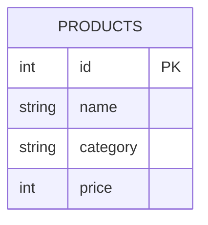

Every SQL query you will ever write starts here: **pick columns, keep rows, sort, trim**.
Instead of defining the clauses in prose, let us *watch* one query walk across a table.

## The sample table

We will query a tiny `products` table throughout this page.



| id | name | category | price |
|:---:|:---|:---|:---:|
| 1 | Pen | Office | 3 |
| 2 | Notebook | Office | 6 |
| 3 | Mug | Kitchen | 12 |
| 4 | Kettle | Kitchen | 25 |
| 5 | Lamp | Home | 18 |

## The clauses at a glance

| Clause | Its one job | Example |
|--------|-------------|---------|
| `SELECT` | choose the **columns** | `SELECT name, price` |
| `FROM` | choose the **table** | `FROM products` |
| `WHERE` | keep the **rows** that match | `WHERE price > 10` |
| `DISTINCT` | drop **duplicate rows** | `SELECT DISTINCT category` |
| `ORDER BY` | **sort** the result | `ORDER BY price DESC` |
| `LIMIT` | **cap** the row count | `LIMIT 3` |

## See each clause change the result

````tabs
tabs:
  - label: SELECT columns
    body: |
      Pick which columns come back. `*` means *every* column.
      ```sql
      SELECT name, price
      FROM products;
      ```
      | name | price |
      |------|:---:|
      | Pen | 3 |
      | Notebook | 6 |
      | Mug | 12 |
      | Kettle | 25 |
      | Lamp | 18 |
  - label: WHERE
    body: |
      Keep only the rows whose condition is **TRUE**.
      ```sql
      SELECT name, price
      FROM products
      WHERE price > 10;
      ```
      | name | price |
      |------|:---:|
      | Mug | 12 |
      | Kettle | 25 |
      | Lamp | 18 |
  - label: DISTINCT
    body: |
      Collapse duplicate rows. Four products fall under `Office`/`Kitchen`, but only the **unique** categories remain.
      ```sql
      SELECT DISTINCT category
      FROM products;
      ```
      | category |
      |----------|
      | Office |
      | Kitchen |
      | Home |
  - label: ORDER BY
    body: |
      Sort the output. `DESC` = largest first (`ASC` is the default).
      ```sql
      SELECT name, price
      FROM products
      ORDER BY price DESC;
      ```
      | name | price |
      |------|:---:|
      | Kettle | 25 |
      | Lamp | 18 |
      | Mug | 12 |
      | Notebook | 6 |
      | Pen | 3 |
  - label: LIMIT
    body: |
      Trim to the first N rows — almost always paired with `ORDER BY` so N *means* something.
      ```sql
      SELECT name, price
      FROM products
      ORDER BY price DESC
      LIMIT 3;
      ```
      | name | price |
      |------|:---:|
      | Kettle | 25 |
      | Lamp | 18 |
      | Mug | 12 |
````

## Watch WHERE scan the rows

The engine walks each row, tests the `WHERE` condition, and keeps only the ones that pass.

```walkthrough
title: WHERE price > 10 — kept vs dropped
code: |
  SELECT name, price
  FROM products
  WHERE price > 10;
steps:
  - text: '`FROM products` loads all 5 rows. `WHERE` will scan each price and keep only `price > 10`.'
    array: [3, 6, 12, 25, 18]
    line: 2
  - text: '`3 > 10`? No → drop **Pen**.'
    array: [3, 6, 12, 25, 18]
    pointers: { 0: 'scan' }
    line: 3
  - text: '`6 > 10`? No → drop **Notebook**.'
    array: [3, 6, 12, 25, 18]
    pointers: { 1: 'scan' }
    line: 3
  - text: '`12 > 10`? Yes → **keep Mug**.'
    array: [3, 6, 12, 25, 18]
    highlight: [2]
    pointers: { 2: 'scan' }
    line: 3
  - text: '`25 > 10`? Yes → **keep Kettle**.'
    array: [3, 6, 12, 25, 18]
    highlight: [2, 3]
    pointers: { 3: 'scan' }
    line: 3
  - text: '`18 > 10`? Yes → **keep Lamp**.'
    array: [3, 6, 12, 25, 18]
    highlight: [2, 3, 4]
    pointers: { 4: 'scan' }
    line: 3
  - text: 'Three rows survived. `SELECT` now returns just their `name` and `price`.'
    array: [3, 6, 12, 25, 18]
    highlight: [2, 3, 4]
    line: 1
```

## Terminology recall

```flashcards
title: Clause recall
cards:
  - front: '`WHERE`'
    back: 'Keeps only rows where the condition evaluates to **TRUE**.'
  - front: '`DISTINCT`'
    back: 'Removes duplicate **rows** — it looks at *all* selected columns together, not one column.'
  - front: '`ORDER BY col DESC`'
    back: 'Sorts the result by `col`, largest first. Default direction is `ASC`.'
  - front: '`LIMIT n`'
    back: 'Returns at most `n` rows. Meaningful only alongside `ORDER BY`.'
```

:::tip
`DISTINCT` de-duplicates the **whole selected row**. `SELECT DISTINCT category, price` keeps a
row per *unique (category, price) pair* — not per unique category.
:::

:::gotcha
`LIMIT` **without** `ORDER BY` gives you *some* N rows, but which ones is undefined and can
change between runs. Always sort first when the identity of the rows matters.
:::

## Check yourself

```quiz
title: SELECT & filtering
questions:
  - q: 'How many rows does `SELECT DISTINCT category FROM products` return?'
    options:
      - '5'
      - text: '3'
        correct: true
      - '1'
    explain: 'The distinct categories are Office, Kitchen, and Home → **3 rows**, no matter how many products share them.'
  - q: 'Which clause removes rows that fail a condition?'
    options:
      - text: '`WHERE`'
        correct: true
      - '`SELECT`'
      - '`ORDER BY`'
    explain: '`WHERE` filters rows. `SELECT` picks columns; `ORDER BY` only sorts.'
  - q: '`... ORDER BY price DESC LIMIT 2` returns which products?'
    options:
      - '`Pen`, `Notebook`'
      - text: '`Kettle`, `Lamp`'
        correct: true
      - '`Mug`, `Lamp`'
    explain: 'Sorted by price descending: 25 (Kettle), 18 (Lamp), 12, 6, 3. `LIMIT 2` keeps the top two.'
  - q: 'Does `LIMIT 3` **without** an `ORDER BY` guarantee *which* 3 rows you get?'
    options:
      - 'Yes — always the first 3 inserted'
      - text: 'No — the row order is undefined'
        correct: true
    explain: 'Without `ORDER BY`, SQL makes no promise about row order, so the 3 rows you receive can vary.'
```

:::key
`SELECT` cols · `FROM` table · `WHERE` filters rows · `DISTINCT` drops duplicate rows ·
`ORDER BY` sorts · `LIMIT` caps the count. Pair `LIMIT` with `ORDER BY` or the result is nondeterministic.
:::
