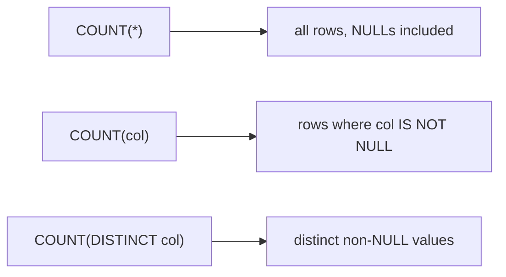

Aggregation turns **many rows into one number**. `GROUP BY` does it *per bucket*. The trick
that trips people up is *where* you filter — `WHERE` or `HAVING` — so we will make the pipeline
visible.

## The sample table

A `sales` table with two regions.

| id | region | amount |
|:---:|:---|:---:|
| 1 | East | 100 |
| 2 | East | 50 |
| 3 | West | 200 |
| 4 | West | 40 |
| 5 | East | 30 |

## The aggregate functions

| Function | Returns | NULL handling |
|----------|---------|---------------|
| `COUNT(*)` | number of rows | counts every row |
| `COUNT(col)` | count of **non-NULL** values | skips NULLs |
| `SUM(col)` | total | skips NULLs |
| `AVG(col)` | mean | skips NULLs (divides by non-NULL count) |
| `MIN(col)` / `MAX(col)` | smallest / largest | skips NULLs |

## Watch GROUP BY build buckets

`GROUP BY region` sorts rows into buckets, then `SUM(amount)` collapses each bucket to one row.

```walkthrough
title: SUM(amount) grouped by region
code: |
  SELECT region, SUM(amount)
  FROM sales
  GROUP BY region;
steps:
  - text: '`FROM sales` loads all 5 rows. Each has a region (E/W shown above the box) and an amount.'
    array: [100, 50, 200, 40, 30]
    pointers: { 0: 'E', 1: 'E', 2: 'W', 3: 'W', 4: 'E' }
    line: 2
  - text: '`GROUP BY region` sorts rows into buckets. First, gather the **East** rows.'
    array: [100, 50, 200, 40, 30]
    highlight: [0, 1, 4]
    pointers: { 0: 'E', 1: 'E', 2: 'W', 3: 'W', 4: 'E' }
    line: 3
  - text: '`SUM(amount)` over the East bucket = 100 + 50 + 30 = **180**.'
    array: [100, 50, 200, 40, 30]
    highlight: [0, 1, 4]
    pointers: { 0: 'E', 1: 'E', 2: 'W', 3: 'W', 4: 'E' }
    line: 1
  - text: 'Now the **West** bucket.'
    array: [100, 50, 200, 40, 30]
    highlight: [2, 3]
    pointers: { 0: 'E', 1: 'E', 2: 'W', 3: 'W', 4: 'E' }
    line: 3
  - text: '`SUM(amount)` over West = 200 + 40 = **240**. Two buckets → **two result rows**.'
    array: [100, 50, 200, 40, 30]
    highlight: [2, 3]
    pointers: { 0: 'E', 1: 'E', 2: 'W', 3: 'W', 4: 'E' }
    line: 1
```

The result — one row per group:

| region | SUM(amount) |
|--------|:---:|
| East | 180 |
| West | 240 |

## WHERE vs HAVING

Both filter, but at **different stages**: `WHERE` throws out *rows* before grouping; `HAVING`
throws out whole *groups* after aggregating.

| | `WHERE` | `HAVING` |
|--|--------|----------|
| Filters | individual **rows** | whole **groups** |
| Runs | **before** `GROUP BY` | **after** `GROUP BY` |
| Can use aggregates (`SUM`, `COUNT`…)? | ❌ no | ✅ yes |
| Typical use | `WHERE amount > 40` | `HAVING SUM(amount) > 200` |

Using both in one query reads top-to-bottom but runs `WHERE` first:

```sql
SELECT region, SUM(amount) AS total
FROM sales
WHERE amount > 40          -- 1. drop the tiny rows first
GROUP BY region            -- 2. bucket what remains
HAVING SUM(amount) > 100;  -- 3. keep only the big groups
```

## COUNT, three ways



:::gotcha
`AVG(col)` divides the `SUM` by the count of **non-NULL** values, not by the total row count.
If some values are NULL, `AVG(col)` is **not** equal to `SUM(col) / COUNT(*)`.
:::

:::senior
Every column in the `SELECT` must be either inside an aggregate **or** listed in `GROUP BY`.
Standard SQL and most engines reject a "bare" non-grouped column; the exception is a column
functionally dependent on the primary key (allowed by the SQL standard and modern PostgreSQL).
:::

## Check yourself

```quiz
title: Aggregation & grouping
questions:
  - q: 'Which clause filters **groups** using an aggregate like `SUM()`?'
    options:
      - '`WHERE`'
      - text: '`HAVING`'
        correct: true
      - '`ORDER BY`'
    explain: '`HAVING` runs after `GROUP BY`, so it can see aggregates. `WHERE` runs before grouping and cannot.'
  - q: 'A column has some NULLs. How do `COUNT(*)` and `COUNT(col)` differ?'
    options:
      - 'They are always equal'
      - text: '`COUNT(*)` counts every row; `COUNT(col)` skips the NULLs'
        correct: true
      - '`COUNT(col)` counts every row; `COUNT(*)` skips the NULLs'
    explain: '`COUNT(*)` counts rows. `COUNT(col)` counts only non-NULL values of that column.'
  - q: 'Can `WHERE` reference `SUM(amount)`?'
    options:
      - 'Yes'
      - text: 'No — aggregates are not available until after grouping'
        correct: true
    explain: '`WHERE` runs before `GROUP BY`, so aggregates do not exist yet. Filter aggregates in `HAVING`.'
  - q: 'For the sample data, how many rows does `GROUP BY region` produce?'
    options:
      - '5'
      - text: '2'
        correct: true
      - '1'
    explain: 'Two distinct regions (East, West) → **2 groups → 2 result rows**.'
```

:::key
Aggregates squash rows into one value; `GROUP BY` does it per bucket. `WHERE` filters rows
**before** grouping and cannot use aggregates; `HAVING` filters groups **after** and can.
`COUNT(*)` counts rows, `COUNT(col)` skips NULLs.
:::
