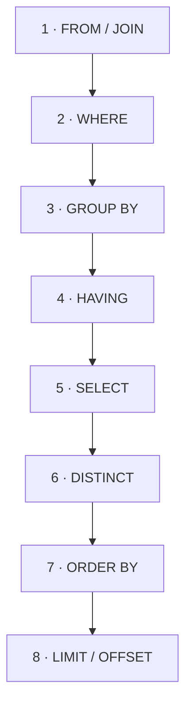

You **write** `SELECT` first, but the engine **runs** it almost last. This mismatch explains a
whole family of interview questions — the most famous being *"why cannot I use my column alias
in `WHERE`?"* Learn the pipeline once and those puzzles dissolve.

## The logical pipeline

Regardless of how you type it, SQL is evaluated in this order:



| # | Stage | Job | Can see `SELECT` aliases? |
|:-:|-------|-----|:---:|
| 1 | `FROM` / `JOIN` | assemble the source rows | — |
| 2 | `WHERE` | filter **rows** | ❌ |
| 3 | `GROUP BY` | collapse into buckets | ❌ |
| 4 | `HAVING` | filter **groups** (aggregates allowed) | ❌ |
| 5 | `SELECT` | compute output columns **& aliases** | creates them |
| 6 | `DISTINCT` | drop duplicate output rows | ✅ |
| 7 | `ORDER BY` | sort the result | ✅ |
| 8 | `LIMIT` / `OFFSET` | cap / page the rows | ✅ |

:::note
A handy mnemonic for the run-order: **F**rom · **W**here · **G**roup · **H**aving · **S**elect
· **D**istinct · **O**rder · **L**imit.
:::

## Run one query through every stage

Follow this query as it flows down the pipeline. Watch which SQL line each stage touches.

```walkthrough
title: One query, stage by stage
code: |
  SELECT region, SUM(amount) AS total
  FROM sales
  WHERE amount > 40
  GROUP BY region
  HAVING SUM(amount) > 100
  ORDER BY total DESC
  LIMIT 1;
steps:
  - text: '**1 · FROM** loads the source. Rowset = all 5 sales rows.'
    array: ['FROM', 'WHERE', 'GROUP BY', 'HAVING', 'SELECT', 'ORDER BY', 'LIMIT']
    highlight: [0]
    line: 2
  - text: '**2 · WHERE** filters rows: keep `amount > 40` → 100, 50, 200 survive. The alias `total` does **not exist yet**.'
    array: ['FROM', 'WHERE', 'GROUP BY', 'HAVING', 'SELECT', 'ORDER BY', 'LIMIT']
    highlight: [1]
    sorted: [0]
    line: 3
  - text: '**3 · GROUP BY** buckets the survivors by region: East = {100, 50}, West = {200}.'
    array: ['FROM', 'WHERE', 'GROUP BY', 'HAVING', 'SELECT', 'ORDER BY', 'LIMIT']
    highlight: [2]
    sorted: [0, 1]
    line: 4
  - text: '**4 · HAVING** filters groups: East = 150, West = 200, both `> 100` → both stay.'
    array: ['FROM', 'WHERE', 'GROUP BY', 'HAVING', 'SELECT', 'ORDER BY', 'LIMIT']
    highlight: [3]
    sorted: [0, 1, 2]
    line: 5
  - text: '**5 · SELECT** computes the output columns — the alias `total` is **born here**.'
    array: ['FROM', 'WHERE', 'GROUP BY', 'HAVING', 'SELECT', 'ORDER BY', 'LIMIT']
    highlight: [4]
    sorted: [0, 1, 2, 3]
    line: 1
  - text: '**7 · ORDER BY** sorts by `total DESC`. It **can** use the alias — SELECT already ran. West (200) then East (150).'
    array: ['FROM', 'WHERE', 'GROUP BY', 'HAVING', 'SELECT', 'ORDER BY', 'LIMIT']
    highlight: [5]
    sorted: [0, 1, 2, 3, 4]
    line: 6
  - text: '**8 · LIMIT** keeps the first row → **West, 200**.'
    array: ['FROM', 'WHERE', 'GROUP BY', 'HAVING', 'SELECT', 'ORDER BY', 'LIMIT']
    highlight: [6]
    sorted: [0, 1, 2, 3, 4, 5]
    line: 7
```

## Why the alias rule works the way it does

Because `SELECT` (step 5) runs **after** `WHERE` (step 2), the alias simply does not exist when
`WHERE` is evaluated.

````tabs
tabs:
  - label: ❌ alias in WHERE
    body: |
      `total` has not been created yet at step 2 — the database rejects it.
      ```sql
      SELECT region, SUM(amount) AS total
      FROM sales
      WHERE total > 100      -- ERROR: column "total" does not exist
      GROUP BY region;
      ```
      Fixes: repeat the expression (`WHERE amount > 100`), or wrap the query in a subquery / CTE.
  - label: ✅ alias in ORDER BY
    body: |
      `ORDER BY` runs at step 7, long after `SELECT` created the alias — so this is fine.
      ```sql
      SELECT region, SUM(amount) AS total
      FROM sales
      GROUP BY region
      ORDER BY total DESC;   -- OK: alias already exists
      ```
````

## Terminology recall

```flashcards
title: Pipeline recall
cards:
  - front: 'Run-order mnemonic'
    back: '**F**rom → **W**here → **G**roup → **H**aving → **S**elect → **D**istinct → **O**rder → **L**imit.'
  - front: 'Why can `WHERE` not use a SELECT alias?'
    back: '`WHERE` (step 2) runs **before** `SELECT` (step 5), so the alias does not exist yet.'
  - front: 'Which clauses *can* use a SELECT alias?'
    back: '`ORDER BY` (and `DISTINCT`) — they run **after** `SELECT`.'
  - front: 'Why does `HAVING` exist at all?'
    back: '`WHERE` runs before `GROUP BY`, so it cannot filter on aggregates. `HAVING` filters after grouping.'
```

## Check yourself

```quiz
title: Logical query order
questions:
  - q: 'Which runs first, `WHERE` or `SELECT`?'
    options:
      - text: '`WHERE`'
        correct: true
      - '`SELECT`'
      - 'They run at the same time'
    explain: 'Run-order is FROM → WHERE → GROUP BY → HAVING → SELECT → … so `WHERE` is evaluated before `SELECT`.'
  - q: 'Why can `WHERE` not reference a column alias defined in `SELECT`?'
    options:
      - 'Aliases are only for display'
      - text: '`SELECT` runs after `WHERE`, so the alias does not exist yet'
        correct: true
      - 'It is a syntax typo'
    explain: 'The alias is created at the SELECT stage (step 5), which runs after WHERE (step 2).'
  - q: 'Can `ORDER BY` use a `SELECT` alias?'
    options:
      - text: 'Yes'
        correct: true
      - 'No'
    explain: '`ORDER BY` (step 7) runs after `SELECT` (step 5), so the alias is already available.'
  - q: 'Which stage runs **last**?'
    options:
      - '`ORDER BY`'
      - text: '`LIMIT` / `OFFSET`'
        correct: true
      - '`HAVING`'
    explain: '`LIMIT`/`OFFSET` is applied last, after the rows are filtered, grouped, projected, and sorted.'
```

:::key
Written order is not run order. SQL runs **FROM → WHERE → GROUP BY → HAVING → SELECT →
DISTINCT → ORDER BY → LIMIT**. Aliases are born in `SELECT`, so only the later stages
(`DISTINCT`, `ORDER BY`, `LIMIT`) can use them — never `WHERE` or `HAVING`.
:::
