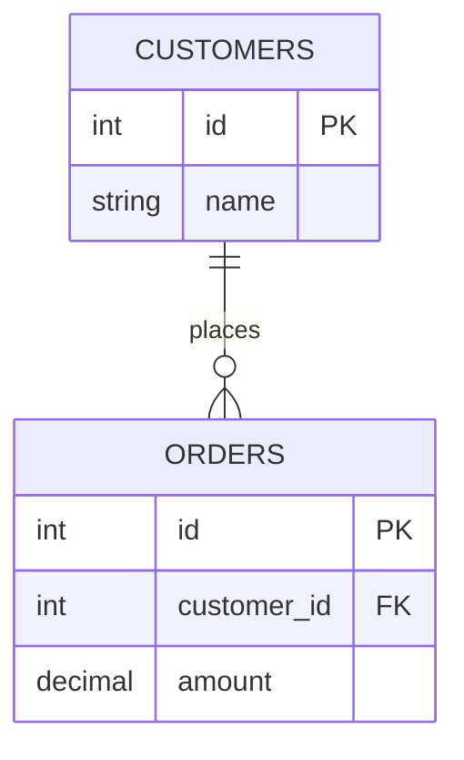

A **join** stitches rows from two tables together using a related column. It's the single
most-tested SQL skill in interviews — so let's *see* exactly what each join does.

## The two tables

We'll join `customers` to their `orders`. One customer can have many orders (a **one-to-many**
relationship on `orders.customer_id`).



Here's the sample data — note **Bo has no orders**, and every order belongs to a real customer:

| customers.id | name |   | orders.id | customer_id | amount |
|:---:|:---|---|:---:|:---:|:---:|
| 1 | Ada  |   | 101 | 1 | 50 |
| 2 | Bo   |   | 102 | 1 | 20 |
| 3 | Cara |   | 103 | 3 | 75 |

## The four joins at a glance

| Join | Keeps | Ada (2 orders) | Bo (0 orders) |
|------|-------|:---:|:---:|
| `INNER` | only matched rows | ✅ | ❌ dropped |
| `LEFT` | all left + matches | ✅ | ✅ (NULLs) |
| `RIGHT` | all right + matches | ✅ | ❌ |
| `FULL` | everything | ✅ | ✅ (NULLs) |

## See each join's result

````tabs
tabs:
  - label: INNER JOIN
    body: |
      Keeps only customers that **have** a matching order. Bo disappears.
      ```sql
      SELECT c.name, o.amount
      FROM customers c
      JOIN orders o ON o.customer_id = c.id;
      ```
      | name | amount |
      |------|:---:|
      | Ada  | 50 |
      | Ada  | 20 |
      | Cara | 75 |
  - label: LEFT JOIN
    body: |
      Keeps **every customer**; fills NULL where there's no order. Bo stays.
      ```sql
      SELECT c.name, o.amount
      FROM customers c
      LEFT JOIN orders o ON o.customer_id = c.id;
      ```
      | name | amount |
      |------|:---:|
      | Ada  | 50 |
      | Ada  | 20 |
      | Bo   | NULL |
      | Cara | 75 |
  - label: RIGHT JOIN
    body: |
      Keeps **every order**; fills NULL where there's no customer. (All orders match here, so no NULLs.)
      ```sql
      SELECT c.name, o.amount
      FROM customers c
      RIGHT JOIN orders o ON o.customer_id = c.id;
      ```
      | name | amount |
      |------|:---:|
      | Ada  | 50 |
      | Ada  | 20 |
      | Cara | 75 |
  - label: FULL JOIN
    body: |
      Keeps **both** unmatched sides. Bo (no order) and any orphan order would both appear.
      ```sql
      SELECT c.name, o.amount
      FROM customers c
      FULL JOIN orders o ON o.customer_id = c.id;
      ```
      | name | amount |
      |------|:---:|
      | Ada  | 50 |
      | Ada  | 20 |
      | Bo   | NULL |
      | Cara | 75 |
````

## Watch an INNER JOIN match rows

```walkthrough
title: How INNER JOIN builds its result
code: |
  SELECT c.name, o.amount
  FROM customers c
  JOIN orders o ON o.customer_id = c.id;
steps:
  - text: 'These are the `customer_id` values in `orders`. We match each customer against them.'
    array: [1, 1, 3]
    line: 3
  - text: 'Customer **1 (Ada)** matches the orders at index 0 and 1 → **2 result rows**.'
    array: [1, 1, 3]
    highlight: [0, 1]
    pointers: { 0: 'Ada', 1: 'Ada' }
    line: 3
  - text: 'Customer **2 (Bo)** matches nothing → INNER JOIN **drops Bo entirely**.'
    array: [1, 1, 3]
    line: 3
  - text: 'Customer **3 (Cara)** matches the order at index 2 → **1 more row**. Total = 3 rows.'
    array: [1, 1, 3]
    highlight: [2]
    sorted: [0, 1]
    pointers: { 2: 'Cara' }
    line: 3
```

:::gotcha
Putting a right-table condition in `WHERE` silently turns a `LEFT JOIN` back into an `INNER JOIN`:

```sql
-- Bo (amount IS NULL) gets filtered out — the LEFT JOIN is wasted!
SELECT c.name FROM customers c
LEFT JOIN orders o ON o.customer_id = c.id
WHERE o.amount > 0;
```
Put the condition in the `ON` clause instead, or check `o.id IS NULL` on purpose.
:::

:::senior
Joins aren't magic — the planner picks a physical algorithm: **nested loop** (small inputs / indexed), **hash join** (large unsorted equi-joins), or **merge join** (both inputs sorted). `EXPLAIN` shows which one — knowing why it chose it is a senior-level signal.
:::

## Check yourself

```quiz
title: Join intuition
questions:
  - q: 'With the data above, how many rows does the `INNER JOIN` return?'
    options:
      - '4'
      - text: '3'
        correct: true
      - '2'
    explain: 'Ada has 2 matching orders, Cara has 1, Bo has 0 → 2 + 1 + 0 = **3 rows**. Bo is dropped.'
  - q: 'How many rows does the `LEFT JOIN` return?'
    options:
      - text: '4'
        correct: true
      - '3'
      - '2'
    explain: 'LEFT JOIN keeps every customer: Ada (2) + Bo (1 row with NULLs) + Cara (1) = **4 rows**.'
  - q: 'A `CROSS JOIN` of 3 customers and 3 orders returns how many rows?'
    options:
      - '3'
      - '6'
      - text: '9'
        correct: true
    explain: 'CROSS JOIN is the Cartesian product: every left row paired with every right row → 3 × 3 = **9**.'
```

:::key
`INNER` = matches only. `LEFT` = all left rows + matches (NULLs otherwise). `RIGHT` mirrors LEFT. `FULL` = both unmatched sides. Filtering the outer-joined table in `WHERE` turns an outer join back into an inner one — use `ON` instead.
:::
