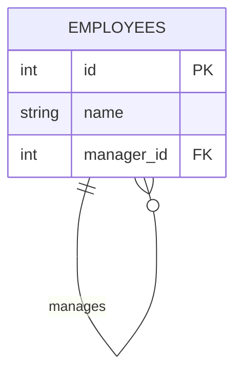
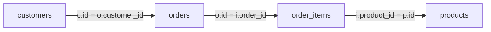

Once the four basic joins click, interviews push further: joining a table **to itself**,
chaining **three or more** tables, matching on a **range** instead of `=`, and combining
joins with `GROUP BY`. Let's *see* each one.

## A table joined to itself

Some data points *back at its own table*. Classic example: an `employees` table where each
row stores the **id of its manager** — and managers are just employees too.



The trick: list the table **twice** under two aliases, so one copy is the *employee* (`e`)
and the other is the *manager* (`m`).

| id | name  | manager_id |
|:--:|:------|:----------:|
| 1  | Alice | NULL       |
| 2  | Bob   | 1          |
| 3  | Carol | 1          |
| 4  | Dan   | 2          |

````tabs
tabs:
  - label: The self join
    body: |
      Match each row's `manager_id` to another row's `id` **in the same table**.
      ```sql
      SELECT e.name AS employee, m.name AS manager
      FROM employees e
      JOIN employees m ON e.manager_id = m.id;
      ```
  - label: Result (INNER)
    body: |
      Alice (the CEO) has no manager, so an **INNER** self-join drops her.
      | employee | manager |
      |----------|---------|
      | Bob      | Alice   |
      | Carol    | Alice   |
      | Dan      | Bob     |
  - label: Keep the CEO (LEFT)
    body: |
      Swap to `LEFT JOIN` to keep rows whose `manager_id` is NULL.
      ```sql
      SELECT e.name AS employee, m.name AS manager
      FROM employees e
      LEFT JOIN employees m ON e.manager_id = m.id;
      ```
      | employee | manager |
      |----------|---------|
      | Alice    | NULL    |
      | Bob      | Alice   |
      | Carol    | Alice   |
      | Dan      | Bob     |
````

## Watch a self-join match rows

```walkthrough
title: How a self-join pairs employees with managers
code: |
  SELECT e.name AS employee, m.name AS manager
  FROM employees e
  JOIN employees m ON e.manager_id = m.id;
steps:
  - text: 'The table plays **two roles**: `e` (employee) and `m` (manager). These are each row''s `manager_id` — we look each one up in the same table''s `id` column.'
    array: ['NULL', 1, 1, 2]
    pointers: { 0: 'Alice', 1: 'Bob', 2: 'Carol', 3: 'Dan' }
    line: 3
  - text: '**Alice** is the CEO — her `manager_id` is `NULL`. NULL matches no `id`, so INNER JOIN **drops her**.'
    array: ['NULL', 1, 1, 2]
    highlight: [0]
    pointers: { 0: 'Alice' }
    line: 3
  - text: '**Bob**''s `manager_id` is `1` → matches Alice (`id = 1`). Row: **(Bob, Alice)**.'
    array: ['NULL', 1, 1, 2]
    highlight: [1]
    sorted: [0]
    pointers: { 1: 'Bob→1' }
    line: 1
  - text: '**Carol**''s `manager_id` is `1` → Alice again. Row: **(Carol, Alice)**.'
    array: ['NULL', 1, 1, 2]
    highlight: [2]
    sorted: [0, 1]
    pointers: { 2: 'Carol→1' }
    line: 1
  - text: '**Dan**''s `manager_id` is `2` → matches **Bob** (`id = 2`). Row: **(Dan, Bob)**. Total = **3 rows**; the CEO is absent (use `LEFT JOIN` to keep her).'
    array: ['NULL', 1, 1, 2]
    highlight: [3]
    sorted: [0, 1, 2]
    pointers: { 3: 'Dan→2' }
    line: 1
```

## Joining three or more tables

Each `JOIN` bolts on **one more table**. Read them top-to-bottom as a chain — the result of
joining the first two becomes the left input to the next join.



```sql
SELECT c.name, p.title, i.qty
FROM customers c
JOIN orders       o ON o.customer_id = c.id
JOIN order_items  i ON i.order_id    = o.id
JOIN products     p ON p.id          = i.product_id;
```

:::tip
Give **every** table a short alias (`c`, `o`, `i`, `p`) and qualify **every** column. With 3+
tables an unqualified `id` is ambiguous and the query won't even parse.
:::

## Non-equi joins — matching on a range

A join condition doesn't have to be `=`. A **non-equi join** matches with `<`, `>`, or
`BETWEEN` — perfect for bucketing a value into a band.

| scores.name | score |   | grades.grade | low | high |
|:------------|:-----:|---|:------------:|:---:|:----:|
| Ada         | 95    |   | A            | 90  | 100  |
| Bo          | 83    |   | B            | 80  | 89   |
| Cara        | 72    |   | C            | 70  | 79   |

```sql
SELECT s.name, g.grade
FROM scores s
JOIN grades g ON s.score BETWEEN g.low AND g.high;
```

| name | grade |
|------|:-----:|
| Ada  | A     |
| Bo   | B     |
| Cara | C     |

## `USING` vs `ON`

When the join columns share the **same name** in both tables, `USING(col)` is a tidy
shorthand for `ON a.col = b.col` — and it **collapses** the pair into a single output column.

````tabs
tabs:
  - label: ON — explicit
    body: |
      Fully general: any predicate, and **both** join columns appear in `SELECT *`.
      ```sql
      SELECT *
      FROM orders o
      JOIN customers c ON o.customer_id = c.id;
      ```
      Output has both `o.customer_id` **and** `c.id`.
  - label: USING — shared name
    body: |
      Only when the column is named identically in both tables. The shared column appears
      **once** and must **not** be qualified.
      ```sql
      SELECT *
      FROM orders
      JOIN customers USING (customer_id);
      ```
      Output has a single, un-prefixed `customer_id`.

      *Note:* this tab assumes a variant schema where `customers` also has a `customer_id`
      column, unlike the `orders`/`customers` pair elsewhere, which joins on `customers.id`.
````

:::gotcha
After `USING (customer_id)`, the **unqualified** `customer_id` is the merged (coalesced)
column, and `SELECT *` shows it once. Qualified references like `orders.customer_id` or
`c.customer_id` still work, though — each points at that table's own underlying column.
:::

## Joins + `GROUP BY`

The everyday reporting pattern: `LEFT JOIN` then aggregate, so rows with **no** matches still
show up (with a zero) instead of vanishing.

```sql
SELECT c.name, COUNT(o.id) AS order_count
FROM customers c
LEFT JOIN orders o ON o.customer_id = c.id
GROUP BY c.name;
```

| name | order_count |
|------|:-----------:|
| Ada  | 2           |
| Bo   | 0           |
| Cara | 1           |

:::gotcha
Use `COUNT(o.id)`, **not** `COUNT(*)`. With a `LEFT JOIN`, a customer with no orders still
produces one NULL-padded row — `COUNT(*)` counts it as **1**, while `COUNT(o.id)` ignores the
NULL and correctly reports **0**.
:::

## Check yourself

```quiz
title: Advanced-join intuition
questions:
  - q: 'How does a **self join** reference the one table it uses?'
    options:
      - 'Once, with no alias'
      - text: 'Twice, under two different aliases'
        correct: true
      - 'Through a foreign key to another table'
    explain: 'A self join lists the same table twice with two aliases (e.g. `e` and `m`) so each row can be paired with another row from the same table.'
  - q: 'With an **INNER** self-join on `manager_id = id`, what happens to the CEO whose `manager_id` is NULL?'
    options:
      - 'She appears with a NULL manager'
      - text: 'She is dropped from the result'
        correct: true
      - 'The query throws an error'
    explain: 'NULL matches no `id`, so INNER JOIN drops the CEO. Switch to `LEFT JOIN` to keep her (manager = NULL).'
  - q: 'A customer has **zero** orders. In `LEFT JOIN ... GROUP BY`, which expression reports `0` for them?'
    options:
      - 'COUNT(*)'
      - text: 'COUNT(o.id)'
        correct: true
      - 'Both give the same answer'
    explain: '`COUNT(*)` counts the NULL-padded row as 1; `COUNT(o.id)` skips NULLs and returns 0 — the correct count.'
  - q: 'After joining with `USING (customer_id)`, how do you refer to that column?'
    options:
      - 'orders.customer_id'
      - text: 'customer_id (unqualified)'
        correct: true
      - 'c.customer_id'
    explain: '`USING` merges the two columns into one **unqualified** column; qualifying it is an error.'
```

:::key
**Self join** = one table, two aliases (pair rows within a table). Chain a `JOIN` per extra
table and alias everything. **Non-equi joins** match on `<`/`>`/`BETWEEN`. `USING(col)` = `ON
a.col=b.col` but collapses to one unqualified column. With `LEFT JOIN + GROUP BY`, count the
right-table key (`COUNT(o.id)`), never `COUNT(*)`.
:::
