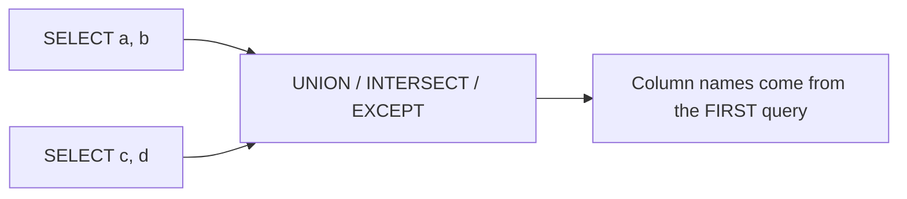

A join stitches tables **side by side** (more columns). A **set operation** stacks two result
sets **on top of each other** (more rows), comparing whole rows like mathematical sets.

## Two ways to combine

| | Grows | Compares | Combines with |
|---|---|---|---|
| **JOIN** | → wider (adds columns) | one key (`ON`) | `JOIN` |
| **Set op** | ↓ longer (adds rows) | the **whole row** | `UNION` / `INTERSECT` / `EXCEPT` |

## The two inputs

Every example below combines the same two single-column sets. Note **Bo** and **Cara** appear
in both; **Ada** is only in A; **Dan** is only in B.

| team_a |   | team_b |
|:-------|---|:-------|
| Ada    |   | Bo     |
| Bo     |   | Cara   |
| Cara   |   | Dan    |

## Each operator on that data

````tabs
tabs:
  - label: UNION
    body: |
      Everything in **either** set, with **duplicates removed**. Bo and Cara collapse to one each.
      ```sql
      SELECT name FROM team_a
      UNION
      SELECT name FROM team_b;
      ```
      | name |
      |------|
      | Ada  |
      | Bo   |
      | Cara |
      | Dan  |

      **4 rows.**
  - label: UNION ALL
    body: |
      Everything in **either** set, **duplicates kept**. Bo and Cara appear twice. No dedup step, so it's faster.
      ```sql
      SELECT name FROM team_a
      UNION ALL
      SELECT name FROM team_b;
      ```
      | name |
      |------|
      | Ada  |
      | Bo   |
      | Cara |
      | Bo   |
      | Cara |
      | Dan  |

      **6 rows.**
  - label: INTERSECT
    body: |
      Only rows present in **both** sets.
      ```sql
      SELECT name FROM team_a
      INTERSECT
      SELECT name FROM team_b;
      ```
      | name |
      |------|
      | Bo   |
      | Cara |

      **2 rows.**
  - label: EXCEPT
    body: |
      Rows in the **first** set that are **not** in the second (in A, not in B).
      ```sql
      SELECT name FROM team_a
      EXCEPT
      SELECT name FROM team_b;
      ```
      | name |
      |------|
      | Ada  |

      **1 row.**
````

## Side-by-side summary

| Operator | Keeps duplicates? | Keeps a row when it is… | Rows here |
|----------|:-----------------:|-------------------------|:---------:|
| `UNION`     | No (dedups) | in **either** set        | 4 |
| `UNION ALL` | **Yes**     | in **either** set        | 6 |
| `INTERSECT` | No          | in **both** sets         | 2 |
| `EXCEPT`    | No          | in the **first** only    | 1 |

## The rules (they trip people up)



:::key
Every `SELECT` in a set operation must have:

1. the **same number** of columns, and
2. **compatible types** in each matching position (column 1 with column 1, etc.).

Column **names** are taken from the **first** query. A single `ORDER BY` is allowed only at the
**very end**, after the last query.
:::

## EXCEPT is directional

Unlike `UNION` and `INTERSECT`, `EXCEPT` is **not** symmetric — order matters.

````tabs
tabs:
  - label: team_a EXCEPT team_b
    body: |
      In A but not B.
      | name |
      |------|
      | Ada  |
  - label: team_b EXCEPT team_a
    body: |
      In B but not A — a **different** answer.
      | name |
      |------|
      | Dan  |
````

:::senior
`UNION` performs an implicit `DISTINCT` — a sort or hash to drop duplicates. If you *know* the
inputs can't overlap (or duplicates are fine), reach for `UNION ALL` to skip that cost. Also
note portability: Oracle spells `EXCEPT` as `MINUS`, and MySQL only gained `INTERSECT`/`EXCEPT`
in 8.0.31.
:::

## Check yourself

```quiz
title: Set-operation intuition
questions:
  - q: 'What is the difference between `UNION` and `UNION ALL`?'
    options:
      - '`UNION ALL` removes duplicate rows'
      - text: '`UNION` removes duplicates; `UNION ALL` keeps them'
        correct: true
      - 'They are identical'
    explain: '`UNION` does an implicit DISTINCT (a dedup step). `UNION ALL` keeps every row and is faster because it skips that work.'
  - q: 'With the sets above, how many rows does `team_a INTERSECT team_b` return?'
    options:
      - text: '2'
        correct: true
      - '4'
      - '6'
    explain: 'INTERSECT keeps rows present in both sets: Bo and Cara → 2 rows.'
  - q: 'What does `team_a EXCEPT team_b` return?'
    options:
      - text: 'Ada'
        correct: true
      - 'Dan'
      - 'Bo and Cara'
    explain: 'EXCEPT returns rows in the first set that are not in the second: only Ada. It is directional — `team_b EXCEPT team_a` would give Dan.'
  - q: 'Which requirement must every `SELECT` in a `UNION` satisfy?'
    options:
      - text: 'The same number of columns, with compatible types'
        correct: true
      - 'Exactly matching column names'
      - 'A shared foreign key'
    explain: 'Set operators align columns by position: same column count and compatible types. Names come from the first SELECT — they need not match.'
```

:::note
`UNION`/`INTERSECT`/`EXCEPT` all remove duplicates by default; only `UNION` has the explicit
`ALL` variant in common use. When you need dedup for `INTERSECT`/`EXCEPT` you already have it —
their default is DISTINCT.
:::
