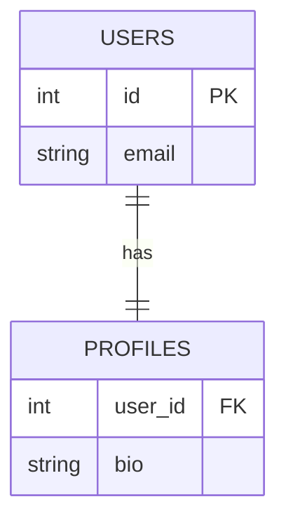
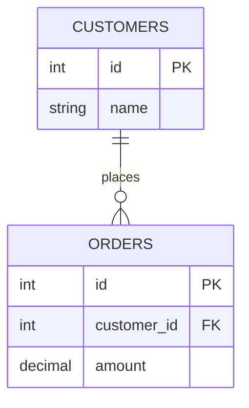
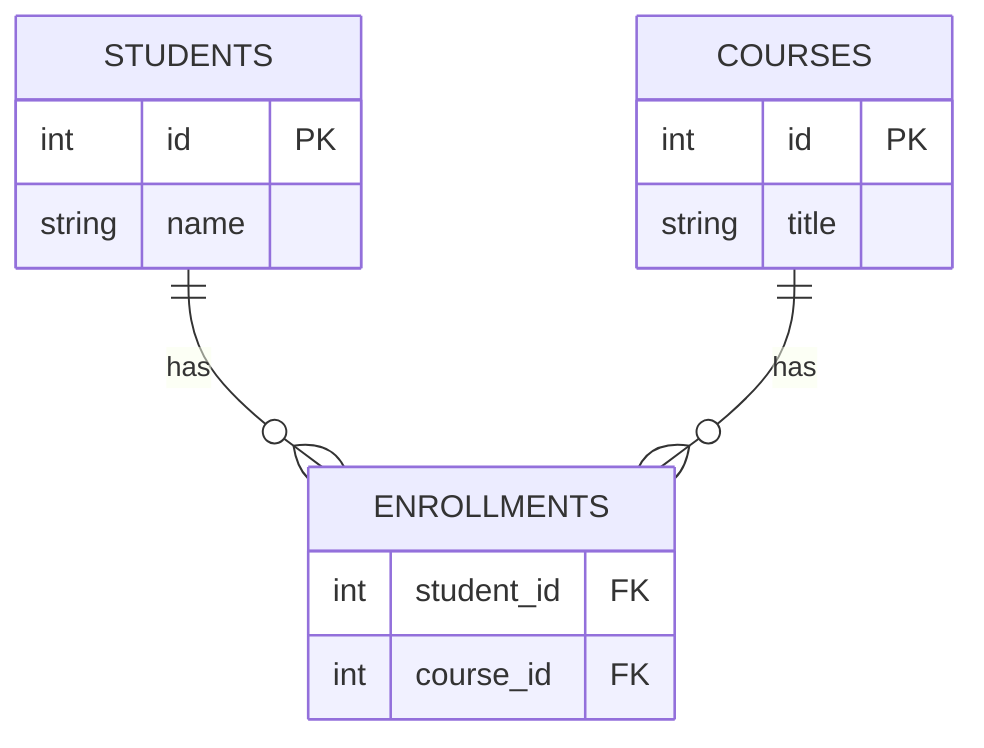

Tables rarely stand alone — they **relate**. A **foreign key (FK)** is the column that records
the link, pointing at another table's **primary key (PK)**. How *many* rows relate on each side
is the **cardinality**. There are three shapes.

## One-to-one (1:1)

Each row on the left matches **at most one** row on the right, and vice versa. Used to split a
table — e.g. keep bulky or sensitive columns in a separate `profiles` table.



The `||--||` on both ends means *exactly one* each way. Enforced by making the FK
(`profiles.user_id`) **also unique** (often it doubles as the profile's PK).

## One-to-many (1:N) — the everyday case

One row on the **"one"** side owns **many** rows on the **"many"** side. The FK always lives on
the **many** side. A customer has many orders; each order belongs to exactly one customer.



The crow's-foot (`o{`) marks the "many" end. If you can say *"one X has many Y,"* the FK goes on
**Y**.

## Many-to-many (M:N) — needs a junction table

A student takes many courses; a course has many students. A single FK can't express this — so
we add a **junction** (bridge) table holding two FKs, splitting the M:N into **two 1:N** links.



Each `ENROLLMENTS` row is one *(student, course)* pairing — and it's a natural home for extras
like `grade` or `enrolled_on`.

| students |   | enrollments |   | courses |
|:---------|---|:------------|---|:--------|
| 1 Ada    |   | 1 → 10      |   | 10 SQL  |
| 2 Bo     |   | 1 → 20      |   | 20 Math |
|          |   | 2 → 10      |   |         |

*(Ada takes SQL and Math; Bo takes SQL.)*

## Foreign keys enforce the link

Declaring the FK gives you **referential integrity**: the database refuses an `orders` row whose
`customer_id` doesn't exist, and controls what happens when the parent changes.

```sql
CREATE TABLE orders (
  id          INT PRIMARY KEY,
  customer_id INT,
  amount      DECIMAL(10,2),
  FOREIGN KEY (customer_id) REFERENCES customers(id)
    ON DELETE CASCADE
    ON UPDATE CASCADE
);
```

## ON DELETE / ON UPDATE actions

What should happen to the **child** rows when the **parent** row is deleted (or its key
updated)? You choose per foreign key:

| Action | When the parent is deleted… | Reach for it when |
|--------|------------------------------|-------------------|
| `CASCADE` | child rows are **deleted too** | children can't exist alone (`order_items` under an order) |
| `SET NULL` | child FK becomes **NULL** | the link is optional (`employees.manager_id`) — column must allow NULL |
| `RESTRICT` | the delete is **blocked** immediately | you must clean up children first |
| `NO ACTION` | blocked (checked at end of statement) | the SQL-standard default; like `RESTRICT` in practice |
| `SET DEFAULT` | child FK set to its **default** value | rare; needs a sensible default row |

:::gotcha
The default is `NO ACTION` (a blocked delete), **not** `CASCADE`. If you delete a customer and
get a constraint error, that's referential integrity protecting orphaned orders — decide
deliberately between `CASCADE` and `SET NULL`.
:::

## Terminology flashcards

```flashcards
title: Relationship vocabulary
cards:
  - front: 'Primary key (PK)'
    back: 'A column (or set of columns) that **uniquely** identifies each row. Never NULL.'
  - front: 'Foreign key (FK)'
    back: 'A column that **references** another table''s primary key, recording and enforcing the link.'
  - front: 'Cardinality'
    back: 'How many rows relate on each side: **1:1**, **1:N**, or **M:N**.'
  - front: 'Junction (bridge) table'
    back: 'A table with two FKs that turns a **many-to-many** into two one-to-many relationships.'
  - front: 'Referential integrity'
    back: 'The guarantee that every FK value points to an **existing** parent row (or is NULL).'
  - front: '`ON DELETE CASCADE`'
    back: 'Deleting a parent row automatically **deletes its child rows**.'
  - front: '`ON DELETE SET NULL`'
    back: 'Deleting a parent **nulls** the FK in child rows (the column must allow NULL).'
```

## Check yourself

```quiz
title: Relationships & keys
questions:
  - q: 'How is a **many-to-many** relationship implemented in a relational database?'
    options:
      - text: 'With a junction (bridge) table holding two foreign keys'
        correct: true
      - 'With a single foreign key on one side'
      - 'With a UNION of both tables'
    explain: 'A junction table stores two FKs — one to each side — splitting the M:N into two one-to-many links.'
  - q: 'In a **one-to-many** relationship, which table holds the foreign key?'
    options:
      - 'The "one" side'
      - text: 'The "many" side'
        correct: true
      - 'Both sides'
    explain: 'The FK lives on the "many" side (e.g. `orders.customer_id`) — each child points back to its single parent.'
  - q: 'What does `ON DELETE CASCADE` do?'
    options:
      - text: 'Deleting a parent row deletes its child rows too'
        correct: true
      - 'Blocks the delete if children exist'
      - 'Sets the child foreign keys to NULL'
    explain: 'CASCADE propagates the delete to children. `SET NULL` nulls the FK instead; `RESTRICT`/`NO ACTION` blocks the delete.'
  - q: 'A valid foreign key value must…'
    options:
      - text: 'Match an existing primary key, or be NULL'
        correct: true
      - 'Always be unique'
      - 'Equal the child row''s own primary key'
    explain: 'Referential integrity: an FK either points to a real parent row or is NULL (when the column permits it).'
```

:::key
FK lives on the **many** side. **1:1** = unique FK; **1:N** = plain FK on the child; **M:N** =
a **junction table** with two FKs. FKs enforce **referential integrity**, and `ON DELETE`
picks the fallout: `CASCADE` (delete children), `SET NULL` (null the link), or
`RESTRICT`/`NO ACTION` (block it — the default).
:::
