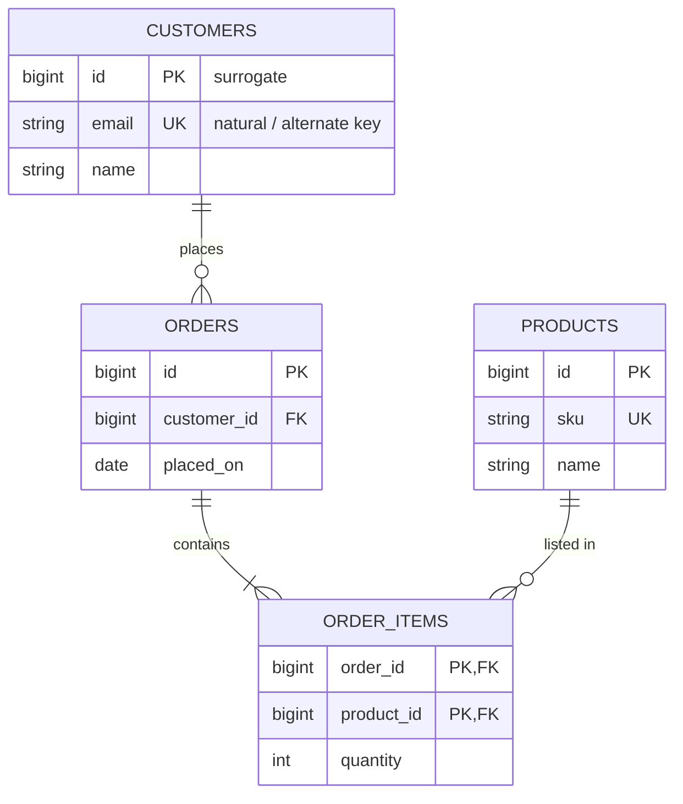
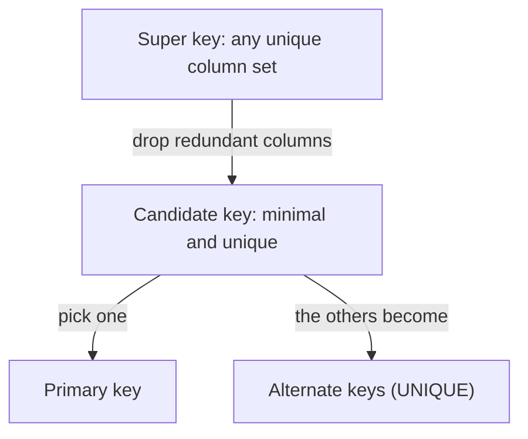

A **key** is a column (or set of columns) that identifies rows and wires tables together.
Get keys right and the whole schema falls into place — so let's *see* every kind at once.

## Keys on a real schema

Notice the annotations: `PK` = primary key, `FK` = foreign key, `UK` = unique (alternate) key.
`ORDER_ITEMS` uses a **composite** key — two columns together identify a row.



## Every key type in one table

| Key type | What it is | Example (a `users` table) |
|----------|-----------|---------------------------|
| **Super key** | *Any* column set that is unique — extras allowed | `{id}`, `{id, email}`, `{email, name}` |
| **Candidate key** | A **minimal** super key (drop any column → not unique) | `{id}`, `{email}` |
| **Primary key** | The **one** candidate key chosen as row identity; `NOT NULL` + `UNIQUE` | `id` |
| **Alternate key** | Candidate keys *not* chosen as primary | `email` |
| **Composite key** | A key made of **2+ columns** | `{order_id, product_id}` |
| **Foreign key** | Column(s) referencing another table's key | `orders.customer_id → users.id` |
| **Surrogate key** | Artificial, system-generated, no business meaning | auto-increment `id`, `UUID` |
| **Natural key** | Drawn from real-world data | `email`, `ISBN`, `iso_code` |

## From super key down to primary key

Every candidate key *is* a super key — just the leanest one. You pick **one** candidate to be
the primary key; the leftovers become **alternate** keys (enforced with `UNIQUE`).



## Composite keys

When no single column is unique, combine columns. A **junction table** for a many-to-many
relationship almost always uses a composite key of the two foreign keys:

| order_id | product_id | quantity |
|:--------:|:----------:|:--------:|
| 1 | 100 | 2 |
| 1 | 101 | 1 |
| 2 | 100 | 5 |

The pair `(order_id, product_id)` is unique even though neither column is on its own.

```sql
CREATE TABLE order_items (
  order_id   BIGINT REFERENCES orders(id),
  product_id BIGINT REFERENCES products(id),
  quantity   INT NOT NULL,
  PRIMARY KEY (order_id, product_id)   -- composite key
);
```

## Surrogate vs natural — the classic debate

````tabs
tabs:
  - label: Surrogate key
    body: |
      A meaningless, system-generated id — stable forever.

      ```sql
      CREATE TABLE users (
        id     BIGINT GENERATED ALWAYS AS IDENTITY PRIMARY KEY,
        email  TEXT UNIQUE NOT NULL,   -- natural / alternate key
        name   TEXT NOT NULL
      );
      ```

      - **Stable:** `email` can change without touching a single foreign key.
      - **Compact:** narrow integer joins and indexes are fast.
      - **Cost:** you still need a `UNIQUE` on the natural column to stop duplicates.
  - label: Natural key
    body: |
      A real-world attribute that is already unique.

      ```sql
      CREATE TABLE countries (
        iso_code CHAR(2) PRIMARY KEY,   -- 'US', 'GB' — meaningful, never changes
        name     TEXT NOT NULL
      );
      ```

      - **Meaningful:** the key itself tells you something; fewer joins to read.
      - **Risky:** if the "unchanging" value ever changes or is reused, every FK breaks.
      - **Wide:** multi-column natural keys bloat every referencing table.
````

:::tip
Default to a **surrogate primary key** *plus* a `UNIQUE` constraint on the natural key. You
get stable joins and still reject real-world duplicates.
:::

## Terminology drill

```flashcards
title: Key vocabulary
cards:
  - front: 'Super key'
    back: 'Any column set that uniquely identifies a row — may contain extra, removable columns.'
  - front: 'Candidate key'
    back: 'A minimal super key: remove any column and it stops being unique.'
  - front: 'Primary key'
    back: 'The one candidate key chosen as row identity. Implies NOT NULL and UNIQUE; one per table.'
  - front: 'Alternate key'
    back: 'A candidate key that was not chosen as the primary key. Enforced with UNIQUE.'
  - front: 'Composite key'
    back: 'A key made of two or more columns together, e.g. (order_id, product_id).'
  - front: 'Foreign key'
    back: 'A column set that references a key in another table, enforcing referential integrity.'
  - front: 'Surrogate key'
    back: 'A system-generated key with no business meaning: auto-increment id or UUID.'
  - front: 'Natural key'
    back: 'A key drawn from real-world data: email, ISBN, country code.'
```

## Check yourself

```quiz
title: Keys intuition
questions:
  - q: 'Which statement about a `PRIMARY KEY` is TRUE?'
    options:
      - 'It may contain NULLs'
      - text: 'It is a candidate key chosen to identify rows, so it is UNIQUE and NOT NULL'
        correct: true
      - 'A table can have several primary keys'
    explain: 'A table has at most one primary key. It is a chosen candidate key and is automatically UNIQUE and NOT NULL.'
  - q: 'A **minimal** column set that uniquely identifies each row is a...'
    options:
      - 'Super key'
      - text: 'Candidate key'
        correct: true
      - 'Foreign key'
    explain: 'Every candidate key is a super key, but it is minimal — no column can be removed without losing uniqueness.'
  - q: 'The main advantage of a surrogate key over a natural key is that...'
    options:
      - text: 'It is stable — it never changes when business data changes'
        correct: true
      - 'It carries business meaning'
      - 'It removes the need for indexes'
    explain: 'Surrogate keys are opaque and stable. Natural keys (email, phone) can change, cascading painful updates through every foreign key.'
```

:::key
**Super** ⊇ **candidate** (minimal) → one becomes the **primary** key, the rest are **alternate** keys.
A **foreign** key points at another table's key. Prefer a **surrogate** PK plus a `UNIQUE` on the **natural** key.
:::
