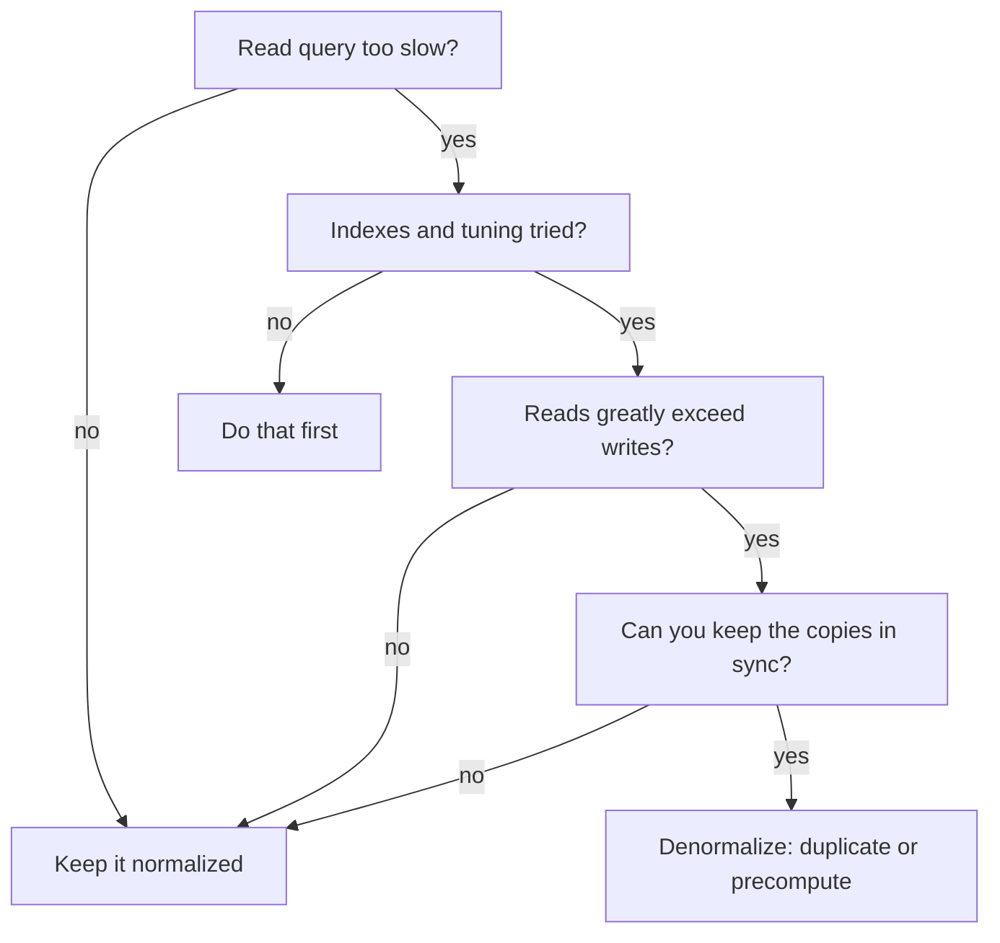

**Denormalization** deliberately re-introduces redundancy — duplicated columns or pre-computed
values — to make **reads** faster. You trade extra storage and write complexity for fewer joins.
It is a *performance* decision, not a modeling mistake.

## Should you denormalize?

Reach for it **last**, after indexing and query tuning, and only when reads dominate writes.



## Same question, two schemas

````tabs
tabs:
  - label: Normalized (3NF)
    body: |
      Facts live once, across three tables. Correct and anomaly-free — but every read of an
      order summary pays for **three joins plus an aggregation**.

      ```sql
      SELECT o.id,
             c.name                    AS customer,
             SUM(oi.qty * p.price)      AS total
      FROM orders o
      JOIN customers   c  ON c.id  = o.customer_id
      JOIN order_items oi ON oi.order_id  = o.id
      JOIN products    p  ON p.id  = oi.product_id
      GROUP BY o.id, c.name;
      ```

      - No redundancy, guaranteed consistent.
      - Slow when this runs thousands of times per second.
  - label: Denormalized
    body: |
      A wide `order_summary` table copies `customer_name` and stores a **pre-computed** `total`.
      The read collapses to a single-row lookup — **no joins, no aggregation**.

      ```sql
      SELECT id, customer_name, total_amount
      FROM order_summary
      WHERE id = 42;
      ```

      - Blazing reads.
      - `customer_name` is duplicated and `total_amount` must be recomputed on **every** write
        that touches the order — or it silently goes stale.
````

## The trade-off, dimension by dimension

| Dimension | Normalized | Denormalized |
|-----------|-----------|--------------|
| **Redundancy** | none | intentional duplication |
| **Read speed** | slower (joins + aggregates) | faster (few/no joins) |
| **Write speed** | fast — one place to change | slow — update every copy |
| **Storage** | minimal | larger |
| **Consistency** | guaranteed by design | app / trigger must maintain |
| **Anomalies** | prevented | possible if a copy is missed |

## Common denormalization techniques

| Technique | What it does | Use when |
|-----------|-------------|----------|
| **Duplicated column** | copy a parent attribute into the child (`customer_name` on `orders`) | a hot join is the bottleneck |
| **Pre-computed aggregate** | store a `SUM`/`COUNT` (`order_total`, `comment_count`) | expensive rollups are read often |
| **Materialized view** | cache a query result, refreshed periodically | complex read that tolerates slight staleness |
| **Star schema** | fact table + wide denormalized dimensions | analytics / OLAP workloads |
| **Array / JSON column** | embed child rows inline | children are read with the parent, rarely alone |

:::gotcha
Denormalization brings back the exact **update anomalies** normalization removed. The moment
`customer_name` lives in two tables, *you* own keeping them equal — via triggers, a transactional
write path, or a background job. Miss one write and the data quietly diverges.
:::

:::senior
Keep the **normalized store as the source of truth** and treat denormalized shapes as derived:
materialized views, a read replica, a search index, or a CQRS read model. Refresh them
asynchronously so writes stay cheap and the canonical data stays clean.
:::

## Check yourself

```quiz
title: Denormalization trade-offs
questions:
  - q: 'What do you primarily **gain** by denormalizing?'
    options:
      - 'Less storage'
      - text: 'Faster reads — fewer joins and aggregations'
        correct: true
      - 'Automatic consistency'
    explain: 'Denormalization trades extra storage and write cost for faster reads by pre-joining or pre-aggregating data.'
  - q: 'What is the main **risk** of denormalization?'
    options:
      - text: 'Redundant copies drift out of sync (update anomalies return)'
        correct: true
      - 'Queries suddenly need more joins'
      - 'You can no longer index columns'
    explain: 'Duplicated data must be kept consistent on every write. Miss a copy and the data diverges — the very anomaly normalization prevents.'
  - q: 'A dashboard recomputes an expensive `COUNT(*)` of comments on every page load. Best first move?'
    options:
      - text: 'Maintain a pre-computed comment_count column on the parent row'
        correct: true
      - 'Split the table into more tables'
      - 'Drop the primary key'
    explain: 'A maintained aggregate turns an expensive COUNT into a single-column read. Splitting further (more normalization) would make it slower.'
```

:::key
Normalize for **correctness and cheap writes**; denormalize for **read speed** — but only after
indexing fails you, and always with a plan to keep the duplicated data in sync.
:::
