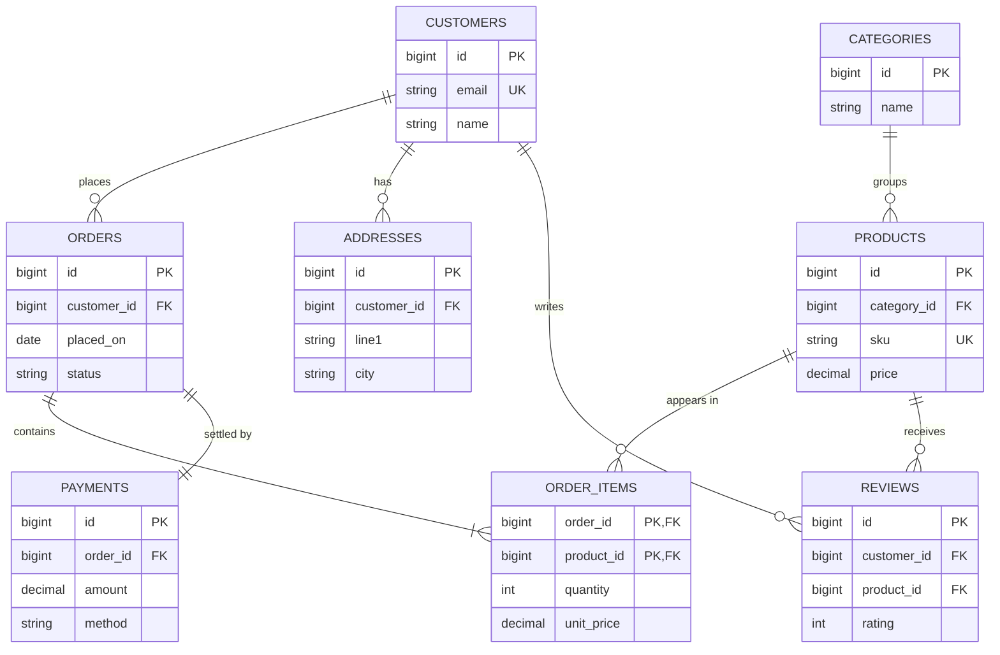
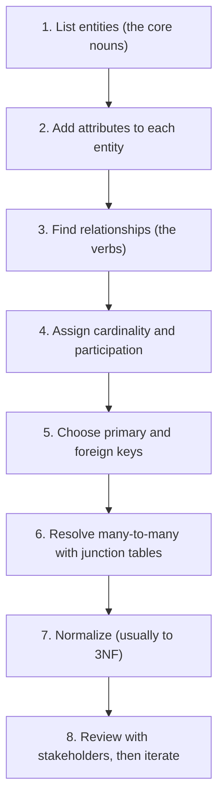

An **Entity-Relationship (ER) model** is the blueprint you draw *before* writing a single
`CREATE TABLE`. It captures the **entities** (things), their **attributes** (properties), and the
**relationships** between them — with **cardinality** saying how many relate to how many.

## The vocabulary

| Term | Meaning | Example |
|------|---------|---------|
| **Entity** | a thing we store rows about | `Customer`, `Order` |
| **Attribute** | a property of an entity | `email`, `price` |
| **Relationship** | an association between entities | *Customer **places** Order* |
| **Cardinality** | how many on each side relate | one customer → many orders |
| **Participation** | is the relationship optional or mandatory | every order **must** have a customer |
| **Weak entity** | cannot be identified without its parent | `OrderItem` inside an `Order` |

## Attribute flavours

| Attribute type | Meaning | Example |
|----------------|---------|---------|
| **Simple** | atomic, indivisible | `age` |
| **Composite** | splits into parts | `address` → street, city, zip |
| **Derived** | computed from others | `age` from `birth_date` |
| **Multivalued** | many values per entity | `phone_numbers` |
| **Key** | uniquely identifies the entity | `customer_id` |

## Reading cardinality (crow's foot)

The symbols on each end of a line encode "how many". This is exactly the notation Mermaid draws:

| Notation | Reads as | Meaning |
|----------|----------|---------|
| `\|\|--\|\|` | one to one | exactly one on each side |
| `\|\|--o{` | one to zero-or-many | optional many |
| `\|\|--\|{` | one to one-or-many | mandatory many |
| `}o--o{` | many to many | needs a junction table |

## A realistic e-commerce model

Read the crow's feet: one **CUSTOMERS** places many **ORDERS**; each **ORDER** is settled by
exactly one **PAYMENT** (1:1); **ORDER_ITEMS** is the junction that resolves the many-to-many
between **ORDERS** and **PRODUCTS**.



:::gotcha
There is no such thing as a many-to-many *table* relationship in SQL. You resolve it with a
**junction (associative) table** — here `ORDER_ITEMS` — whose composite key is the two foreign
keys. That turns one many-to-many into two clean one-to-many relationships.
:::

## The modeling process

Work top-down: nouns first, then how they connect, then keys, then normalize.



## Check yourself

```quiz
title: ER modeling
questions:
  - q: 'A `CUSTOMER` has many `ORDERS`, and each `ORDER` belongs to exactly one `CUSTOMER`. This is a...'
    options:
      - 'many-to-many'
      - text: 'one-to-many'
        correct: true
      - 'one-to-one'
    explain: 'One customer relates to many orders; each order relates to exactly one customer. Model it with a customer_id foreign key on orders.'
  - q: 'How do you implement a many-to-many relationship such as `Orders` ↔ `Products`?'
    options:
      - text: 'Add a junction table holding both foreign keys as a composite key'
        correct: true
      - 'Put a comma-separated list column on one side'
      - 'Merge the two tables into one'
    explain: 'A junction table (order_items) with (order_id, product_id) as its composite key resolves the many-to-many into two one-to-many relationships.'
  - q: 'In crow-foot notation, what does `||--o{` mean?'
    options:
      - text: 'One to zero-or-many (optional many)'
        correct: true
      - 'One to exactly one'
      - 'Many to many'
    explain: 'The || end means exactly one; the o{ end means zero-or-many. So one parent relates to zero or more children.'
  - q: 'What is the **first** step when building an ER model?'
    options:
      - text: 'Identify the entities — the core nouns you must store'
        correct: true
      - 'Choose which columns to index'
      - 'Denormalize for read speed'
    explain: 'Start with entities (nouns), then attributes, then relationships (verbs) and their cardinalities. Indexing and denormalization come much later.'
```

:::key
Entities = **nouns**, relationships = **verbs**, cardinality = **how many**. Draw the ER model
first, resolve every many-to-many into a **junction table**, then translate it into `CREATE TABLE`s.
:::
