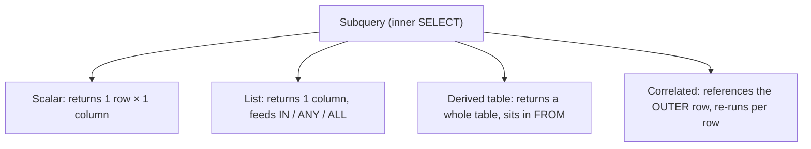

A **subquery** is a `SELECT` nested inside another statement. Where it sits — and whether it
points back at the outer query — changes *everything* about how it runs.

## The four shapes of a subquery



## The sample data

Two tables — four employees across two departments:

| employees.id | name | dept_id | salary |   | departments.id | name |
|:---:|:---|:---:|:---:|---|:---:|:---|
| 1 | Ada  | 10 | 90 |   | 10 | Engineering |
| 2 | Bo   | 10 | 60 |   | 20 | Sales |
| 3 | Cara | 20 | 80 |   |    |  |
| 4 | Dan  | 20 | 100 |  |    |  |

## See each shape run

````tabs
tabs:
  - label: Scalar
    body: |
      Returns **one value**, usable anywhere a value is — here, next to every row.
      ```sql
      SELECT name, salary,
             (SELECT AVG(salary) FROM employees) AS company_avg
      FROM employees;
      ```
      | name | salary | company_avg |
      |------|:---:|:---:|
      | Ada  | 90  | 82.5 |
      | Bo   | 60  | 82.5 |
      | Cara | 80  | 82.5 |
      | Dan  | 100 | 82.5 |
  - label: IN (list)
    body: |
      The subquery returns a **column of values**; the outer row is kept if it matches one.
      ```sql
      SELECT name FROM employees
      WHERE dept_id IN (
        SELECT id FROM departments WHERE name = 'Engineering'
      );
      ```
      | name |
      |------|
      | Ada  |
      | Bo   |
  - label: EXISTS
    body: |
      Tests whether **any row exists** — the `SELECT` list is ignored (use `SELECT 1`).
      ```sql
      SELECT d.name FROM departments d
      WHERE EXISTS (
        SELECT 1 FROM employees e WHERE e.dept_id = d.id
      );
      ```
      | name |
      |------|
      | Engineering |
      | Sales |
  - label: Derived table
    body: |
      A subquery in `FROM` becomes a **temporary table** you can query (needs an alias).
      ```sql
      SELECT dept_id, avg_sal
      FROM (
        SELECT dept_id, AVG(salary) AS avg_sal
        FROM employees GROUP BY dept_id
      ) AS dept_stats
      WHERE avg_sal > 70;
      ```
      | dept_id | avg_sal |
      |:---:|:---:|
      | 10 | 75 |
      | 20 | 90 |
````

## Watch a CORRELATED subquery re-run per row

A correlated subquery references a column from the **outer** query, so it cannot be run once —
it is **re-evaluated for every single outer row**. Here we find employees paid above *their own
department's* average.

```walkthrough
title: 'Above-department-average — the inner query runs 4 times'
code: |
  SELECT name, salary
  FROM employees e
  WHERE salary > (
    SELECT AVG(salary)
    FROM employees
    WHERE dept_id = e.dept_id
  );
steps:
  - text: 'Outer rows, in order. The inner query re-runs for **each** one, filtered by that row''s `dept_id`.'
    array: [90, 60, 80, 100]
    pointers: { 0: 'Ada·10', 1: 'Bo·10', 2: 'Cara·20', 3: 'Dan·20' }
    line: 3
  - text: 'Row **Ada** (dept 10). Inner runs → AVG of dept 10 = (90+60)/2 = **75**. Is 90 > 75? **Yes → keep.**'
    array: [90, 60, 80, 100]
    highlight: [0]
    pointers: { 0: 'avg=75' }
    line: 4
  - text: 'Row **Bo** (dept 10). Inner runs **again** → AVG = **75**. Is 60 > 75? No → drop.'
    array: [90, 60, 80, 100]
    highlight: [1]
    sorted: [0]
    pointers: { 1: 'avg=75' }
    line: 4
  - text: 'Row **Cara** (dept 20). Inner runs **again** → AVG of dept 20 = (80+100)/2 = **90**. Is 80 > 90? No → drop.'
    array: [90, 60, 80, 100]
    highlight: [2]
    sorted: [0]
    pointers: { 2: 'avg=90' }
    line: 4
  - text: 'Row **Dan** (dept 20). Inner runs a **4th** time → AVG = **90**. Is 100 > 90? **Yes → keep.**'
    array: [90, 60, 80, 100]
    highlight: [3]
    sorted: [0]
    pointers: { 3: 'avg=90' }
    line: 4
  - text: 'Result = **Ada** and **Dan**. The inner query executed once per outer row — the price of correlation.'
    array: [90, 60, 80, 100]
    sorted: [0, 3]
    line: 1
```

:::senior
That re-run-per-row cost is why correlated subqueries can be slow. The planner often rewrites
them into a **semi-join** (for `EXISTS`) or a hashed aggregate, but not always — a window
function or a joined derived table is frequently faster and clearer.
:::

## IN vs EXISTS

|  | `IN (subquery)` | `EXISTS (subquery)` |
|---|---|---|
| Tests | value is in a returned list | at least one row exists |
| Subquery result | a column of values | rows (SELECT list ignored) |
| Short-circuits | no — materializes the list | yes — stops at first match |
| Correlation | usually uncorrelated | usually correlated |
| Handles `NULL` well | **`NOT IN` breaks** on NULL | `NOT EXISTS` is NULL-safe |

## The NOT IN + NULL trap

```sql
-- departments.manager_id contains a NULL somewhere...
SELECT name FROM employees
WHERE dept_id NOT IN (SELECT manager_id FROM departments);
-- 😱 returns ZERO rows
```

:::gotcha
`x NOT IN (1, NULL)` expands to `x <> 1 AND x <> NULL`. Comparing anything to `NULL` yields
**UNKNOWN**, so the `AND` can never be TRUE — the whole predicate silently rejects every row.
`IN` with a NULL is merely useless; `NOT IN` is actively **wrong**. Fix it with `NOT EXISTS`
(NULL-safe) or by adding `WHERE manager_id IS NOT NULL` to the subquery.
:::

```flashcards
title: 'Subquery recall'
cards:
  - front: 'A subquery in the `FROM` clause is called a…'
    back: '**Derived table** (or inline view). It must have an alias.'
  - front: 'How many times does a correlated subquery execute?'
    back: 'Conceptually **once per outer row** — it depends on the outer row''s values.'
  - front: 'Why prefer `NOT EXISTS` over `NOT IN`?'
    back: '`NOT EXISTS` is **NULL-safe**; `NOT IN` returns no rows if the list contains any NULL.'
  - front: 'What must a **scalar** subquery return?'
    back: 'At most **one row and one column** — more than one row raises a runtime error; zero rows yields `NULL`.'
```

## Check yourself

```quiz
title: 'Subquery intuition'
questions:
  - q: 'In the correlated example above, how many times does the inner `AVG` query run?'
    options:
      - '1 — the planner caches it'
      - '2 — once per department'
      - text: '4 — once per outer employee row'
        correct: true
    explain: 'A correlated subquery re-evaluates for **every outer row**. Four employees → four executions.'
  - q: 'A subquery in the `FROM` clause is a…'
    options:
      - 'Scalar subquery'
      - text: 'Derived table (needs an alias)'
        correct: true
      - 'Correlated subquery'
    explain: 'A `SELECT` inside `FROM` produces a temporary result set — a derived table — which must be aliased.'
  - q: 'The subquery `SELECT manager_id FROM departments` returns a NULL. What does `dept_id NOT IN (...)` return?'
    options:
      - 'All employees'
      - 'Only employees with a non-null dept_id'
      - text: 'No rows at all'
        correct: true
    explain: 'Any NULL in a `NOT IN` list makes the predicate UNKNOWN for every row, so nothing is returned. Use `NOT EXISTS`.'
  - q: 'Which returns a value you can place in a `SELECT` list next to other columns?'
    options:
      - text: 'A scalar subquery'
        correct: true
      - 'An EXISTS subquery'
      - 'A derived table'
    explain: 'Only a scalar subquery (one row, one column) can stand in for a single value in the SELECT list.'
```

:::key
**Scalar** = one value. **List** feeds `IN`/`ANY`. **Derived table** sits in `FROM` (needs an
alias). **Correlated** references the outer row and re-runs per row. Never use `NOT IN` against a
subquery that can produce `NULL` — reach for `NOT EXISTS`.
:::
