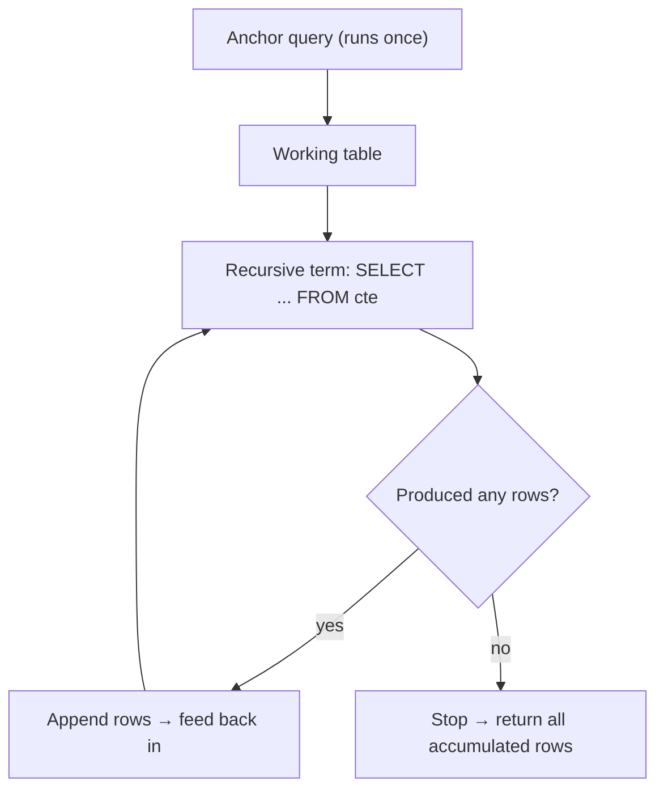

A **CTE** (Common Table Expression) is a named, temporary result set defined with `WITH`, usable
only in the statement that follows. Think of it as a **derived table with a name** — the same
power, far more readable.

## Nested subquery vs CTE — same result, cleaner shape

````tabs
tabs:
  - label: Nested subquery
    body: |
      Logic reads **inside-out**; the derived table has no name.
      ```sql
      SELECT e.name, e.salary, d.avg_sal
      FROM employees e
      JOIN (
        SELECT dept_id, AVG(salary) AS avg_sal
        FROM employees GROUP BY dept_id
      ) d ON d.dept_id = e.dept_id
      WHERE e.salary > d.avg_sal;
      ```
  - label: CTE (WITH)
    body: |
      Logic reads **top-down**; `dept_avg` is named and reusable.
      ```sql
      WITH dept_avg AS (
        SELECT dept_id, AVG(salary) AS avg_sal
        FROM employees GROUP BY dept_id
      )
      SELECT e.name, e.salary, d.avg_sal
      FROM employees e
      JOIN dept_avg d ON d.dept_id = e.dept_id
      WHERE e.salary > d.avg_sal;
      ```
````

:::tip
You can chain multiple CTEs with commas — each can reference the ones **above** it, letting you
build a query as a readable pipeline: `WITH a AS (...), b AS (SELECT ... FROM a) SELECT ...`.
:::

## Recursive CTEs — the two-part engine

A `WITH RECURSIVE` CTE has an **anchor** (runs once) and a **recursive term** (references the CTE
itself, runs repeatedly), combined with `UNION [ALL]`. It stops when the recursive term produces
no new rows.



## Watch a recursive CTE build 1..5

```walkthrough
title: 'Generating a series with WITH RECURSIVE'
code: |
  WITH RECURSIVE nums AS (
    SELECT 1 AS n              -- anchor
    UNION ALL
    SELECT n + 1 FROM nums     -- recursive term
    WHERE n < 5
  )
  SELECT n FROM nums;
steps:
  - text: 'The **anchor** runs once, seeding the working table with a single row: `n = 1`.'
    array: [1]
    highlight: [0]
    line: 2
  - text: 'Recursive term takes the last row (`n=1`). Since 1 < 5, emit `n+1 = 2` and append it.'
    array: [1, 2]
    highlight: [1]
    sorted: [0]
    line: 4
  - text: 'Repeat with `n=2`. 2 < 5 → emit **3**.'
    array: [1, 2, 3]
    highlight: [2]
    sorted: [0, 1]
    line: 4
  - text: 'Repeat with `n=3`. 3 < 5 → emit **4**.'
    array: [1, 2, 3, 4]
    highlight: [3]
    sorted: [0, 1, 2]
    line: 4
  - text: 'Repeat with `n=4`. 4 < 5 → emit **5**.'
    array: [1, 2, 3, 4, 5]
    highlight: [4]
    sorted: [0, 1, 2, 3]
    line: 4
  - text: 'Now `n=5`. The `WHERE n < 5` guard fails → **no new rows** → recursion stops.'
    array: [1, 2, 3, 4, 5]
    sorted: [0, 1, 2, 3, 4]
    line: 5
  - text: 'Final result: the accumulated rows **1, 2, 3, 4, 5**.'
    array: [1, 2, 3, 4, 5]
    sorted: [0, 1, 2, 3, 4]
    line: 6
```

:::gotcha
Forget the termination condition (`WHERE n < 5`) and the recursion never ends — an **infinite
loop**. Engines differ: SQL Server caps it by default (`MAXRECURSION 100`), but Postgres has **no**
default depth limit — it runs until it exhausts memory/temp disk (or hits `statement_timeout`), so
always write a guard that will eventually be false.
:::

## Real use: walking an org hierarchy

The killer app for recursive CTEs is tree traversal — "give me everyone under the CEO, with their
depth." Each iteration descends one level.

```sql
WITH RECURSIVE org AS (
  SELECT id, name, manager_id, 1 AS depth   -- anchor: the CEO (no manager)
  FROM employees WHERE manager_id IS NULL
  UNION ALL
  SELECT e.id, e.name, e.manager_id, o.depth + 1   -- descend one level
  FROM employees e
  JOIN org o ON e.manager_id = o.id
)
SELECT depth, name FROM org ORDER BY depth;
```

| depth | name |
|:---:|:---|
| 1 | Ada (CEO) |
| 2 | Bo |
| 2 | Cara |
| 3 | Dan |

```flashcards
title: 'CTE recall'
cards:
  - front: 'What keyword introduces a CTE?'
    back: '`WITH name AS ( ... )`, placed before the main `SELECT`.'
  - front: 'The two parts of a recursive CTE are…'
    back: 'The **anchor** (base case, runs once) and the **recursive term** (references the CTE), joined by `UNION [ALL]`.'
  - front: 'When does a recursive CTE stop?'
    back: 'When the recursive term returns **no new rows**.'
  - front: 'CTE vs derived table — key difference?'
    back: 'A CTE is **named** (and reusable / self-referencing); a derived table is anonymous and inline.'
```

## Check yourself

```quiz
title: 'CTE intuition'
questions:
  - q: 'In the 1..5 walkthrough, what makes the recursion stop?'
    options:
      - 'It reaches exactly 5 rows'
      - text: 'The `WHERE n < 5` guard fails, so the recursive term returns no new rows'
        correct: true
      - 'UNION ALL removes duplicates'
    explain: 'Recursion ends when the recursive term produces zero new rows — here when `n = 5` fails `n < 5`.'
  - q: 'Which part of a recursive CTE runs exactly once?'
    options:
      - text: 'The anchor'
        correct: true
      - 'The recursive term'
      - 'The final SELECT list'
    explain: 'The anchor seeds the working table a single time; the recursive term repeats until exhausted.'
  - q: 'A CTE defined with `WITH` is visible…'
    options:
      - 'To every query in the session'
      - text: 'Only within the single statement that follows it'
        correct: true
      - 'Until you DROP it'
    explain: 'CTEs are scoped to the statement — they are not persisted objects like views or tables.'
  - q: 'Compared to a nested subquery, a CTE mainly improves…'
    options:
      - 'Raw performance in every engine'
      - text: 'Readability and reuse (naming a subquery, referencing it more than once)'
        correct: true
      - 'Storage — it caches results to disk'
    explain: 'A CTE names a subquery so it reads top-down and can be referenced repeatedly; performance is usually similar.'
```

:::key
`WITH name AS (...)` names a subquery for readability and reuse. `WITH RECURSIVE` = **anchor** +
**recursive term** joined by `UNION`, ideal for hierarchies and series. It halts when the
recursive term yields no new rows — always give it a terminating condition.
:::
