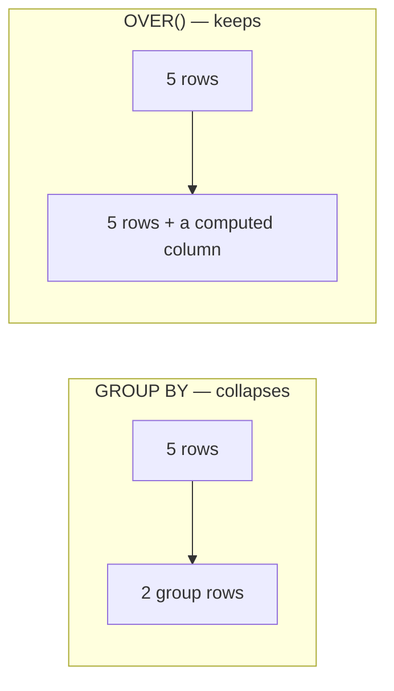

A **window function** computes across a set of rows *related to the current row* — but, unlike
`GROUP BY`, it **keeps every row**. This is the highest-value advanced SQL skill in interviews, so
we will *see* it work.

## Aggregate vs window — the core difference



| | `GROUP BY` | Window `OVER()` |
|---|---|---|
| Row count | collapses to one per group | **every input row kept** |
| Detail + aggregate together | no | **yes** |
| Where it goes | whole query | just that expression |

## Anatomy of the OVER() clause

```sql
SUM(amount) OVER (
  PARTITION BY region     -- 1. split rows into independent windows
  ORDER BY day            -- 2. order rows inside each window
  ROWS BETWEEN ...        -- 3. (optional) frame: which rows count
)
```

| Piece | Meaning | Omit it and… |
|-------|---------|--------------|
| `PARTITION BY` | groups rows into windows | one window = the whole result |
| `ORDER BY` | orders rows in the window | function sees the whole partition at once |
| frame (`ROWS`/`RANGE`) | which rows around the current one | defaults apply (see frames below) |

## The ranking trio — ROW_NUMBER vs RANK vs DENSE_RANK

They differ **only on ties**. Given scores `90, 90, 80, 70` ordered descending:

| name | score | `ROW_NUMBER` | `RANK` | `DENSE_RANK` |
|------|:---:|:---:|:---:|:---:|
| Ada  | 90 | 1 | 1 | 1 |
| Bo   | 90 | 2 | **1** | **1** |
| Cara | 80 | 3 | **3** | **2** |
| Dan  | 70 | 4 | 4 | 3 |

````tabs
tabs:
  - label: ROW_NUMBER
    body: |
      **Always unique**, 1..N — ties are broken arbitrarily. Great for "pick exactly one per group".
      ```sql
      SELECT name, score,
             ROW_NUMBER() OVER (ORDER BY score DESC) AS rn
      FROM scores;
      ```
      | name | rn |
      |------|:---:|
      | Ada  | 1 |
      | Bo   | 2 |
      | Cara | 3 |
      | Dan  | 4 |
  - label: RANK
    body: |
      Ties share a rank, then it **skips** — note the gap (no 2).
      ```sql
      SELECT name, score,
             RANK() OVER (ORDER BY score DESC) AS rnk
      FROM scores;
      ```
      | name | rnk |
      |------|:---:|
      | Ada  | 1 |
      | Bo   | 1 |
      | Cara | 3 |
      | Dan  | 4 |
  - label: DENSE_RANK
    body: |
      Ties share a rank, **no gap** — the next value is +1.
      ```sql
      SELECT name, score,
             DENSE_RANK() OVER (ORDER BY score DESC) AS drnk
      FROM scores;
      ```
      | name | drnk |
      |------|:---:|
      | Ada  | 1 |
      | Bo   | 1 |
      | Cara | 2 |
      | Dan  | 3 |
````

:::key
`ROW_NUMBER` = unique 1..N. `RANK` = tie, then **skip** (1,1,3). `DENSE_RANK` = tie, **no skip**
(1,1,2). Interview favourite: "top N per group" → `ROW_NUMBER() OVER (PARTITION BY g ORDER BY x)`.
:::

## Watch a running total accumulate per partition

`SUM(...) OVER (PARTITION BY region ORDER BY day)` gives a **running total** that **resets at each
partition boundary**. Sales: West = 100, 50, 75 · East = 200, 60.

```walkthrough
title: 'Running total — resets when the partition changes'
code: |
  SELECT region, day, amount,
         SUM(amount) OVER (
           PARTITION BY region
           ORDER BY day
         ) AS running_total
  FROM sales;
steps:
  - text: '`PARTITION BY region` splits the 5 rows into **two independent windows**: West (0–2) and East (3–4).'
    array: [100, 50, 75, 200, 60]
    pointers: { 0: 'West', 1: 'West', 2: 'West', 3: 'East', 4: 'East' }
    line: 4
  - text: 'Enter the **West** window. The running total resets to **0** and we walk it in `day` order.'
    array: [100, 50, 75, 200, 60]
    highlight: [0, 1, 2]
    line: 5
  - text: 'Row 0: running = 0 + 100 = **100**.'
    array: [100, 50, 75, 200, 60]
    highlight: [0]
    pointers: { 0: '100' }
    line: 2
  - text: 'Row 1: running = 100 + 50 = **150**.'
    array: [100, 50, 75, 200, 60]
    highlight: [1]
    sorted: [0]
    pointers: { 0: '100', 1: '150' }
    line: 2
  - text: 'Row 2: running = 150 + 75 = **225**. West window done.'
    array: [100, 50, 75, 200, 60]
    highlight: [2]
    sorted: [0, 1]
    pointers: { 0: '100', 1: '150', 2: '225' }
    line: 2
  - text: 'New partition → **East**. The running total **resets to 0** — this is the whole point of `PARTITION BY`.'
    array: [100, 50, 75, 200, 60]
    highlight: [3, 4]
    sorted: [0, 1, 2]
    pointers: { 0: '100', 1: '150', 2: '225' }
    line: 4
  - text: 'Row 3: running = 0 + 200 = **200**.'
    array: [100, 50, 75, 200, 60]
    highlight: [3]
    sorted: [0, 1, 2]
    pointers: { 0: '100', 1: '150', 2: '225', 3: '200' }
    line: 2
  - text: 'Row 4: running = 200 + 60 = **260**. Every row kept, each with its own running total above it.'
    array: [100, 50, 75, 200, 60]
    highlight: [4]
    sorted: [0, 1, 2, 3]
    pointers: { 0: '100', 1: '150', 2: '225', 3: '200', 4: '260' }
    line: 2
```

## LAG and LEAD — peek at neighbouring rows

`LAG(col, n)` reads the row *n* before; `LEAD(col, n)` reads *n* after — perfect for
row-over-row deltas.

```sql
SELECT day, amount,
       LAG(amount) OVER (ORDER BY day)              AS prev_day,
       amount - LAG(amount) OVER (ORDER BY day)     AS change
FROM sales_west;
```

| day | amount | prev_day | change |
|:---:|:---:|:---:|:---:|
| 1 | 100 | NULL | NULL |
| 2 | 50  | 100  | -50 |
| 3 | 75  | 50   | +25 |

## Frames — which rows the window "sees"

The frame narrows the window relative to the current row. A big interview gotcha lives in the
**default frame**:

```sql
-- running total (default frame when ORDER BY is present):
SUM(x) OVER (ORDER BY day)
-- ≡ ... RANGE BETWEEN UNBOUNDED PRECEDING AND CURRENT ROW

-- moving 3-row average:
AVG(x) OVER (ORDER BY day ROWS BETWEEN 2 PRECEDING AND CURRENT ROW)
```

:::gotcha
Add `ORDER BY` to an aggregate window and the default frame becomes `RANGE UNBOUNDED PRECEDING …
CURRENT ROW` — turning `SUM` into a **running total**, not a partition-wide total. Want the grand
total on every row? Use `PARTITION BY` **without** `ORDER BY`, or an explicit
`ROWS BETWEEN UNBOUNDED PRECEDING AND UNBOUNDED FOLLOWING`.
:::

```flashcards
title: 'Window function recall'
cards:
  - front: 'Difference between `GROUP BY` and a window function?'
    back: '`GROUP BY` collapses rows; a window function keeps **every row** and adds a computed column.'
  - front: '`RANK` vs `DENSE_RANK` on ties `90, 90, 80`?'
    back: '`RANK` → 1, 1, **3** (skips). `DENSE_RANK` → 1, 1, **2** (no skip).'
  - front: 'What does `PARTITION BY` do to a running total?'
    back: 'It **resets** the accumulation at every partition boundary.'
  - front: '`LAG(amount) OVER (ORDER BY day)` returns…'
    back: 'The `amount` from the **previous** row in day order (NULL for the first row).'
  - front: 'Adding `ORDER BY` to `SUM() OVER()` does what?'
    back: 'Changes the default frame to `UNBOUNDED PRECEDING → CURRENT ROW`, making it a **running total**.'
```

## Check yourself

```quiz
title: 'Window function mastery'
questions:
  - q: 'For scores `95, 95, 90` ordered descending, what does `RANK()` return?'
    options:
      - '1, 2, 3'
      - text: '1, 1, 3'
        correct: true
      - '1, 1, 2'
    explain: 'RANK gives ties the same rank, then **skips** — so after two 1s the next is 3, not 2. (That 1,1,2 pattern is DENSE_RANK.)'
  - q: 'In the running-total walkthrough, why does East start at 200 and not 425?'
    options:
      - 'ORDER BY resets the sum'
      - text: 'PARTITION BY region starts a fresh window, resetting the running total to 0'
        correct: true
      - 'It is a bug — it should be 425'
    explain: 'Each partition is independent. Crossing from West to East resets the accumulation, so East begins at 0 + 200.'
  - q: 'You need exactly one (the highest-paid) employee per department. Which function fits best?'
    options:
      - text: 'ROW_NUMBER() OVER (PARTITION BY dept ORDER BY salary DESC), keep rn = 1'
        correct: true
      - 'RANK() — it never produces ties'
      - 'GROUP BY dept'
    explain: 'ROW_NUMBER is unique per partition, so filtering `rn = 1` yields exactly one row even when salaries tie. RANK could return several 1s.'
  - q: 'What does a window function do to the number of rows in the result?'
    options:
      - 'Collapses them like GROUP BY'
      - text: 'Nothing — every input row is preserved'
        correct: true
      - 'Doubles them'
    explain: 'Window functions add a column computed over related rows but never remove rows — that is their defining trait.'
  - q: 'Which reads the value from the *next* row in order?'
    options:
      - 'LAG(x)'
      - text: 'LEAD(x)'
        correct: true
      - 'FIRST_VALUE(x)'
    explain: 'LEAD looks forward (next row); LAG looks backward (previous row).'
```

:::senior
Window functions run **after** `WHERE`/`GROUP BY`/`HAVING` but **before** the final `ORDER BY`, so
you cannot filter on a window result in `WHERE` — wrap the query in a CTE/derived table and filter
outside (e.g. `WHERE rn = 1`). This "compute-then-filter" pattern is the backbone of top-N-per-group
and deduplication queries.
:::
