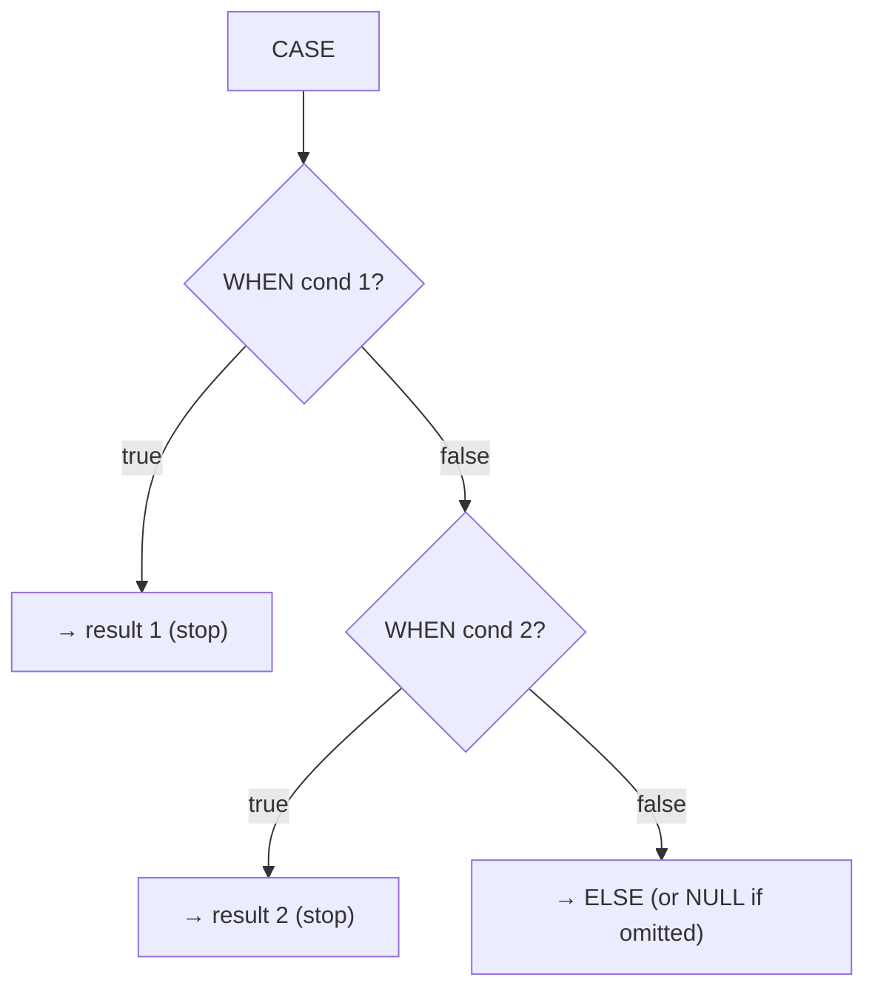

SQL has no `if` statement in a query — instead a small family of expressions handles branching and
`NULL`s. Here they are at a glance, with inputs and outputs side by side.

## The toolkit at a glance

| Expression | Does | Example | Result |
|------------|------|---------|:---:|
| `CASE` | multi-branch if/else | `CASE WHEN x>0 THEN 'pos' ELSE 'neg' END` | `'pos'` |
| `COALESCE(a,b,…)` | first non-NULL argument | `COALESCE(NULL, NULL, 5)` | `5` |
| `NULLIF(a,b)` | NULL if `a = b`, else `a` | `NULLIF(10, 10)` | `NULL` |
| `GREATEST(…)` | largest of the arguments | `GREATEST(3, 9, 5)` | `9` |
| `LEAST(…)` | smallest of the arguments | `LEAST(3, 9, 5)` | `3` |

## CASE — searched vs simple

```sql
-- Searched CASE: each WHEN is a full condition (most flexible)
SELECT name, salary,
  CASE
    WHEN salary >= 100 THEN 'senior'
    WHEN salary >= 70  THEN 'mid'
    ELSE 'junior'
  END AS band
FROM employees;

-- Simple CASE: compares one expression to values
SELECT name,
  CASE dept_id
    WHEN 10 THEN 'Engineering'
    WHEN 20 THEN 'Sales'
    ELSE 'Other'
  END AS dept
FROM employees;
```



:::gotcha
`CASE` returns the **first** matching branch, top to bottom — order your `WHEN`s from most to
least specific. Omit `ELSE` and unmatched rows return `NULL`, not `0` or `''`.
:::

## COALESCE and NULLIF — taming NULL

```sql
-- COALESCE: supply a default for missing data
SELECT name, COALESCE(phone, email, 'no contact') AS contact FROM users;

-- NULLIF: classic divide-by-zero guard
SELECT revenue / NULLIF(orders, 0) AS avg_order_value FROM stats;
--                        ^ if orders = 0 → NULL → no error (result is NULL, not a crash)
```

| Call | Result | Why |
|------|:---:|-----|
| `COALESCE(NULL, 'x', 'y')` | `'x'` | first non-NULL, left to right |
| `COALESCE(NULL, NULL)` | `NULL` | all arguments were NULL |
| `NULLIF(5, 5)` | `NULL` | the two are equal |
| `NULLIF(5, 0)` | `5` | not equal → returns the first |

## Pivot rows into columns with CASE

The most-loved interview trick: turn "long" rows into a "wide" report by wrapping a `CASE` in an
aggregate — one `SUM(CASE …)` per output column.

````tabs
tabs:
  - label: Long (raw rows)
    body: |
      One row per region-per-quarter.
      | region | quarter | amount |
      |--------|:---:|:---:|
      | West | Q1 | 100 |
      | West | Q2 | 150 |
      | East | Q1 | 200 |
      | East | Q2 | 90 |
  - label: The pivot query
    body: |
      Each `SUM(CASE …)` collapses one quarter into its own column.
      ```sql
      SELECT region,
        SUM(CASE WHEN quarter = 'Q1' THEN amount ELSE 0 END) AS q1,
        SUM(CASE WHEN quarter = 'Q2' THEN amount ELSE 0 END) AS q2
      FROM sales
      GROUP BY region;
      ```
  - label: Wide (pivoted)
    body: |
      One row per region, quarters spread across columns.
      | region | q1 | q2 |
      |--------|:---:|:---:|
      | West | 100 | 150 |
      | East | 200 | 90 |
````

:::tip
Swap `SUM` for `COUNT(CASE WHEN … THEN 1 END)` to pivot **counts** instead of sums — the `CASE`
returns `NULL` for non-matching rows, and `COUNT` skips NULLs automatically.
:::

```flashcards
title: 'Conditional logic recall'
cards:
  - front: '`COALESCE(NULL, 0, 5)` returns…'
    back: '**0** — the first non-NULL argument, scanning left to right.'
  - front: 'Why `x / NULLIF(y, 0)`?'
    back: 'If `y = 0`, `NULLIF` yields `NULL`, so the division returns `NULL` instead of a **divide-by-zero error**.'
  - front: 'A `CASE` with no matching `WHEN` and no `ELSE` returns…'
    back: '`NULL`.'
  - front: '`GREATEST(3, NULL, 9)` in most databases returns…'
    back: 'Usually `NULL` — any NULL argument makes the result NULL (engine-dependent, unlike `MAX` the aggregate).'
```

## Check yourself

```quiz
title: 'Conditional logic'
questions:
  - q: 'What does `COALESCE(NULL, NULL, 3, 4)` return?'
    options:
      - '4'
      - 'NULL'
      - text: '3'
        correct: true
    explain: 'COALESCE returns the first non-NULL argument scanning left to right → 3.'
  - q: 'Why wrap a divisor in `NULLIF(divisor, 0)`?'
    options:
      - 'To speed up the division'
      - text: 'To turn a zero divisor into NULL and avoid a divide-by-zero error'
        correct: true
      - 'To round the result'
    explain: 'NULLIF(x, 0) is NULL when x is 0, so the division yields NULL rather than raising an error.'
  - q: 'A searched `CASE` matches multiple WHEN conditions. Which branch wins?'
    options:
      - 'The last matching WHEN'
      - text: 'The first matching WHEN, top to bottom'
        correct: true
      - 'All of them, concatenated'
    explain: 'CASE evaluates WHENs in order and returns the first that is true, then stops.'
  - q: 'To pivot quarterly sales into one column per quarter, you typically use…'
    options:
      - 'A recursive CTE'
      - text: 'SUM(CASE WHEN quarter = ... THEN amount ELSE 0 END), one per column'
        correct: true
      - 'COALESCE for each quarter'
    explain: 'Conditional aggregation — an aggregate wrapping a CASE — is the portable way to pivot rows into columns.'
```

:::key
`CASE` = branching (first true `WHEN` wins, else `NULL`). `COALESCE` = first non-NULL default.
`NULLIF(a,b)` = `NULL` when equal (divide-by-zero guard). `GREATEST`/`LEAST` = row-wise max/min.
Pivot with `SUM(CASE WHEN … THEN … END)`.
:::
