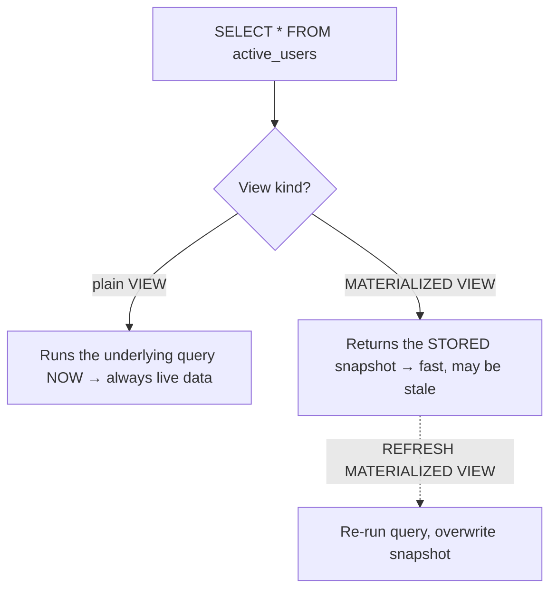

A **view** is a named, stored `SELECT`. It behaves like a table you can query, but it stores no
data of its own — it is a saved query. A **materialized view** *does* store the result, trading
freshness for speed.

## What happens when you read one?



## Defining one

```sql
-- Plain view: just a saved query, zero storage
CREATE VIEW active_users AS
SELECT id, name FROM users WHERE status = 'active';

-- Materialized view: query runs once, result is stored on disk
CREATE MATERIALIZED VIEW sales_by_region AS
SELECT region, SUM(amount) AS total FROM sales GROUP BY region;

REFRESH MATERIALIZED VIEW sales_by_region;   -- recompute the snapshot
```

## View vs Materialized view

````tabs
tabs:
  - label: Plain VIEW
    body: |
      A **virtual** table — the query re-executes on every read, so data is always current.
      ```sql
      CREATE VIEW active_users AS
      SELECT id, name FROM users WHERE status = 'active';
      ```
      | Trait | Value |
      |-------|-------|
      | Stores data? | **No** — just the query text |
      | Freshness | **Always live** |
      | Read speed | Cost of the underlying query, every time |
      | Good for | Simplifying/securing access to live data |
  - label: MATERIALIZED VIEW
    body: |
      A **physical** snapshot — reads are fast, but the data is only as fresh as the last refresh.
      ```sql
      CREATE MATERIALIZED VIEW sales_by_region AS
      SELECT region, SUM(amount) AS total
      FROM sales GROUP BY region;
      ```
      | Trait | Value |
      |-------|-------|
      | Stores data? | **Yes** — result on disk |
      | Freshness | **Stale** until you `REFRESH` |
      | Read speed | **Fast** — no recomputation |
      | Good for | Expensive aggregations read far more than they change |
````

| | Plain view | Materialized view |
|---|---|---|
| Storage | none (query only) | stores the result set |
| Data freshness | always current | as of last `REFRESH` |
| Read cost | recomputes each time | cheap lookup |
| Can be indexed | no (it is not stored) | **yes** |
| Write cost | none | refresh recomputes |

## Updatable views

An `INSERT`/`UPDATE`/`DELETE` on a **plain** view can pass through to the base table — but only if
the view maps cleanly to **one** row source.

```sql
CREATE VIEW active_users AS
SELECT id, name, status FROM users WHERE status = 'active'
WITH CHECK OPTION;   -- reject writes that would fall outside the view's WHERE
```

| A view is generally **updatable** when it has… | Generally **not** updatable with… |
|---|---|
| a single base table | `JOIN` across tables |
| no aggregate / `GROUP BY` | `SUM`, `COUNT`, `GROUP BY`, `HAVING` |
| no `DISTINCT` | `DISTINCT`, `UNION` |
| every required (NOT NULL) column present | window functions, computed-only columns |

:::gotcha
`WITH CHECK OPTION` stops the classic "row vanishes on insert" surprise: without it you can insert
a row through `active_users` with `status = 'inactive'` — it lands in the base table but instantly
disappears from the view because it fails the view's `WHERE`.
:::

:::senior
For complex, non-updatable views (joins, aggregates), most engines let you attach an `INSTEAD OF`
trigger that translates writes into the right base-table operations — the view stays read-friendly
while writes still work.
:::

```flashcards
title: 'Views recall'
cards:
  - front: 'Does a plain view store data?'
    back: 'No — it stores only the query. It re-runs on every read, so it is always current.'
  - front: 'How do you update a materialized view''s data?'
    back: '`REFRESH MATERIALIZED VIEW name;` — it does not update automatically.'
  - front: 'What blocks a view from being updatable?'
    back: 'Joins, aggregates/`GROUP BY`, `DISTINCT`, `UNION`, or window functions — anything that breaks the 1:1 row mapping to one base table.'
  - front: 'Why add `WITH CHECK OPTION`?'
    back: 'It rejects inserts/updates that would produce rows failing the view''s `WHERE` (rows that would immediately vanish).'
```

## Check yourself

```quiz
title: 'View intuition'
questions:
  - q: 'You query a plain view. Where does the data come from?'
    options:
      - 'A stored copy inside the view'
      - text: 'The underlying tables, re-queried right now'
        correct: true
      - 'A cached snapshot from creation time'
    explain: 'A plain view stores only the query; reading it re-runs that query against the live base tables.'
  - q: 'A materialized view returns yesterday''s numbers. Why?'
    options:
      - 'The base table is corrupt'
      - text: 'Its stored snapshot has not been refreshed since yesterday'
        correct: true
      - 'Materialized views cannot show aggregates'
    explain: 'A materialized view serves its stored result until you REFRESH it, so it can be stale.'
  - q: 'Which view is most likely NOT updatable?'
    options:
      - 'SELECT id, name FROM users WHERE active'
      - text: 'SELECT region, SUM(amount) FROM sales GROUP BY region'
        correct: true
      - 'SELECT * FROM users'
    explain: 'Aggregation with GROUP BY means a view row maps to many base rows, so writes cannot be mapped back — not updatable.'
  - q: 'The main reason to use a materialized view is…'
    options:
      - 'Always-fresh data'
      - text: 'Fast reads of an expensive query, at the cost of freshness'
        correct: true
      - 'To enforce foreign keys'
    explain: 'It stores (and can index) a precomputed result, so reads are cheap — but the data is only as current as the last refresh.'
```

:::key
Plain **view** = saved query, no storage, always live, recomputed each read. **Materialized view**
= stored snapshot, fast to read, **stale until `REFRESH`**, and indexable. Views are updatable only
when they map 1:1 to a single base table (no joins/aggregates); use `WITH CHECK OPTION` to keep
inserts inside the view.
:::
