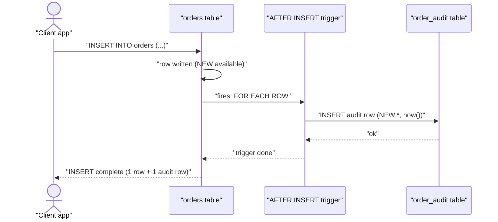

**Procedures**, **functions**, and **triggers** move logic *into* the database. Procedures and
functions are called explicitly; triggers fire **automatically** in response to data changes.

## Procedure vs function

|  | Stored procedure | Function |
|---|---|---|
| Invoked with | `CALL proc(...)` | inside a query: `SELECT fn(x)` |
| Returns | optional (out params / result sets) | **must** return a value |
| Use in `SELECT`/`WHERE`? | no | **yes** |
| Transactions | can `COMMIT` / `ROLLBACK` | usually cannot |
| Typical job | multi-step business operation | compute/derive a value |

```sql
-- Function: returns a value, usable in a query
CREATE FUNCTION order_total(o_id int) RETURNS numeric AS $$
  SELECT SUM(qty * price) FROM order_lines WHERE order_id = o_id;
$$ LANGUAGE sql;

SELECT order_total(101);   -- called inside a query

-- Procedure: performs steps, invoked with CALL
CREATE PROCEDURE archive_old_orders() LANGUAGE plpgsql AS $$
BEGIN
  INSERT INTO orders_archive SELECT * FROM orders WHERE created < now() - interval '1 year';
  DELETE FROM orders WHERE created < now() - interval '1 year';
END;
$$;

CALL archive_old_orders();
```

## Triggers — logic that fires itself

A **trigger** binds a function to a table event (`INSERT` / `UPDATE` / `DELETE`), firing
`BEFORE` or `AFTER` it, per **row** or per **statement**. The classic use is an **audit log**.

```sql
CREATE TRIGGER log_new_order
AFTER INSERT ON orders
FOR EACH ROW
EXECUTE FUNCTION write_audit();   -- inserts NEW.* into order_audit
```

## Watch a trigger fire on INSERT

The client issues one `INSERT`; the trigger transparently writes a second row into the audit
table — all inside the same transaction.



:::note
`BEFORE` triggers can **modify or reject** the row before it is written (validation, defaults);
`AFTER` triggers see the final row and are used for **side effects** like auditing or cascades.
`NEW` holds the incoming row, `OLD` the prior one (on `UPDATE`/`DELETE`).
:::

## Pros and cons — the trade-off

| ✅ Upsides | ❌ Downsides |
|-----------|-------------|
| Runs next to the data — **less round-trip latency** | Logic **hidden** from the app; easy to forget |
| **Centralizes** rules for every client | Harder to **version, test, and debug** |
| Triggers **guarantee** an action happens | **Implicit** — a simple INSERT does surprising work |
| Can encapsulate multi-step transactions | **Portability**: dialects differ (PL/pgSQL vs T-SQL vs PL/SQL) |

:::gotcha
Triggers run inside your transaction, so a slow or failing trigger makes the **original**
statement slow or fail. Avoid heavy work (external calls, big cascades) in a `FOR EACH ROW`
trigger on a hot table — it multiplies per row.
:::

:::senior
Recursive/loop triggers are a real hazard: a trigger on table A that writes to B, whose trigger
writes back to A, can loop or deadlock. Keep trigger logic minimal and one-directional, and prefer
application-level or declarative constraints when they suffice.
:::

```flashcards
title: 'Procedures & triggers recall'
cards:
  - front: 'Procedure vs function — which can be used inside a `SELECT`?'
    back: 'A **function** (it returns a value). A procedure is invoked separately with `CALL`.'
  - front: 'When does a trigger execute?'
    back: '**Automatically**, on `INSERT`/`UPDATE`/`DELETE`, either `BEFORE` or `AFTER`, per row or per statement.'
  - front: 'What do `NEW` and `OLD` refer to in a trigger?'
    back: '`NEW` = the incoming/updated row; `OLD` = the previous row (on UPDATE/DELETE).'
  - front: 'BEFORE vs AFTER trigger — typical use?'
    back: '`BEFORE` = validate/modify or reject the row. `AFTER` = side effects like auditing once the row is final.'
```

## Check yourself

```quiz
title: 'Procedures & triggers'
questions:
  - q: 'In the sequence diagram, what writes the row into order_audit?'
    options:
      - 'The client, in a second statement'
      - text: 'The AFTER INSERT trigger, automatically'
        correct: true
      - 'A scheduled job later'
    explain: 'The client issues only the INSERT into orders; the trigger fires and writes the audit row within the same transaction.'
  - q: 'Which object can you call inside a query expression, e.g. `SELECT fn(x)`?'
    options:
      - 'A stored procedure'
      - text: 'A function'
        correct: true
      - 'A trigger'
    explain: 'Functions return values and are usable in SELECT/WHERE. Procedures are invoked with CALL; triggers fire on events.'
  - q: 'You need to validate and possibly reject a row before it is stored. Which trigger timing?'
    options:
      - text: 'BEFORE INSERT/UPDATE'
        correct: true
      - 'AFTER INSERT/UPDATE'
      - 'Neither — triggers cannot reject rows'
    explain: 'A BEFORE trigger runs before the write and can alter the row or raise an error to reject it.'
  - q: 'A commonly cited downside of putting business logic in triggers is…'
    options:
      - 'They cannot access the inserted data'
      - text: 'The logic is implicit and hidden — harder to test, version, and debug'
        correct: true
      - 'They always run in a separate transaction'
    explain: 'Triggers fire invisibly on ordinary statements, so behaviour is easy to overlook and harder to test/version than app code.'
```

:::key
**Function** = returns a value, usable in queries. **Procedure** = `CALL`ed for multi-step work,
can manage transactions. **Trigger** = fires automatically on data changes (`BEFORE` to
validate/modify, `AFTER` for side effects like auditing), using `NEW`/`OLD`. Powerful but implicit
— keep trigger logic light and easy to reason about.
:::
