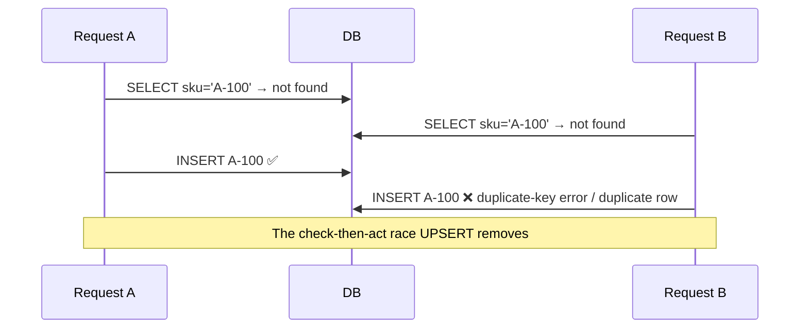

You often need *"insert this row, or update it if it already exists."* Doing that as `SELECT` then `INSERT`/`UPDATE` in application code is **racy** — two requests can both see "not there" and both insert, violating a unique constraint or duplicating data. **UPSERT** collapses it into one atomic statement.

## The dialects

Each engine spells it differently, keyed on a **unique/primary-key conflict**:

````tabs
tabs:
  - label: PostgreSQL / SQLite
    body: |
      `ON CONFLICT` names the conflicting constraint's column(s).
      ```sql
      INSERT INTO inventory (sku, qty)
      VALUES ('A-100', 5)
      ON CONFLICT (sku)
      DO UPDATE SET qty = inventory.qty + EXCLUDED.qty;  -- EXCLUDED = the row we tried to insert
      ```
      Use `DO NOTHING` to insert-if-absent and silently skip on conflict.
  - label: MySQL / MariaDB
    body: |
      `ON DUPLICATE KEY UPDATE` reacts to any unique/PK collision.
      ```sql
      INSERT INTO inventory (sku, qty)
      VALUES ('A-100', 5)
      ON DUPLICATE KEY UPDATE qty = qty + VALUES(qty);
      ```
  - label: SQL standard / Oracle / SQL Server
    body: |
      `MERGE` is the verbose, general form (also does deletes).
      ```sql
      MERGE INTO inventory AS t
      USING (SELECT 'A-100' AS sku, 5 AS qty) AS s
      ON t.sku = s.sku
      WHEN MATCHED THEN UPDATE SET t.qty = t.qty + s.qty
      WHEN NOT MATCHED THEN INSERT (sku, qty) VALUES (s.sku, s.qty);
      ```
````

## Why UPSERT, not SELECT-then-INSERT



A single `INSERT ... ON CONFLICT` lets the **database's unique index** arbitrate atomically — no race, and it's **idempotent** (safe to retry), which is exactly what you want for at-least-once message processing or sync jobs.

:::gotcha
UPSERT keys off an actual **unique or primary-key constraint** — no constraint, no conflict to detect. Also, historically some engines' `MERGE` had **concurrency anomalies** (it could still raise duplicate-key errors under contention); Postgres's `ON CONFLICT` is the race-safe choice. And beware: a busy `ON CONFLICT DO UPDATE` still **consumes auto-increment values** on the failed insert attempt in some engines.
:::

:::senior
Frame UPSERT as **idempotency at the storage layer**. When a consumer might process the same event twice (at-least-once delivery), an upsert keyed on a business/idempotency key makes the write safe to repeat. It also replaces the classic "get-or-create" round-trips with one statement, cutting latency and eliminating the TOCTOU race.
:::

## Check yourself

```quiz
title: UPSERT check
questions:
  - q: 'Why is a single UPSERT better than SELECT-then-INSERT in application code?'
    options:
      - text: 'It is atomic — the unique index arbitrates, removing the check-then-act race between concurrent requests'
        correct: true
      - 'It is the only way to insert rows'
      - 'It avoids using an index'
    explain: 'Two requests can both SELECT "not found" and both INSERT. UPSERT resolves the conflict atomically at the constraint, so it is race-free and idempotent.'
  - q: 'In PostgreSQL, what must exist for ON CONFLICT (col) to work?'
    options:
      - text: 'A unique or primary-key constraint on that column (or set of columns)'
        correct: true
      - 'A foreign key on the column'
      - 'Nothing — it works on any column'
    explain: 'ON CONFLICT detects a violation of a specific unique/PK constraint; without one there is no conflict to catch.'
  - q: 'What property makes UPSERT valuable for at-least-once event processing?'
    options:
      - text: 'Idempotency — reprocessing the same event upserts to the same state instead of duplicating rows'
        correct: true
      - 'It deletes old rows automatically'
      - 'It disables constraints'
    explain: 'Keyed on an idempotency/business key, an upsert makes a repeated write converge to the same result, so duplicate deliveries are harmless.'
```

:::key
**UPSERT** = insert-or-update atomically: Postgres/SQLite `INSERT ... ON CONFLICT (col) DO UPDATE` (use `EXCLUDED` for the new values), MySQL `ON DUPLICATE KEY UPDATE`, standard `MERGE`. It keys off a **unique/PK constraint**, removes the racy SELECT-then-INSERT, and gives **idempotent** writes — ideal for retries and at-least-once processing. Prefer `ON CONFLICT` over `MERGE` where concurrency matters.
:::
