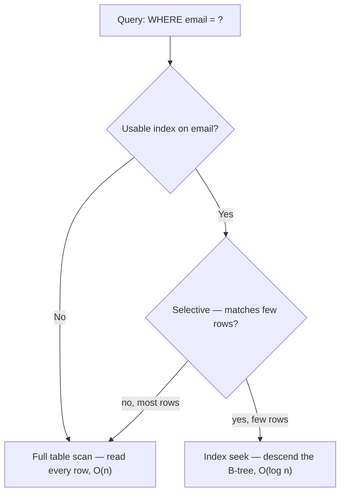
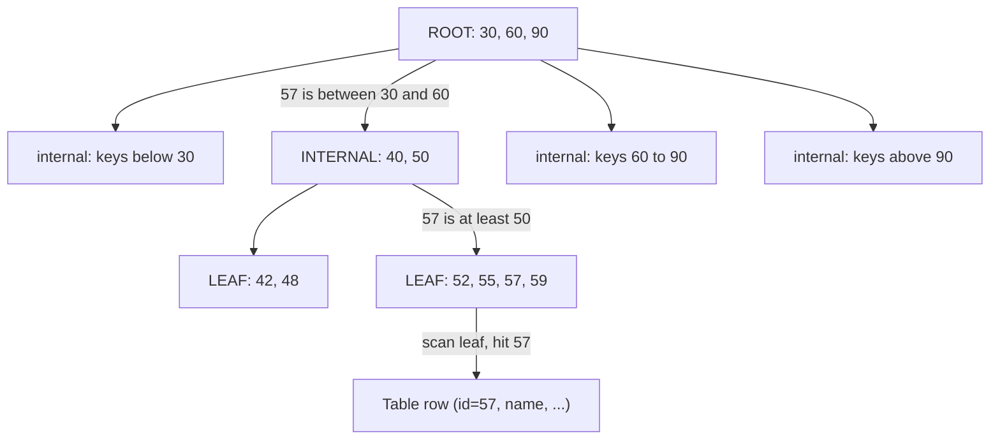
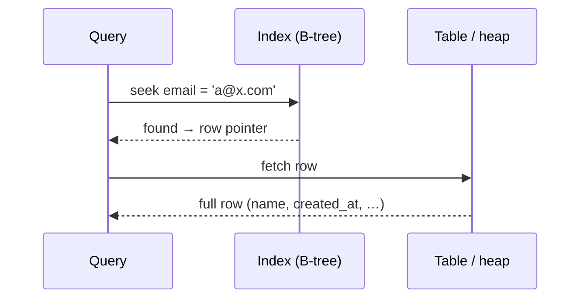

An **index** is a sorted, tree-shaped copy of one or more columns that lets the database
**jump** to a row instead of reading every one. Almost every relational index is a
**B-tree** (really a **B+tree**). Let's *see* how it finds a key.

## Index seek vs full table scan

The whole point of an index is turning **O(n)** into **O(log n)**.

| | Full table scan | Index seek |
|---|---|---|
| Rows touched | **every** row (n) | ~**log n** nodes, then the match |
| Data structure | heap / table pages | B-tree |
| Cost on 1M rows | ~1,000,000 reads | ~3–4 reads |
| Great when | you need most rows | you need **few, selective** rows |
| Ordered output | no (extra sort) | **free** — leaves are sorted |



:::key
An index only helps when a query is **selective** (returns a small slice). To fetch 90% of
a table, a full scan is *cheaper* — sequential reads beat millions of random tree lookups.
:::

## The shape of a B-tree

Keys are sorted at every level. Internal nodes hold **separator keys + child pointers**;
the **leaves** hold the sorted keys and a pointer to the actual row (or the row itself).



The labelled edges trace the route a seek for **57** takes: three node reads instead of
scanning the whole table. A B-tree stays **balanced** and **shallow** — even a billion rows
is only ~4–5 levels deep, because each node fans out to hundreds of children.

## Watch a B-tree lookup, step by step

Search for **key = 57**. Each step shows the **current node's keys** as boxes; the marker
above a key is the comparison that chooses the next child. We step *down* one level per move.

```walkthrough
title: Descending a B-tree to find key 57
code: |
  find(key):
    node = root
    while node is not a leaf:
      pick the child whose range holds key
      node = that child
    return scan the leaf for key
steps:
  - text: 'Start at the **root**. Its separator keys split the space into ranges.'
    array: [30, 60, 90]
    line: 2
  - text: '`57` is **≥ 30** and **< 60**, so follow the child pointer sitting *between* 30 and 60.'
    array: [30, 60, 90]
    highlight: [1]
    pointers: { 1: '57<60' }
    line: 4
  - text: 'Down one level to an **internal node**. Here `57` **≥ 50**, so take the rightmost child.'
    array: [40, 50]
    highlight: [1]
    pointers: { 1: '57>50' }
    line: 4
  - text: 'This child is a **leaf** — stop descending and scan its sorted keys.'
    array: [52, 55, 57, 59]
    line: 6
  - text: '**Found `57`** at position 3. Follow its row pointer to fetch the full record. Total: **3 node reads**.'
    array: [52, 55, 57, 59]
    highlight: [2]
    sorted: [0, 1, 3]
    pointers: { 2: 'match' }
    line: 6
```

:::note
Because leaves are kept in **sorted order** (and, in a B+tree, linked to their neighbours),
the same structure also powers `ORDER BY`, `>=` range scans, and `BETWEEN` — the engine
seeks to the start key, then walks the leaf chain.
:::

## The hidden cost: bookmark lookups

A **secondary** (non-clustered) index leaf usually stores only the key + a pointer, not the
whole row. So after the seek, the engine does a second hop to fetch the other columns.



Thousands of these random **bookmark lookups** can be slower than one scan — which is exactly
why **covering indexes** (that carry every needed column) matter. More on that in the next topics.

:::senior
Some engines (**InnoDB**, SQL Server) default to a **clustered index** on the primary key —
the table *is* the B-tree, sorted by PK, so a PK seek needs **no** second hop — while others
(**PostgreSQL**, Oracle) use heap tables by default. Secondary indexes then point at the PK
(InnoDB) or a physical address (heap-based engines). Knowing which one you have explains a lot
of plan surprises.
:::

```flashcards
title: Index mechanics recall
cards:
  - front: 'Complexity of a B-tree seek vs a full scan?'
    back: '**O(log n)** vs **O(n)** — a million-row table is ~3–4 node reads via the tree.'
  - front: 'Why is a B-tree so shallow even at a billion rows?'
    back: 'Huge **fan-out** — each node holds hundreds of separator keys, so depth grows as log with base in the hundreds (~4–5 levels).'
  - front: 'What is a **bookmark lookup**?'
    back: 'The extra hop from a secondary-index leaf to the table to fetch columns the index doesn''t carry — one **random I/O per matched row**.'
  - front: 'Clustered vs heap table — who uses which by default?'
    back: '**InnoDB/SQL Server**: table stored as a B-tree on the PK (clustered). **PostgreSQL/Oracle**: heap tables; every index is secondary.'
  - front: 'When does the planner *prefer* a full scan despite an index?'
    back: 'When the predicate is **not selective** — reading most of the table sequentially beats millions of random bookmark lookups.'
```

## Check yourself

```quiz
title: Index fundamentals
questions:
  - q: 'A table has 1,000,000 rows. Roughly how many node reads does a B-tree **seek** for one key need?'
    options:
      - text: 'About 3–4'
        correct: true
      - 'About 1,000'
      - 'About 1,000,000'
    explain: 'B-trees are shallow and balanced — depth is ~log(n) with a huge fan-out, so ~3–4 levels for a million rows.'
  - q: 'You need to return **95%** of a large table. What will the planner most likely choose?'
    options:
      - 'An index seek — indexes are always faster'
      - text: 'A full table scan — sequential reads beat millions of random lookups'
        correct: true
      - 'A bookmark lookup per row'
    explain: 'Indexes win only when selective. For most of the table, a sequential scan avoids per-row random I/O and is cheaper.'
  - q: 'Why can one B-tree index also satisfy `ORDER BY key` for free?'
    options:
      - 'It sorts the result at the end'
      - text: 'Its leaves are already stored in sorted order'
        correct: true
      - 'It caches previous sorts'
    explain: 'B-tree leaves are kept sorted (and linked), so the engine can read them in order — no extra sort step.'
```

:::key
Index = a sorted **B-tree** that turns O(n) scans into O(log n) seeks. It pays off only for
**selective** queries; secondary-index seeks may add a **bookmark lookup** back to the table.
:::
