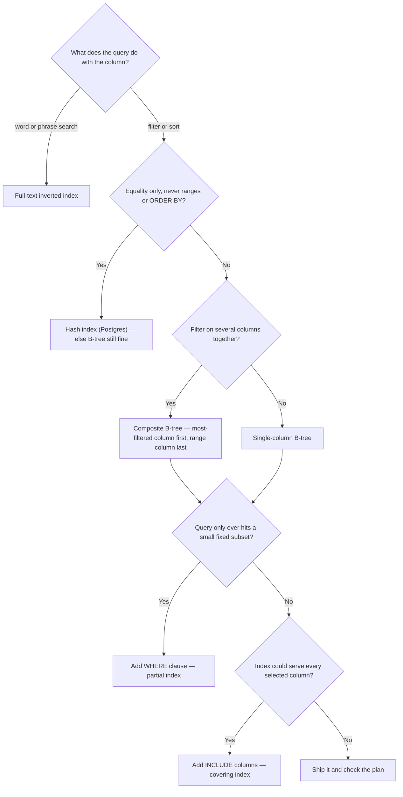

Not every index is a B-tree, and not every index helps every query. Here's the full menu and
**when each one wins**.

## The index-type cheat sheet

| Type | Structure | Best for | Can't do |
|------|-----------|----------|----------|
| **B-tree** | balanced sorted tree | `=`, `<`, `>`, `BETWEEN`, `ORDER BY`, prefix `LIKE 'a%'` | nothing common — the default |
| **Hash** | hash table | `=` only (very fast) | ranges, sorting, `LIKE` |
| **Composite** | B-tree on `(a, b, c)` | filters on a **left prefix** of the columns | skipping the leading column |
| **Covering** | index that *includes* all needed columns | read straight from the index — **no table hop** | grows the index size |
| **Partial / filtered** | B-tree over a `WHERE` subset | indexing only `is_active = true` rows | rows outside the filter |
| **Unique** | B-tree + uniqueness constraint | enforce no duplicates, speed lookups | store duplicates |
| **Full-text** | inverted index | word/phrase search in documents | numeric ranges, sorting |

The decision is driven by the **predicate shape**, not the data type:



:::gotcha
In MySQL/InnoDB you can't choose hash: `CREATE INDEX ... USING HASH` on an InnoDB table is
silently ignored and you get a B-tree anyway (only MEMORY tables honour it). PostgreSQL has
real hash indexes — WAL-logged and crash-safe since v10 — but a B-tree on the same column is
usually within a few percent, which is why B-tree stays the default answer.
:::

```flashcards
title: Pick the right index
cards:
  - front: 'Fastest structure for pure equality (`=`) lookups?'
    back: '**Hash index** — O(1) average. But it can''t do ranges, ordering, or `LIKE`.'
  - front: 'Query filters on `status` **and** sorts by `created_at`. One index?'
    back: 'A **composite** B-tree on `(status, created_at)` — filter on the prefix, then read leaves already sorted.'
  - front: 'What is a **covering** index?'
    back: 'An index that contains **every column the query needs**, so the engine answers from the index alone — an **index-only scan**, no bookmark lookup.'
  - front: 'You only ever query `WHERE is_active = true` (5% of rows). Index?'
    back: 'A **partial index** `WHERE is_active` — smaller, cheaper to maintain, and it skips the 95% you never filter on.'
  - front: 'Searching article bodies for the word "database"?'
    back: 'A **full-text** (inverted) index — maps each term to the rows containing it. A B-tree on the text column can''t.'
  - front: 'Difference between a **unique** index and a plain one?'
    back: 'Same B-tree, plus a **constraint**: inserts/updates that would duplicate the key are rejected.'
```

## The left-prefix rule (the #1 composite-index question)

A composite index on `(a, b)` is a B-tree sorted by **`a` first, then `b` within each `a`**.
That single fact decides everything: the index can seek only when your filter forms a
**left prefix** — `a`, or `a` + `b`. A filter on **`b` alone** can't, because the `b` values
are scattered across the whole tree.

```walkthrough
title: Why (a, b) helps WHERE a=2 but not WHERE b='C'
code: |
  CREATE INDEX ix ON t (a, b);   -- sorted by a, then b
  -- Q1: WHERE a = 2
  -- Q2: WHERE a = 2 AND b = 'C'
  -- Q3: WHERE b = 'C'
steps:
  - text: 'The index entries, **sorted by `a` then `b`**. This ordering is the whole story.'
    array: ['1,A', '1,B', '2,A', '2,C', '3,B', '3,C']
    line: 1
  - text: '**Q1 `WHERE a = 2`** ✅ — all `a=2` entries sit in one **contiguous block**. Seek to it, done.'
    array: ['1,A', '1,B', '2,A', '2,C', '3,B', '3,C']
    highlight: [2, 3]
    pointers: { 2: 'a=2' }
    line: 2
  - text: '**Q2 `WHERE a = 2 AND b = ''C''`** ✅ — the prefix narrows to a single entry. Best case.'
    array: ['1,A', '1,B', '2,A', '2,C', '3,B', '3,C']
    highlight: [3]
    pointers: { 3: 'exact' }
    line: 3
  - text: '**Q3 `WHERE b = ''C''`** ❌ — `b=''C''` rows are **scattered** (index 3 and 5). No contiguous range → the index can''t seek; the engine scans.'
    array: ['1,A', '1,B', '2,A', '2,C', '3,B', '3,C']
    highlight: [3, 5]
    pointers: { 3: 'b=C', 5: 'b=C' }
    line: 4
```

:::key
**Left-prefix rule:** an index on `(a, b, c)` supports filters on `a`, `(a, b)`, and
`(a, b, c)` — but **not** `b` alone, `c` alone, or `(b, c)`. Order the columns so the most
commonly-filtered (and equality-filtered) column comes **first**.
:::

:::gotcha
Column order matters even for two equality filters. `(a, b)` and `(b, a)` are **different**
indexes. Put the column used by *more* queries — or the more selective one — first, and put
**range** predicates (`>`, `BETWEEN`) **last**, since a range stops the prefix from extending
to the next column.
:::

## Covering vs non-covering — the extra hop

````tabs
tabs:
  - label: Non-covering (extra lookup)
    body: |
      The index has `email`, but `name` lives in the table — so every match needs a
      **bookmark lookup** back to the heap.
      ```sql
      CREATE INDEX ix_email ON users (email);
      SELECT name FROM users WHERE email = ?;  -- seek, then hop for name
      ```
      | Step | Cost |
      |------|------|
      | Seek `email` in index | cheap |
      | Fetch `name` from table | **+1 random I/O per row** |
  - label: Covering (index-only)
    body: |
      Add `name` to the index. Now everything the query needs is **in the index** —
      an **index-only scan**, no table hop.
      ```sql
      CREATE INDEX ix_email_cov ON users (email) INCLUDE (name);
      SELECT name FROM users WHERE email = ?;   -- answered from the index alone
      ```
      | Step | Cost |
      |------|------|
      | Seek `email` in index | cheap |
      | Read `name` from same leaf | **free** |
````

:::senior
`INCLUDE (name)` (Postgres/SQL Server) stores `name` only in the **leaves** as payload, so it
doesn't bloat the tree's search path or affect ordering. In MySQL/InnoDB you instead widen the
key — `(email, name)` — since it has no `INCLUDE`. Either way the goal is the same: make the
index **cover** the query.
:::

## Check yourself

```quiz
title: Choosing an index
questions:
  - q: 'You have an index on `(country, city)`. Which query can seek it?'
    options:
      - text: '`WHERE country = ''US'''
        correct: true
      - '`WHERE city = ''Paris'''
      - '`WHERE city = ''Paris'' AND population > 1000000`'
    explain: 'Only a **left prefix** works. `country` is the leading column, so filtering it seeks. `city` alone is not a prefix.'
  - q: 'A query is fully answered by the index without touching the table. That is a…'
    options:
      - 'Bookmark lookup'
      - text: 'Covering index / index-only scan'
        correct: true
      - 'Hash join'
    explain: 'When the index contains every column the query reads, the engine skips the table entirely — an index-only (covering) scan.'
  - q: 'Which index type **cannot** support `WHERE created_at BETWEEN ? AND ?`?'
    options:
      - 'B-tree'
      - text: 'Hash'
        correct: true
      - 'Composite B-tree on `(created_at)`'
    explain: 'Hash indexes support equality only — they have no notion of order, so ranges and `BETWEEN` fall back to a scan.'
  - q: 'You only ever filter `WHERE deleted = false` (3% of rows). Best index?'
    options:
      - 'A full index on `deleted`'
      - text: 'A partial index `WHERE deleted = false`'
        correct: true
      - 'A hash index on every column'
    explain: 'A partial (filtered) index covers just the rows you query — smaller, faster to maintain, and it ignores the 97% you never touch.'
```

:::key
Match the structure to the predicate: **hash** for `=`, **B-tree** for ranges/sorting,
**composite** for multi-column filters (mind the **left-prefix rule**), **covering** to skip
the table hop, **partial** to index a hot subset, **full-text** for word search.
:::
