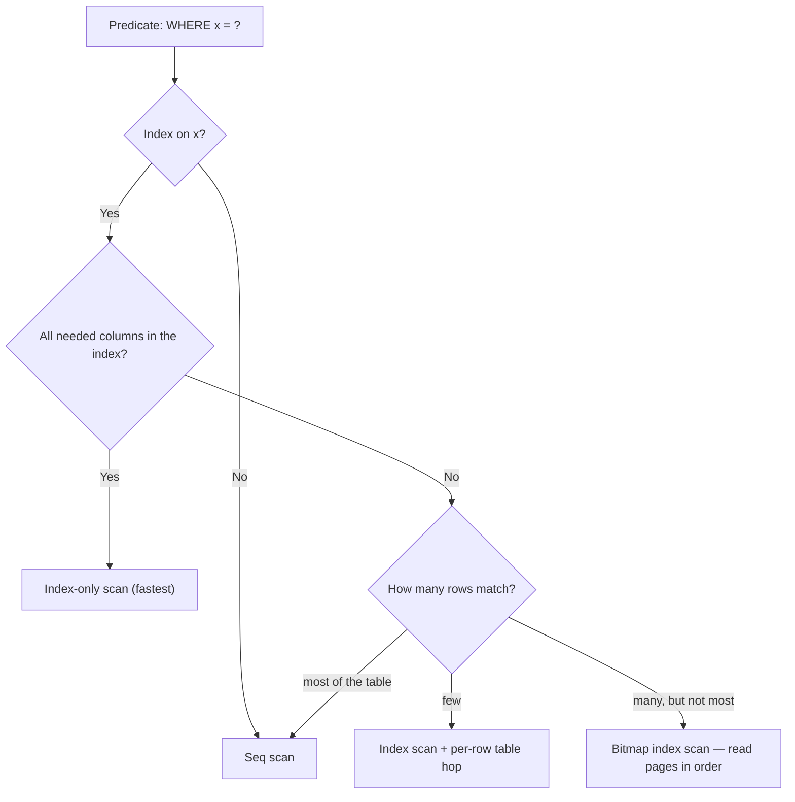
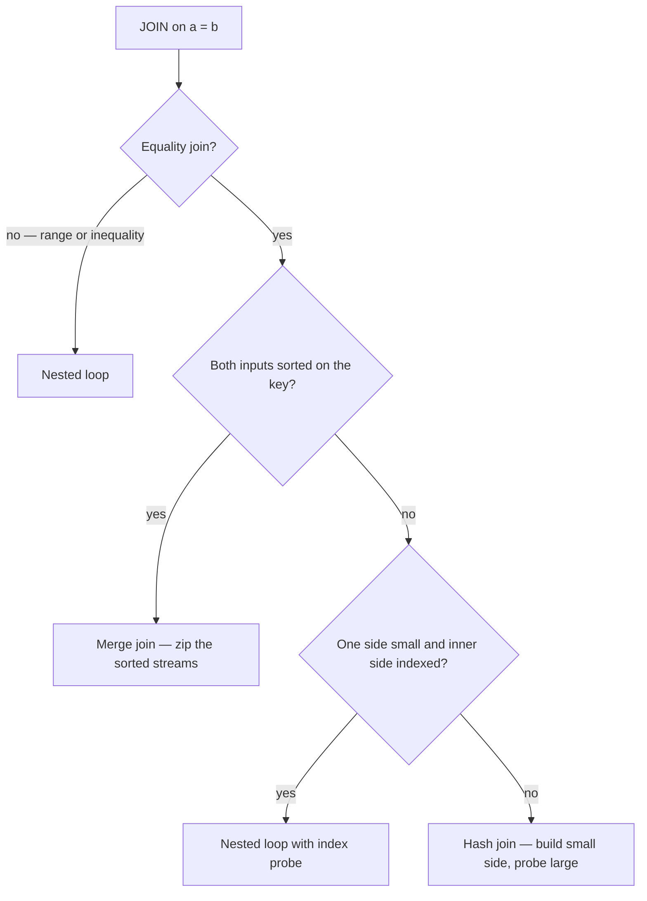

`EXPLAIN` shows the **plan** the optimizer chose *before* running the query; `EXPLAIN ANALYZE`
runs it and shows **actual** rows and time. Reading it is the single most useful performance
skill — you stop guessing and start *seeing*.

## Scan types — how a table is read

| Scan | What it does | When chosen | Speed |
|------|--------------|-------------|-------|
| **Seq scan** (full scan) | read every row | no usable index, or query wants most rows | slow on big tables |
| **Index scan** | seek the B-tree, then hop to the table per match | selective filter, but needs columns not in the index | fast when few rows |
| **Index-only scan** | answer entirely from a **covering** index | index has every column the query reads | fastest — no table hop |
| **Bitmap index scan** | build a bitmap of matching rows, then read the table in **page order** | medium selectivity; combines multiple indexes | between seek and seq |



## Join algorithms — how two tables are combined

| Algorithm | How it works | Wins when | Cost |
|-----------|--------------|-----------|------|
| **Nested loop** | for each outer row, probe the inner (ideally via index) | outer side small **and** inner is indexed | O(outer × lookup) |
| **Hash join** | build a hash table on the smaller side, probe with the larger | large, **unsorted**, equi-joins (`=`) | O(n + m), needs memory |
| **Merge join** | sort both inputs, then zip them together | inputs already **sorted** on the join key | O(n + m) if pre-sorted, else + sort |



### Watch a hash join run — build, then probe

The two-phase shape is why hash joins scale: each input is read **once**.

```walkthrough
title: Hash join — build phase, then probe phase
code: |
  -- orders JOIN customers ON o.customer_id = c.id
  BUILD: scan customers (smaller side)
         bucket = hash(c.id), store the row there
  PROBE: scan orders (larger side)
         bucket = hash(o.customer_id), check it
         same key in bucket -> emit joined row
steps:
  - text: '**Build:** read customer `id=5`, hash it → bucket 1. The boxes are the in-memory hash table''s buckets.'
    array: ['', '5', '', '']
    highlight: [1]
    line: 3
  - text: '**Build:** customer `id=12` hashes to bucket 0.'
    array: ['12', '5', '', '']
    highlight: [0]
    line: 3
  - text: '**Build:** customer `id=7` → bucket 3. Build done — one pass over the small side, O(m) memory.'
    array: ['12', '5', '', '7']
    highlight: [3]
    line: 3
  - text: '**Probe:** order with `customer_id=7` hashes to bucket 3 → key matches → **emit the joined row**. O(1) per probe.'
    array: ['12', '5', '', '7']
    highlight: [3]
    pointers: { 3: 'match' }
    line: 6
  - text: '**Probe:** order with `customer_id=8` hashes to bucket 0 — bucket holds `12`, keys differ → **no match**, row discarded. Total cost: one pass over each input, O(n + m).'
    array: ['12', '5', '', '7']
    highlight: [0]
    pointers: { 0: 'miss' }
    line: 5
```

:::gotcha
The build side must fit in **work memory** (`work_mem` in Postgres, hash area in others). When
it doesn't, the engine spills partitions to disk (Grace hash join) and the plan's cheap-looking
hash join quietly triples its I/O. That's why the optimizer always builds on the **smaller** input
— and why a wildly wrong row estimate can make it build on the wrong side.
:::

## Reading an annotated plan

Plans are **trees**, read **inside-out / bottom-up**: the most-indented node runs first, feeding
its parent. Watch three things: the **scan type**, the **join type**, and **estimated vs actual rows**.

```text
Hash Join  (cost=15.2..92.4 rows=120 width=64) (actual rows=118)
  Hash Cond: (o.customer_id = c.id)          ← join key, hash join chosen
  ->  Seq Scan on orders o                   ← ⚠ full scan of orders
        (cost=0..41 rows=1000) (actual rows=1000)
  ->  Hash                                    ← build side (smaller table)
        ->  Index Scan on customers c         ← ✅ seek, filtered early
              Index Cond: (c.region = 'EU')
              (cost=0..8 rows=40) (actual rows=42)
```

How to read it:

- **Bottom-up:** the `customers` index scan and the `orders` seq scan run first; their outputs feed the **Hash Join** at the top.
- **`cost=start..total`** — arbitrary planner units (not ms). The **second** number is the total; compare nodes to find the expensive one.
- **`rows`** = *estimated*; **`actual rows`** (only with `ANALYZE`) = *reality*. A big gap means **stale statistics** — the #1 cause of bad plans.
- The **Seq Scan on orders** is the red flag here: an index on `orders.customer_id` could turn the whole thing into an indexed nested loop.

:::gotcha
`cost` is **not milliseconds** and not comparable across databases — it's a relative unit the
optimizer minimizes. Use `EXPLAIN ANALYZE` for real timings, and always compare the
**estimated vs actual row counts**: when they diverge by 10×+, run `ANALYZE` to refresh stats.
:::

## Estimate vs reality

```walkthrough
title: Spotting a bad estimate in a plan
code: |
  EXPLAIN ANALYZE
  SELECT * FROM orders WHERE status = 'shipped';
steps:
  - text: 'The planner **estimates** 50 matching rows and picks an **index scan** — cheap for 50 rows.'
    array: [50]
    pointers: { 0: 'est' }
    line: 2
  - text: 'But `ANALYZE` reveals the table actually returned **500,000** rows.'
    array: [50, 500000]
    highlight: [1]
    pointers: { 0: 'est', 1: 'actual' }
    line: 2
  - text: 'A 10,000× miss → the index scan did **500k random hops**. A seq scan would have been far cheaper.'
    array: [50, 500000]
    highlight: [1]
    line: 2
  - text: 'Fix: run `ANALYZE orders` to refresh statistics so the planner estimates correctly next time.'
    array: [500000, 500000]
    sorted: [0, 1]
    pointers: { 0: 'est', 1: 'actual' }
    line: 2
```

:::senior
Read plans **outside-in for intent, inside-out for execution.** The top node is the final
operation; the deepest nodes run first. Senior tells: a `Seq Scan` on a huge table under a
selective filter, a `Nested Loop` with a large outer row count, or `actual rows` wildly above
`rows` — each points at a fix (add an index, refresh stats, or rewrite the query).
:::

```flashcards
title: Plan-reading recall
cards:
  - front: 'Order to read a plan tree?'
    back: '**Bottom-up / inside-out** — the most-indented node runs first and feeds its parent.'
  - front: 'Nested loop join wins when…'
    back: 'The **outer side is small** and the inner side has an **index** on the join key — cost is outer rows × one indexed probe.'
  - front: 'Hash join wins when…'
    back: 'Both inputs are **large and unsorted** and the join is **equality** — one pass each, O(n + m), needs memory for the build side.'
  - front: 'Merge join wins when…'
    back: 'Both inputs are **already sorted** on the join key (e.g. both read from B-tree indexes) — zip them in one pass.'
  - front: 'What does `cost=0.42..8.61` mean?'
    back: 'Startup cost .. total cost in **arbitrary planner units** — not milliseconds, only comparable within one plan.'
  - front: 'Estimated `rows=50`, `actual rows=500000` — diagnosis?'
    back: '**Stale statistics.** Run `ANALYZE` (Postgres) / `ANALYZE TABLE` (MySQL) so the planner sees reality.'
```

## Check yourself

```quiz
title: Reading plans
questions:
  - q: 'In an `EXPLAIN` plan tree, which node executes **first**?'
    options:
      - 'The top (least-indented) node'
      - text: 'The deepest (most-indented) node'
        correct: true
      - 'They run in parallel with no order'
    explain: 'Plans are read inside-out: the most-indented leaf nodes run first and feed their parents up to the root.'
  - q: '`EXPLAIN ANALYZE` shows `rows=50` but `actual rows=500000`. The likely cause?'
    options:
      - 'The query is written incorrectly'
      - text: 'Stale statistics — run ANALYZE to refresh them'
        correct: true
      - 'The cost number is in the wrong unit'
    explain: 'A large gap between estimated and actual rows means the optimizer''s statistics are out of date, leading it to pick the wrong plan.'
  - q: 'Two large, unsorted tables are joined on `a = b` with no useful index. Best algorithm?'
    options:
      - 'Nested loop'
      - text: 'Hash join'
        correct: true
      - 'Merge join'
    explain: 'Hash join builds a hash table on the smaller input and probes it — ideal for large, unsorted equi-joins. Nested loop needs an index; merge join needs sorted inputs.'
  - q: 'An `Index-Only Scan` appears in the plan. What does that tell you?'
    options:
      - 'The index is broken'
      - text: 'The index covers the query — no table access was needed'
        correct: true
      - 'The table has no primary key'
    explain: 'Index-only means every column the query needs lives in the index, so the engine skipped the bookmark lookup entirely — the fastest read.'
```

:::key
Read plans **bottom-up**. Hunt for `Seq Scan` on big tables, `Nested Loop` with large outer
inputs, and **estimated ≠ actual rows**. `cost` is relative units; `EXPLAIN ANALYZE` gives
real time and the truth about row counts.
:::
