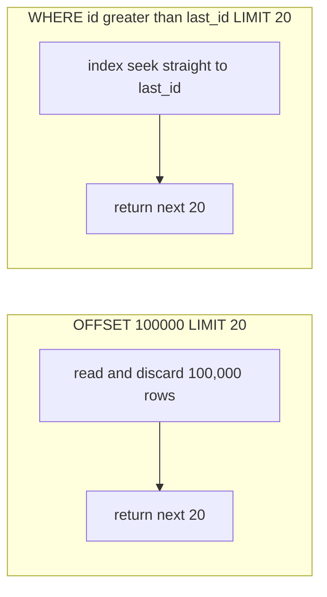

An index only helps if the query lets it. The theme of tuning is simple: **keep the indexed
column bare on one side of the comparison**, and **read as little as possible**.

## SARGable predicates

**SARGable** = *Search ARGument able* = the predicate can use an index seek. The rule: the
indexed column must appear **alone**, untouched by a function or arithmetic.

| Not SARGable (scan) | SARGable rewrite (seek) |
|---|---|
| `WHERE YEAR(created_at) = 2024` | `WHERE created_at >= '2024-01-01' AND created_at < '2025-01-01'` |
| `WHERE price * 1.2 > 100` | `WHERE price > 100 / 1.2` |
| `WHERE UPPER(email) = 'A@X.COM'` | store lowercased, or index `LOWER(email)` (expression index) |
| `WHERE amount + fee > 50` | precompute a `total` column and index it |
| `WHERE status <> 'done'` | `WHERE status IN ('open','pending')` (a range the index can walk) |

:::gotcha
Wrapping an indexed column in a function **disables the index** — the engine would have to
compute `YEAR(created_at)` for *every* row to test it, which is a full scan. Move the
transformation to the **other** side of the comparison (the constant), or index the expression.
:::

## Functions on indexed columns — see the difference

````tabs
tabs:
  - label: Slow — function on column
    body: |
      `YEAR(created_at)` must be evaluated for **every row**, so the index on `created_at`
      is useless.
      ```sql
      SELECT * FROM orders
      WHERE YEAR(created_at) = 2024;
      ```
      ```text
      Seq Scan on orders  (rows=2,000,000)
        Filter: (year(created_at) = 2024)
        actual time=1830 ms   ← reads the whole table
      ```
  - label: Fast — SARGable range
    body: |
      A half-open range keeps `created_at` **bare**, so the B-tree seeks straight to 2024.
      ```sql
      SELECT * FROM orders
      WHERE created_at >= '2024-01-01'
        AND created_at <  '2025-01-01';
      ```
      ```text
      Index Range Scan on ix_created_at  (rows=48,000)
        Index Cond: (created_at >= '2024-01-01' AND < '2025-01-01')
        actual time=12 ms    ← seeks the range
      ```
````

## Covering the query

Give the index every column the query touches so it never hops to the table. Watch a
non-covering plan become an **index-only scan**.

````tabs
tabs:
  - label: Slow — bookmark lookups
    body: |
      The index finds the rows, but `total` and `status` force a hop back to the table for
      each one.
      ```sql
      CREATE INDEX ix ON orders (customer_id);
      SELECT total, status FROM orders WHERE customer_id = 42;
      ```
      ```text
      Index Scan on ix  (rows=800)
        -> + 800 heap fetches (bookmark lookups)
        actual time=95 ms
      ```
  - label: Fast — covering index
    body: |
      Include the read columns; now the whole query is answered from the index leaves.
      ```sql
      CREATE INDEX ix_cov ON orders (customer_id) INCLUDE (total, status);
      SELECT total, status FROM orders WHERE customer_id = 42;
      ```
      ```text
      Index Only Scan on ix_cov  (rows=800)
        Heap Fetches: 0          ← no table access
        actual time=4 ms
      ```
````

## Pagination: OFFSET vs keyset

`LIMIT ... OFFSET n` looks innocent but **re-reads and discards** the first `n` rows every
time — page 10,000 scans a million rows to throw them away. **Keyset** (seek) pagination
remembers the *last row seen* and seeks past it, so every page costs the same.



````tabs
tabs:
  - label: Slow — OFFSET
    body: |
      Cost **grows with page depth** — deep pages get painfully slow.
      ```sql
      SELECT * FROM events
      ORDER BY id
      LIMIT 20 OFFSET 100000;   -- reads 100,020 rows, returns 20
      ```
      | Page | Rows scanned |
      |------|-------------|
      | 1 | 20 |
      | 5,000 | 100,020 |
  - label: Fast — keyset
    body: |
      Remember the last `id`; the index **seeks** straight to it. **Constant** cost per page.
      ```sql
      SELECT * FROM events
      WHERE id > 100000        -- last id from the previous page
      ORDER BY id
      LIMIT 20;                -- reads ~20 rows, always
      ```
      | Page | Rows scanned |
      |------|-------------|
      | 1 | 20 |
      | 5,000 | 20 |
````

:::senior
Keyset pagination needs a **stable, unique, indexed** sort key (often the PK, or
`(created_at, id)` as a tiebreaker for ties). The trade-off: you lose random "jump to page
417" access and get **next/previous** instead — almost always the right call for infinite
scroll and APIs over large tables.
:::

:::note
`LIMIT` is a PostgreSQL/MySQL extension. The ANSI form is `OFFSET 100000 ROWS FETCH FIRST 20
ROWS ONLY` (SQL Server ≥ 2012, Oracle ≥ 12c, DB2). Same semantics — and the same deep-page
cost problem, so keyset pagination is the fix everywhere.
:::

```flashcards
title: SARGable rewrites — instant recall
cards:
  - front: '`WHERE YEAR(created_at) = 2024` → SARGable form?'
    back: '`WHERE created_at >= ''2024-01-01'' AND created_at < ''2025-01-01''` — half-open range keeps the column bare.'
  - front: '`WHERE price * 1.2 > 100` → SARGable form?'
    back: '`WHERE price > 100 / 1.2` — move the arithmetic to the constant side.'
  - front: 'Case-insensitive email lookup without killing the index?'
    back: 'Create an **expression index** on `LOWER(email)` and query `WHERE LOWER(email) = ?` — the function must match the indexed expression exactly.'
  - front: 'Why is deep `OFFSET` slow, in one sentence?'
    back: 'It **fetches and discards** every skipped row — page depth n costs O(n) no matter what.'
  - front: 'Keyset pagination''s two requirements?'
    back: 'A **unique, stable, indexed** sort key, and clients that accept next/prev instead of jump-to-page.'
```

## Check yourself

```quiz
title: Optimizing queries
questions:
  - q: 'Which predicate is **SARGable** (can use an index seek)?'
    options:
      - '`WHERE YEAR(order_date) = 2024`'
      - text: '`WHERE order_date >= ''2024-01-01'' AND order_date < ''2025-01-01'''
        correct: true
      - '`WHERE order_date + INTERVAL ''1 day'' > NOW()`'
    explain: 'The indexed column must stay bare. A half-open date range keeps `order_date` untouched, so the B-tree can seek; wrapping it in `YEAR()` or arithmetic forces a scan.'
  - q: 'Why is `LIMIT 20 OFFSET 1000000` slow?'
    options:
      - 'It sorts the table twice'
      - text: 'It reads and discards the first 1,000,000 rows before returning 20'
        correct: true
      - 'OFFSET disables all indexes'
    explain: 'OFFSET still fetches every skipped row and throws it away, so deep pages scan huge numbers of rows. Keyset pagination seeks past the last row instead.'
  - q: 'A query is fast except for 800 bookmark lookups. The fix?'
    options:
      - 'Add OFFSET'
      - text: 'Make the index covering (INCLUDE the read columns)'
        correct: true
      - 'Wrap the column in a function'
    explain: 'Bookmark lookups are per-row table hops. Adding the needed columns to the index turns it into an index-only scan with zero heap fetches.'
  - q: 'What does keyset pagination require to work correctly?'
    options:
      - 'A random-access page number'
      - text: 'A stable, unique, indexed sort key to seek past'
        correct: true
      - 'A hash index on every column'
    explain: 'Keyset seeks to the last row of the previous page, so it needs a unique, indexed, stably-ordered key (e.g. the PK, or created_at + id as a tiebreaker).'
```

:::key
Keep indexed columns **bare** (SARGable), **cover** the query to kill bookmark lookups, and
paginate with **keyset** (`WHERE id > last`) instead of deep `OFFSET`. Every rule comes back
to: let the index seek, and read the fewest rows possible.
:::
