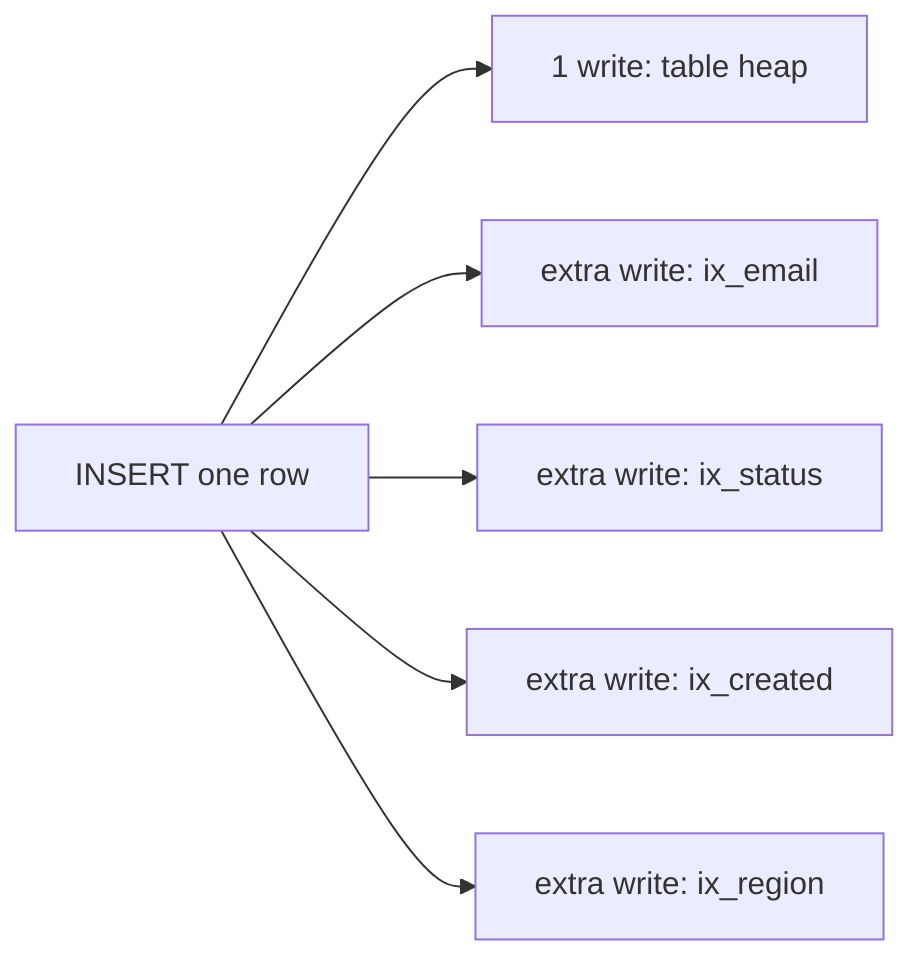

Most slow queries aren't exotic — they're the same handful of anti-patterns. Learn to spot
each one and its fix.

## The pitfall scoreboard

| Anti-pattern | Why it hurts | Fix |
|---|---|---|
| **N+1 queries** | 1 query for the list + N for each row = N+1 round trips | one `JOIN`, or a batched `IN (...)` |
| **`SELECT *`** | reads unused columns; blocks index-only scans | list only the columns you need |
| **Implicit type conversion** | casting the column disables its index | match parameter types to the column |
| **Leading-wildcard `LIKE '%x'`** | no known prefix → can't seek the B-tree | trailing `'x%'`, or a full-text / trigram index |
| **`OR` across columns** | often can't use one index for both sides | `UNION` of two seekable queries |
| **Over-indexing** | every write must update every index | keep only indexes that earn their keep |

## N+1 — the most common one

````tabs
tabs:
  - label: Anti-pattern — N+1
    body: |
      Fetch the list, then loop and query **once per row**. 1 + N round trips.
      ```sql
      -- 1 query
      SELECT id FROM authors;          -- returns 100 authors
      -- then, in app code, 100 more:
      SELECT * FROM books WHERE author_id = ?;   -- ×100
      ```
      **Total: 101 queries** — the latency killer, especially over a network.
  - label: Fix — one JOIN
    body: |
      Let the database do the join in a **single** round trip.
      ```sql
      SELECT a.id, b.title
      FROM authors a
      JOIN books b ON b.author_id = a.id;   -- 1 query
      ```
      Or batch it: `SELECT * FROM books WHERE author_id IN (…100 ids…)` — **2 queries** total.
````

## SELECT * — read only what you need

````tabs
tabs:
  - label: Anti-pattern — SELECT *
    body: |
      Pulls every column (including a big `blob`) and **prevents** a covering/index-only scan.
      ```sql
      SELECT * FROM users WHERE email = ?;
      ```
      ```text
      Index Scan → + heap fetch for every row (needs all columns)
      ```
  - label: Fix — explicit columns
    body: |
      Ask for the two columns you use; an index on `(email) INCLUDE (id, name)` now **covers** it.
      ```sql
      SELECT id, name FROM users WHERE email = ?;
      ```
      ```text
      Index Only Scan  (Heap Fetches: 0)
      ```
````

## Implicit type conversion — the silent index killer

````tabs
tabs:
  - label: Anti-pattern — type mismatch
    body: |
      `phone` is `VARCHAR`, but the parameter is a **number**. The engine casts the *column*
      to compare — so the index on `phone` is skipped.
      ```sql
      SELECT * FROM users WHERE phone = 5551234;   -- number vs VARCHAR
      -- becomes: WHERE CAST(phone AS INT) = 5551234  → full scan
      ```
  - label: Fix — match the type
    body: |
      Pass the value as the **same type** as the column; the index seeks normally.
      ```sql
      SELECT * FROM users WHERE phone = '5551234';  -- string vs VARCHAR
      ```
````

## Leading-wildcard LIKE and OR

````tabs
tabs:
  - label: LIKE '%term' — no seek
    body: |
      A B-tree is sorted by prefix. `'%son'` has **no known prefix**, so there's nothing to
      seek to → full scan.
      ```sql
      SELECT * FROM people WHERE name LIKE '%son';   -- ❌ scan
      SELECT * FROM people WHERE name LIKE 'John%';  -- ✅ prefix seek
      ```
      For real substring/fuzzy search, use a **full-text** or **trigram (GIN)** index.
  - label: OR → UNION
    body: |
      An `OR` across two columns often can't use either index well. Split into two seekable
      queries and combine.
      ```sql
      -- ❌ may scan:
      SELECT * FROM t WHERE email = ? OR phone = ?;

      -- ✅ each side seeks its own index:
      SELECT * FROM t WHERE email = ?
      UNION
      SELECT * FROM t WHERE phone = ?;
      ```
````

## Over-indexing — indexes aren't free

Every index **speeds reads but slows writes**: each `INSERT`/`UPDATE`/`DELETE` must maintain
**every** index on the table, and each one consumes storage and memory.



```flashcards
title: Pitfall quick-recall
cards:
  - front: 'You see 1 list query followed by one query **per row** in the logs.'
    back: '**N+1 problem.** Replace with a single `JOIN` or a batched `WHERE id IN (...)`.'
  - front: 'Why can `SELECT *` block an index-only scan?'
    back: 'The index rarely holds *every* column, so `*` forces a **table hop** for the missing ones. Select only what you need so a covering index can answer alone.'
  - front: '`WHERE phone = 5551234` on a `VARCHAR` column is slow. Why?'
    back: '**Implicit conversion.** Comparing a numeric literal to a string column makes the engine cast the *column*, disabling its index. Pass the matching type (a string).'
  - front: 'Fix for a redundant index on `(a)` when `(a, b)` already exists?'
    back: '**Drop `(a)`** — the composite `(a, b)` already covers any `a`-prefix query. One fewer index to maintain on every write.'
  - front: 'Symptom of over-indexing?'
    back: 'Fast reads but **slow writes** and bloated storage — every insert/update must update every index. Audit with usage stats and drop unused ones.'
```

:::senior
Find dead weight with the engine's index-usage stats (`pg_stat_user_indexes` in Postgres,
`sys.dm_db_index_usage_stats` in SQL Server): indexes with **zero seeks/scans** are pure write
overhead. Also drop indexes made **redundant** by a composite — `(a)` is covered by `(a, b)`.
:::

## Check yourself

```quiz
title: Spot the pitfall
questions:
  - q: 'A page issues 1 query to list orders, then 1 query per order to fetch its items. This is…'
    options:
      - 'A covering index'
      - text: 'The N+1 query problem'
        correct: true
      - 'A hash join'
    explain: '1 list query + N per-row queries = N+1 round trips. Replace with a single JOIN or a batched IN (...) query.'
  - q: 'Why is `WHERE name LIKE ''%smith''` unable to use a B-tree index?'
    options:
      - 'LIKE is never indexable'
      - text: 'A leading wildcard means no known prefix to seek to'
        correct: true
      - 'The column must be numeric'
    explain: 'B-trees are ordered by prefix. `''%smith''` has an unknown start, so there is nothing to seek — use a trailing wildcard, full-text, or trigram index instead.'
  - q: 'Comparing a `VARCHAR` column to a numeric literal often causes a full scan because…'
    options:
      - 'VARCHAR columns cannot be indexed'
      - text: 'implicit conversion casts the column, disabling its index'
        correct: true
      - 'the optimizer prefers scans'
    explain: 'To compare mismatched types the engine casts the column per row, so the index is bypassed. Match the literal''s type to the column.'
  - q: 'A write-heavy table has 12 indexes and slow inserts. First thing to check?'
    options:
      - 'Add more indexes to speed writes'
      - text: 'Drop unused/redundant indexes — each one is maintained on every write'
        correct: true
      - 'Switch every index to a hash index'
    explain: 'Every index must be updated on each insert/update/delete. Use index-usage stats to drop indexes with zero reads and any made redundant by a composite.'
```

:::key
The usual suspects: **N+1** (→ join/batch), **`SELECT *`** (→ name columns), **implicit
casts** (→ match types), **`LIKE '%x'`** (→ prefix/full-text), **`OR`** (→ `UNION`), and
**over-indexing** (→ drop unused/redundant). Reads and writes pull in opposite directions —
index for the workload you actually have.
:::
