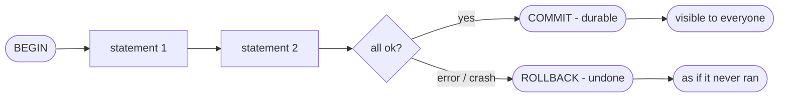
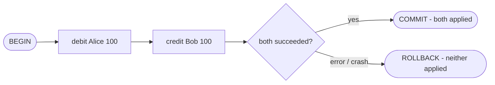
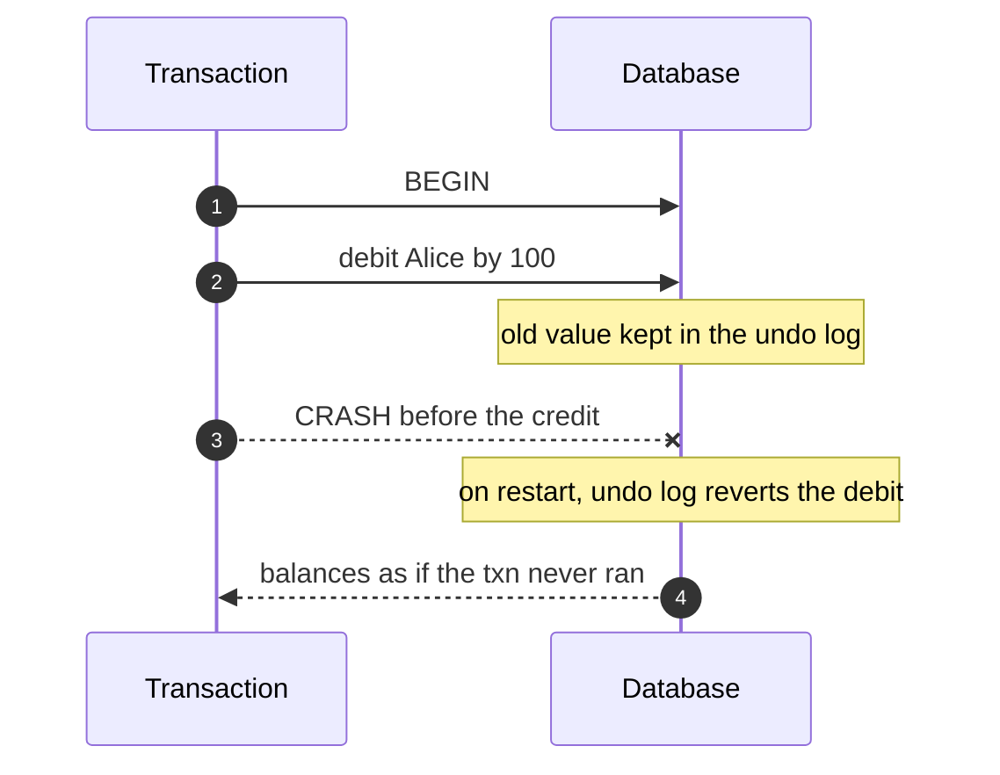
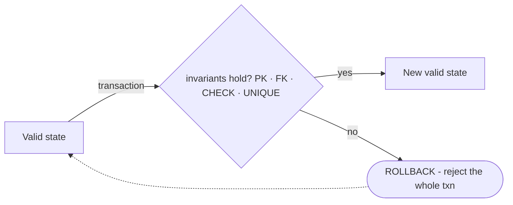
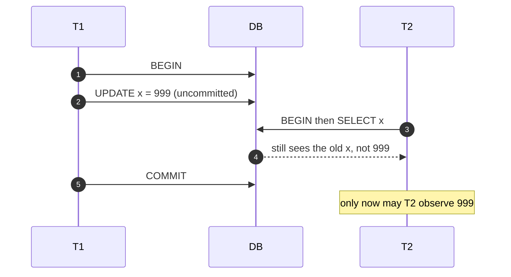
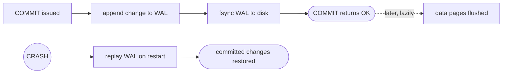

A **transaction** is a group of statements the database runs as **one indivisible unit of
work**. **ACID** is the set of four guarantees it makes. Picture the lifecycle first:



## The four promises at a glance

| Letter | Promise | Without it… | How the DB delivers it |
|---|---|---|---|
| **A**tomicity | all steps happen, or none do | half-finished transfers | **undo log** + `ROLLBACK` |
| **C**onsistency | every commit leaves valid state | broken invariants | constraints, triggers, **A + I** |
| **I**solation | concurrent txns don't corrupt each other | dirty/phantom reads | **locks** or **MVCC** |
| **D**urability | a committed change survives a crash | "confirmed" data vanishes | **write-ahead log** + `fsync` |

:::key
**A** and **D** are about *failure* (crashes, power loss). **I** is about *concurrency* (other
transactions). **C** is the goal the other three exist to protect.
:::

## Atomicity — all or nothing

Transfer 100 from Alice to Bob. The debit and the credit must be **inseparable** — a crash
must never leave money debited but not credited.



Watch a crash **mid-transfer** get undone:



## Consistency — only valid states commit

Consistency means the database moves from one **valid state to another** — never violating a
declared rule (primary key, foreign key, `CHECK`, `UNIQUE`, `NOT NULL`).



:::note
Consistency is a **shared job**. The engine enforces *declared* constraints; correctness rules
you *didn't* declare (e.g. "an invoice total equals the sum of its line items") are the
**application's** responsibility. ACID guarantees the DB won't break its own rules — not that
your business logic is bug-free.
:::

## Isolation — concurrent txns don't step on each other

While `T1` is mid-flight, its **uncommitted** changes must be invisible to `T2`:



*How strictly* isolation holds is tunable — that's the whole topic of
**isolation levels** (dirty reads, phantom reads, and the four levels) covered next.

## Durability — committed means committed

Once `COMMIT` returns, the change must **survive a crash the millisecond later**. The trick is
the **write-ahead log (WAL)**: the change is appended to the log and `fsync`'d to disk *before*
`COMMIT` reports success. Data pages can be flushed lazily afterward.



:::senior
The WAL is why the **same mechanism underpins both A and D**: the log records enough to *redo*
committed work (durability) and *undo* uncommitted work (atomicity) after a crash. This is why
`fsync` latency dominates commit throughput — and why batching commits (group commit) is the
classic write-throughput win.
:::

## Memorize the four

```flashcards
title: ACID recall
cards:
  - front: '**Atomicity**'
    back: 'All statements commit together or none do. Implemented with an **undo log** + `ROLLBACK`. Protects against *partial* work.'
  - front: '**Consistency**'
    back: 'Every commit leaves the DB satisfying all declared constraints (PK, FK, CHECK, UNIQUE). A byproduct of A + I plus your constraints.'
  - front: '**Isolation**'
    back: 'Concurrent transactions produce a result as if run in some serial order. Delivered by **locks** or **MVCC**; strictness is set by the *isolation level*.'
  - front: '**Durability**'
    back: 'Once `COMMIT` returns, the change survives crashes/power loss. Delivered by a **write-ahead log** `fsync`ed before commit acknowledges.'
```

## Check yourself

```quiz
title: ACID intuition
questions:
  - q: 'A transfer debits Alice, then the server loses power before crediting Bob. Which property guarantees Alice is *not* left short?'
    options:
      - text: 'Atomicity'
        correct: true
      - 'Durability'
      - 'Isolation'
    explain: '**Atomicity** — the debit and credit are one unit; a crash before completion rolls the debit back via the undo log, so it is as if nothing happened.'
  - q: 'What property is chiefly responsible for a committed row surviving an immediate power failure?'
    options:
      - 'Consistency'
      - text: 'Durability'
        correct: true
      - 'Atomicity'
    explain: '**Durability** — the write-ahead log is `fsync`ed to disk *before* `COMMIT` acknowledges, so the change can be replayed after a crash.'
  - q: 'Which statement about Consistency is most accurate?'
    options:
      - 'The database alone guarantees all your business rules are correct.'
      - text: 'The DB enforces *declared* constraints; app-level invariants are the application''s job.'
        correct: true
      - 'It is the same thing as Isolation.'
    explain: 'ACID Consistency only promises that *declared* constraints hold at commit. Undeclared business invariants are still your responsibility.'
```

:::key
**A**tomicity = all-or-nothing (undo log). **C**onsistency = only valid states commit
(constraints). **I**solation = concurrent txns don't interfere (locks/MVCC). **D**urability =
committed survives crashes (WAL + fsync). A and D lean on the log; I is the next topic.
:::
