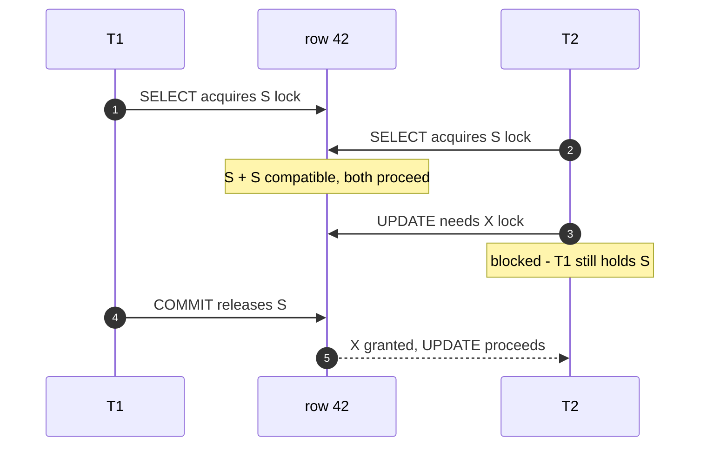
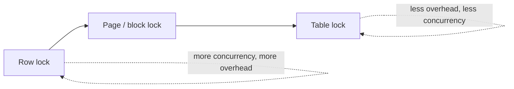
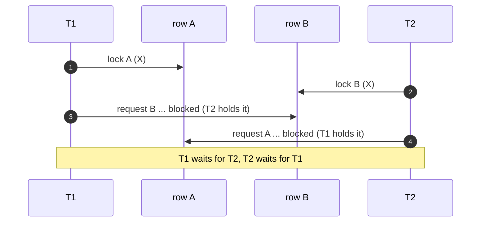
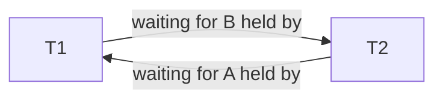

To keep concurrent transactions from corrupting shared rows, the engine hands out **locks**.
Two lock *modes* cover almost everything: **Shared (S)** for readers and **Exclusive (X)** for
writers.

## Shared vs Exclusive

| Mode | Taken by | Intuition | Coexists with |
|---|---|---|---|
| **Shared (S)** | reads (`SELECT ... FOR SHARE`) | "I'm reading — don't change this" | other **S** locks |
| **Exclusive (X)** | writes (`UPDATE`, `DELETE`, `SELECT ... FOR UPDATE`) | "I'm changing this — nobody touch it" | **nothing** |

**Many readers together, one writer alone.** That single rule is captured by the
**lock-compatibility matrix** — can a *requested* lock be granted while another is *held*?

| Held ↓ / Requested → | **Shared (S)** | **Exclusive (X)** |
|---|:---:|:---:|
| *(none)* | ✅ granted | ✅ granted |
| **Shared (S)** | ✅ granted | ⛔ wait |
| **Exclusive (X)** | ⛔ wait | ⛔ wait |

A blocked writer simply waits for the reader to release:



## Lock granularity — how big a thing do you lock?

Locking a **row** maximizes concurrency but costs one lock object per row; locking the whole
**table** is cheap bookkeeping but serializes every writer. Engines pick a level (and may
**escalate** from many row locks to a single table lock under memory pressure).



| Granularity | Concurrency | Lock overhead | Watch out for |
|---|---|---|---|
| **Row** | highest | high (one per row) | lock **escalation** under load |
| **Page** | medium | medium | *false* contention (unrelated rows) |
| **Table** | lowest | low (one lock) | serializes all writers |

## Deadlock — the mutual wait

A **deadlock** is a cycle: each transaction holds a lock the other needs. The textbook cause is
**acquiring two locks in the opposite order.** `T1` grabs A then wants B; `T2` grabs B then
wants A:



Draw the **wait-for graph** and the problem is obvious — a cycle:



Neither can ever proceed. So the database runs a **deadlock detector**: it periodically looks
for a cycle in the wait-for graph, picks a **victim** (usually the transaction that did the
least work / is cheapest to undo), and **aborts it** with a retriable error (Postgres
`40P01`, MySQL `1213`). The other transaction then continues.

:::gotcha
A deadlock abort is **not a bug you can eliminate by retrying blindly** — it's the engine
protecting you. But your app **must** be ready to catch the deadlock error and **retry the
whole transaction**. Code that assumes "commit always succeeds" corrupts data under contention.
:::

## Preventing deadlocks

A deadlock needs all four **Coffman conditions**; break any one:

| Condition present | Prevention technique | In practice |
|---|---|---|
| **Circular wait** | **consistent lock ordering** | always touch rows in the same order (e.g. by ascending `id`) — *the #1 fix* |
| **No preemption** | **lock timeouts** | `SET lock_timeout`, `SELECT ... NOWAIT` — give up and retry |
| **Hold and wait** | **acquire all locks up front** | lock every needed row in one statement before working |
| **Mutual exclusion** | **optimistic concurrency** | avoid locks entirely — detect conflict at commit (next topics) |

Plus two universal reducers: **keep transactions short** (hold locks for less time) and touch
**fewer rows** (smaller lock footprint).

```sql
-- Consistent ordering kills the classic transfer deadlock:
-- always lock the lower id first, so two transfers can't cross.
BEGIN;
SELECT * FROM accounts
WHERE id IN (:a, :b)
ORDER BY id
FOR UPDATE;              -- both rows locked in a fixed order
-- ... debit / credit ...
COMMIT;
```

:::senior
Row locks aren't the only ones that deadlock. **Lock escalation**, **index/gap locks** (MySQL
next-key locks under `REPEATABLE READ`), and even **foreign-key** checks take hidden locks —
so two transactions touching *different* rows can still deadlock. When a deadlock puzzles you,
read the engine's deadlock log: it prints both transactions and the exact locks in the cycle.
:::

## Check yourself

```quiz
title: Locking & deadlocks
questions:
  - q: 'Transaction A holds a Shared (S) lock on a row. Transaction B requests an Exclusive (X) lock on the same row. What happens?'
    options:
      - 'B is granted immediately — S and X are compatible.'
      - text: 'B waits until A releases the S lock.'
        correct: true
      - 'A is aborted to let B proceed.'
    explain: 'S and X are **incompatible**. Readers coexist, but a writer must wait for all shared locks to clear.'
  - q: 'Which technique most directly prevents the classic two-row deadlock?'
    options:
      - text: 'Always acquire locks in a consistent global order.'
        correct: true
      - 'Increase the lock timeout.'
      - 'Use a larger buffer pool.'
    explain: 'Consistent lock ordering removes the **circular wait** condition, so a cycle can never form. Timeouts only *break* a deadlock after it happens.'
  - q: 'The database reports a deadlock and aborts your transaction. The correct application response is to:'
    options:
      - 'Log it and move on — the data is fine.'
      - text: 'Catch the error and retry the entire transaction.'
        correct: true
      - 'Immediately re-run only the failed statement.'
    explain: 'A deadlock aborts the *whole* transaction (its work is rolled back). You must retry the transaction from `BEGIN`, not just the last statement.'
```

:::key
**S** = shared (readers coexist), **X** = exclusive (writer alone). Finer granularity = more
concurrency but more overhead. A deadlock is a **cycle in the wait-for graph**; the DB aborts a
**victim**. Prevent it mainly with **consistent lock ordering**, and always **retry** on the
deadlock error.
:::
