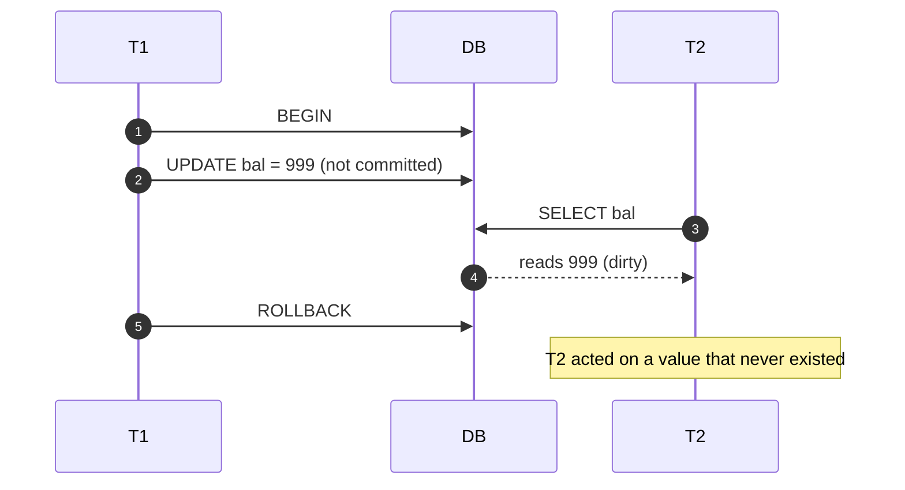
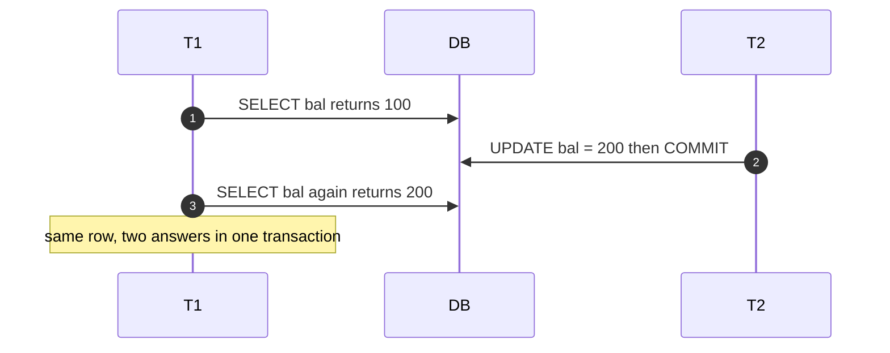
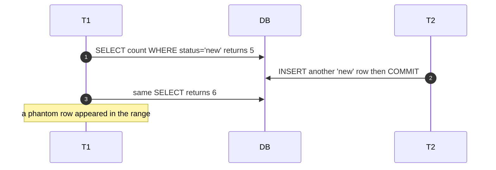
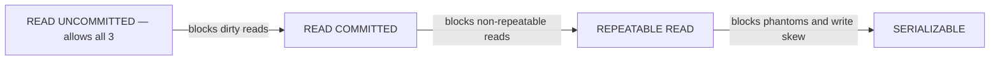

Perfect isolation (`SERIALIZABLE`) is expensive, so SQL defines **weaker levels** that trade a
little correctness for a lot of concurrency. To choose one you must first *see* the three
**read anomalies** each level does or doesn't allow.

## The three anomalies

### 1. Dirty read — reading uncommitted data

`T2` reads a value `T1` wrote but **never committed** — a value that may vanish.



### 2. Non-repeatable read — the same row changes under you

`T1` reads a row twice and gets **two different values** because `T2` committed an `UPDATE` in
between.



### 3. Phantom read — new rows appear in a range

`T1` re-runs the **same query** and a **new row** matching the predicate has appeared (or
disappeared) because `T2` `INSERT`ed (or `DELETE`d) and committed.



:::gotcha
**Non-repeatable read vs phantom read** is the classic trap. Non-repeatable = an **existing
row's value** changed. Phantom = the **set of rows** matching a predicate changed (rows
added/removed). One is about a *row*; the other is about a *range*.
:::

## The matrix — the one table to memorize

Which anomalies can occur at each level (SQL-standard definition):

| Isolation level | Dirty read | Non-repeatable read | Phantom read |
|---|:---:|:---:|:---:|
| `READ UNCOMMITTED` | 🔴 possible | 🔴 possible | 🔴 possible |
| `READ COMMITTED` | 🟢 prevented | 🔴 possible | 🔴 possible |
| `REPEATABLE READ` | 🟢 prevented | 🟢 prevented | 🔴 possible |
| `SERIALIZABLE` | 🟢 prevented | 🟢 prevented | 🟢 prevented |

*Read it as a staircase:* each step **up** eliminates the **next** anomaly. Higher = safer but
lower concurrency.



## What each level actually does

- **`READ UNCOMMITTED`** — no read protection; you can see other txns' uncommitted writes.
  Rarely useful; some engines (Postgres) treat it as `READ COMMITTED` anyway.
- **`READ COMMITTED`** — you only ever read **committed** data, but each *statement* sees a
  fresh snapshot, so two reads can differ. **Default in PostgreSQL, Oracle, SQL Server.**
- **`REPEATABLE READ`** — the whole transaction reads from **one snapshot**, so any row you
  read stays stable. **Default in MySQL/InnoDB.**
- **`SERIALIZABLE`** — the result is guaranteed identical to running the transactions **one at
  a time** in some order. Strongest, slowest.

Setting the level is one statement:

````tabs
tabs:
  - label: READ COMMITTED
    body: |
      Every statement sees the latest committed data. No dirty reads; reads can still change.
      ```sql
      SET TRANSACTION ISOLATION LEVEL READ COMMITTED;
      BEGIN;
      SELECT bal FROM accounts WHERE id = 1;  -- fresh snapshot each statement
      COMMIT;
      ```
  - label: REPEATABLE READ
    body: |
      One snapshot for the whole transaction — rows you read won't change under you.
      ```sql
      SET TRANSACTION ISOLATION LEVEL REPEATABLE READ;
      BEGIN;
      SELECT bal FROM accounts WHERE id = 1;  -- snapshot fixed here
      -- ... later, same query returns the same value ...
      COMMIT;
      ```
  - label: SERIALIZABLE
    body: |
      Behaves as if transactions ran one after another. May abort on a conflict — be ready to retry.
      ```sql
      SET TRANSACTION ISOLATION LEVEL SERIALIZABLE;
      BEGIN;
      -- work ...
      COMMIT;   -- may fail with a serialization error (retry the txn)
      ```
````

## Isolation-level flashcards

```flashcards
title: Isolation levels
cards:
  - front: '`READ UNCOMMITTED`'
    back: 'Weakest. Allows **dirty reads** (+ everything above). Rarely used; Postgres maps it to READ COMMITTED.'
  - front: '`READ COMMITTED`'
    back: 'Only reads **committed** data (no dirty reads). Fresh snapshot **per statement**, so non-repeatable reads + phantoms remain. Default: **Postgres, Oracle, SQL Server**.'
  - front: '`REPEATABLE READ`'
    back: 'One snapshot **per transaction** → no dirty *or* non-repeatable reads. Phantoms allowed by the standard. Default: **MySQL/InnoDB**.'
  - front: '`SERIALIZABLE`'
    back: 'Result equals **some serial order** of the transactions. Prevents all three anomalies (and write skew). Strongest, lowest concurrency.'
  - front: 'Non-repeatable vs phantom?'
    back: 'Non-repeatable = an **existing row''s value** changed between reads. Phantom = the **set of rows** matching a predicate changed (insert/delete).'
```

:::senior
Real engines don't match the standard exactly. **MySQL/InnoDB `REPEATABLE READ`** uses
**next-key (gap) locks**, so it *does* block most phantoms — stronger than the standard.
**PostgreSQL `REPEATABLE READ`** is really **snapshot isolation**: it blocks phantoms on the
snapshot but permits **write skew** (two txns each read an overlapping set, then each writes
based on a rule the *combination* violates — e.g. both doctors go off-call at once).
Postgres's `SERIALIZABLE` adds **SSI** (serializable snapshot isolation) to catch write skew;
SQL Server uses strict **two-phase locking**. Naming the specific engine's behavior is a strong
senior signal.
:::

## Check yourself

```quiz
title: Isolation levels
questions:
  - q: 'At `READ COMMITTED`, `T1` runs the same `SELECT` twice and gets different values. What is this anomaly called?'
    options:
      - 'Dirty read'
      - text: 'Non-repeatable read'
        correct: true
      - 'Phantom read'
    explain: 'READ COMMITTED prevents *dirty* reads but takes a fresh snapshot each statement, so an existing row can change between two reads — a **non-repeatable read**.'
  - q: 'What is the lowest standard isolation level that prevents dirty reads?'
    options:
      - 'READ UNCOMMITTED'
      - text: 'READ COMMITTED'
        correct: true
      - 'SERIALIZABLE'
    explain: '`READ COMMITTED` is the first rung that guarantees you only ever read committed data.'
  - q: 'A report counts rows matching `WHERE status = ''open''` twice in one transaction and the count grows because another txn inserted a matching row. Which level is the lowest that reliably prevents this by the SQL standard?'
    options:
      - 'READ COMMITTED'
      - 'REPEATABLE READ'
      - text: 'SERIALIZABLE'
        correct: true
    explain: 'That is a **phantom** (the row *set* changed). By the SQL standard only `SERIALIZABLE` forbids phantoms. (MySQL/InnoDB blocks them at REPEATABLE READ via gap locks, but the standard does not require it.)'
  - q: 'What does SERIALIZABLE guarantee that snapshot isolation (Postgres REPEATABLE READ) does not?'
    options:
      - 'Durability of committed data'
      - text: 'Freedom from write skew — the result equals some serial execution order'
        correct: true
      - 'Faster reads'
    explain: 'Snapshot isolation still permits **write skew**. SERIALIZABLE guarantees the outcome is equivalent to running the transactions one at a time, eliminating it.'
```

:::key
Anomalies, weakest to strongest to prevent: **dirty read → non-repeatable read → phantom**.
Levels are a staircase: `READ UNCOMMITTED` (all allowed) → `READ COMMITTED` (no dirty) →
`REPEATABLE READ` (+ no non-repeatable) → `SERIALIZABLE` (+ no phantoms, + no write skew). Know
your engine's *actual* behavior, not just the standard.
:::
