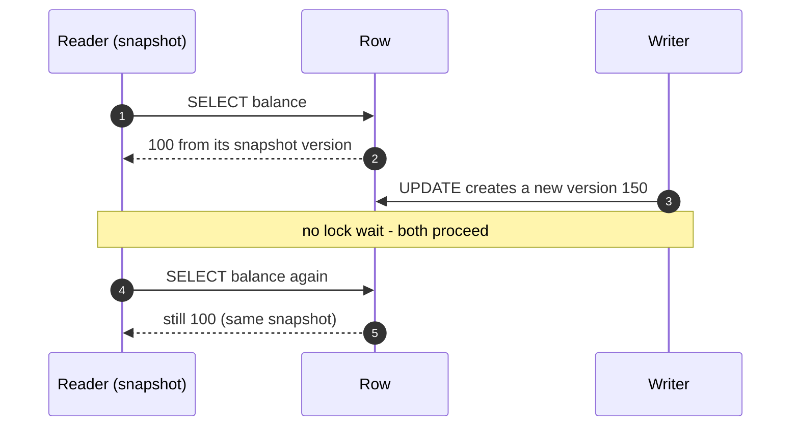
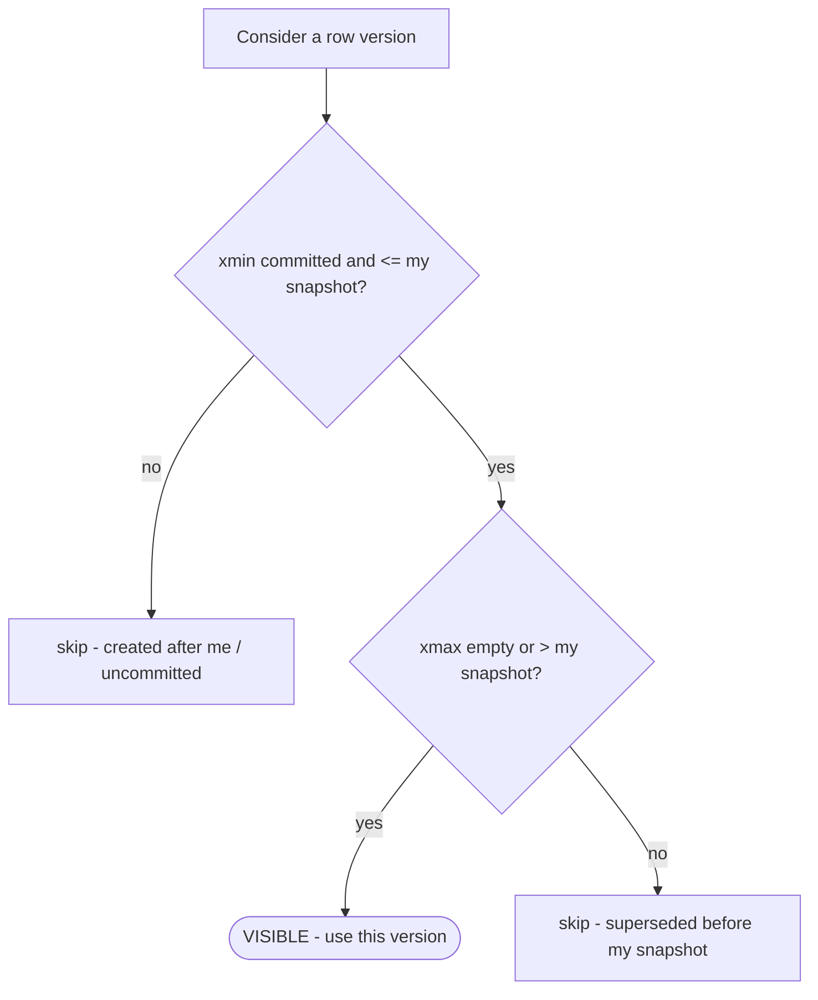

Pure locking forces **readers and writers to block each other**. **MVCC (Multi-Version
Concurrency Control)** removes that: every write creates a **new version** of the row instead
of overwriting it, and each transaction reads from a **consistent snapshot**. The golden rule:

:::key
**Readers never block writers, and writers never block readers.** Writers still block *writers*
on the same row (last write needs the row).
:::



## How a row carries versions

Each stored row version is stamped with two hidden transaction ids:

- **`xmin`** — the txn that **created** this version.
- **`xmax`** — the txn that **superseded/deleted** it (empty = still live).

A version is **visible to you** when `xmin` committed **before** your snapshot **and** `xmax`
is empty or **after** your snapshot. An `UPDATE` is **copy-on-write**: write a new version,
stamp the old one's `xmax`. A `DELETE` just sets `xmax`.

## Watch three readers see three values from one row

```walkthrough
title: One row, many versions, per-snapshot visibility
code: |
  -- version chain for account id = 1 (each write APPENDS a version)
  INSERT balance = 100   -- txn 10  ->  v1  [xmin=10, xmax=20]
  UPDATE balance = 150   -- txn 20  ->  v2  [xmin=20, xmax=30]
  UPDATE balance = 120   -- txn 30  ->  v3  [xmin=30, xmax=--]
  -- a reader sees the version whose  xmin <= snapshot < xmax
steps:
  - text: 'Txn **10** inserts `balance = 100`. This creates **v1**, live from snapshot 10 (`xmax` still empty).'
    array: [100, 150, 120]
    highlight: [0]
    pointers: { 0: 'v1' }
    line: 2
  - text: 'Txn **20** does not overwrite — it writes **v2 = 150** and stamps **v1.xmax = 20**. v1 is now historical.'
    array: [100, 150, 120]
    highlight: [1]
    sorted: [0]
    pointers: { 0: 'dead', 1: 'v2' }
    line: 3
  - text: 'Txn **30** writes **v3 = 120** and stamps **v2.xmax = 30**. Three physical versions now coexist.'
    array: [100, 150, 120]
    highlight: [2]
    sorted: [0, 1]
    pointers: { 1: 'dead', 2: 'v3' }
    line: 4
  - text: 'Reader **Rc** with snapshot **15**: `10 <= 15 < 20`, so it sees **v1 = 100**. Old, but consistent.'
    array: [100, 150, 120]
    highlight: [0]
    pointers: { 0: 'Rc 15' }
    line: 5
  - text: 'Reader **Ra** with snapshot **25**: `20 <= 25 < 30`, so it sees **v2 = 150**.'
    array: [100, 150, 120]
    highlight: [1]
    pointers: { 1: 'Ra 25' }
    line: 5
  - text: 'Reader **Rb** with snapshot **35**: `30 <= 35`, `xmax` empty, so it sees **v3 = 120**.'
    array: [100, 150, 120]
    highlight: [2]
    pointers: { 2: 'Rb 35' }
    line: 5
  - text: '**Three readers, three snapshots, three answers — from the same row, and nobody blocked.** v1 and v2 are dead tuples now waiting to be reclaimed.'
    array: [100, 150, 120]
    highlight: [2]
    sorted: [0, 1]
    pointers: { 0: 'Rc', 1: 'Ra', 2: 'Rb' }
    line: 5
```

The visibility test, as a flowchart:



## MVCC implements the isolation levels

The **snapshot** is exactly the lever from the last topic:

| Level | Snapshot taken | Effect |
|---|---|---|
| `READ COMMITTED` | **per statement** | each statement sees the latest committed data → non-repeatable reads |
| `REPEATABLE READ` (snapshot isolation) | **once per transaction** | stable reads all transaction long → no non-repeatable reads |

Writes use **first-updater-wins**: if two transactions update the same row, the second to
write **blocks** until the first commits, then either proceeds or aborts with a
**serialization/write-conflict** error (so you don't silently lose the first write).

## The cost: dead versions and VACUUM

Because updates/deletes leave old versions behind, tables accumulate **dead tuples** = **bloat**
(wasted space, slower scans). A garbage collector reclaims them.

| Aspect | PostgreSQL | MySQL InnoDB / Oracle |
|---|---|---|
| Where old versions live | in the **table heap** (appended) | in a separate **undo log** |
| Reading an old version | read the visible heap tuple directly | **walk the undo log** to rebuild it |
| Reclaiming space | **VACUUM** / autovacuum | **purge** thread trims undo |
| Main bloat risk | table **and index** bloat | **undo log** growth |

:::gotcha
A single **long-running transaction** holds back the **xmin horizon**: the GC can't reclaim any
version that transaction might still need to see, so dead tuples pile up **database-wide**. An
idle-in-transaction connection or a giant analytics query can bloat tables it never touched.
Keep transactions short — and watch for `idle in transaction`.
:::

:::senior
Snapshot isolation (Postgres `REPEATABLE READ`) prevents dirty/non-repeatable/phantom reads on
the snapshot but **still allows write skew**, because two transactions read overlapping data,
make disjoint writes, and each is individually valid. Postgres's `SERIALIZABLE` layers **SSI**
(serializable snapshot isolation) on top of MVCC to detect and abort such dangerous read/write
dependency cycles — giving true serializability without classic locking.
:::

```flashcards
title: MVCC recall
cards:
  - front: '`xmin` and `xmax` on a row version?'
    back: '`xmin` = txn that **created** the version; `xmax` = txn that **superseded/deleted** it (empty = still live).'
  - front: 'The MVCC visibility rule in one line?'
    back: 'A version is visible when **xmin committed ≤ my snapshot < xmax** (or xmax empty).'
  - front: 'MVCC golden rule?'
    back: '**Readers never block writers; writers never block readers.** Only writer-vs-writer on the same row contends.'
  - front: 'Where do old versions live in Postgres vs InnoDB?'
    back: 'Postgres: in the **table heap** (VACUUM reclaims). InnoDB/Oracle: rebuilt from the **undo log** (purge trims).'
  - front: 'What does one long-running transaction do to the whole database?'
    back: 'Pins the **xmin horizon** — GC can''t reclaim any version it might still see, so dead tuples/undo pile up everywhere.'
  - front: 'Concurrent-write policy under snapshot isolation?'
    back: '**First-updater-wins**: the second writer blocks; when the first commits it gets a write-conflict/serialization error instead of silently overwriting.'
```

## Check yourself

```quiz
title: MVCC
questions:
  - q: 'Under MVCC, what happens to the old row when you `UPDATE` a value?'
    options:
      - 'It is overwritten in place.'
      - text: 'A new version is written and the old one is kept until GC reclaims it.'
        correct: true
      - 'It is deleted immediately and re-inserted.'
    explain: 'MVCC is copy-on-write: the update creates a **new version** and stamps the old version''s `xmax`. The old version survives for snapshots that still need it, until VACUUM/purge removes it.'
  - q: 'Two read-only transactions and one writer all touch the same row concurrently. Under MVCC, who blocks whom?'
    options:
      - 'The writer blocks both readers.'
      - text: 'Nobody — readers see their snapshot; the writer creates a new version.'
        correct: true
      - 'The readers block the writer.'
    explain: 'Readers never block writers and writers never block readers under MVCC. Only two *writers* to the same row contend.'
  - q: 'Why can one long-running transaction cause table bloat across the whole database?'
    options:
      - 'It holds an exclusive table lock.'
      - text: 'It holds back the xmin horizon, so GC cannot reclaim versions it might still see.'
        correct: true
      - 'It disables autovacuum.'
    explain: 'VACUUM/purge can only remove versions no active snapshot needs. A long-lived transaction pins the oldest visible version (the xmin horizon), blocking cleanup everywhere.'
```

:::key
MVCC keeps **multiple versions** stamped `xmin`/`xmax`; each txn reads a **snapshot** and never
blocks (or is blocked by) readers. `READ COMMITTED` = snapshot per statement, `REPEATABLE READ`
= snapshot per transaction. The price is **dead tuples** reclaimed by **VACUUM/purge** — and
long transactions cause bloat by holding the **xmin horizon**.
:::
