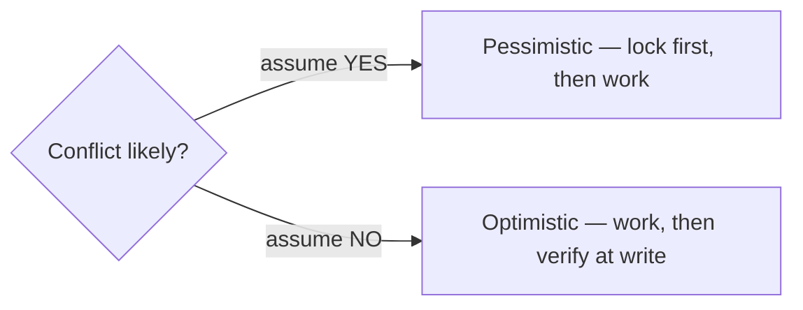
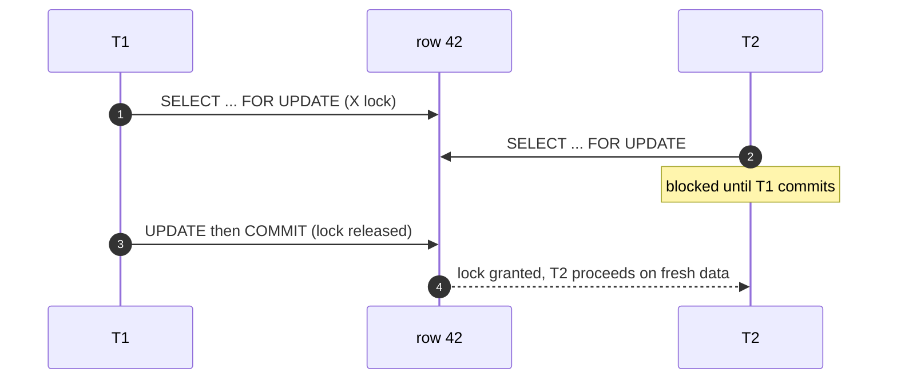
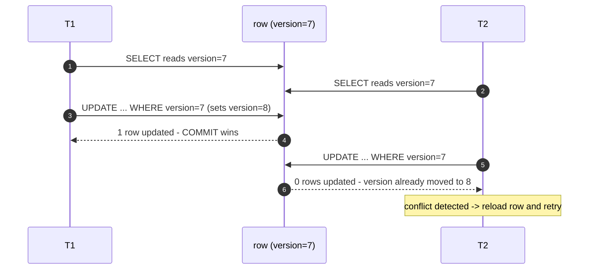

Both strategies solve the **lost update** (two transactions read a value, both write, one
overwrites the other). They differ in a single assumption:



- **Pessimistic** — *"a conflict is likely, so lock the row up front."* Others **wait**.
- **Optimistic** — *"conflicts are rare, so don't lock. Detect one at write time and retry."*

## Side by side

````tabs
tabs:
  - label: Pessimistic (SELECT FOR UPDATE)
    body: |
      Take an **exclusive lock** immediately; other writers block until you commit.
      ```sql
      BEGIN;
      SELECT stock FROM items
      WHERE id = 42
      FOR UPDATE;                    -- X lock held until COMMIT
      -- safe critical section: nobody else can change row 42
      UPDATE items SET stock = stock - 1 WHERE id = 42;
      COMMIT;                        -- releases the lock
      ```
      **Use when:** high contention, short transactions, or a multi-step critical section that
      must own the row. **Costs:** lock waits, and it can **deadlock**.
  - label: Optimistic (version column / CAS)
    body: |
      No lock. Read a **version**, then update **only if it hasn't changed** (compare-and-swap).
      ```sql
      -- 1. read
      SELECT stock, version FROM items WHERE id = 42;   -- e.g. version = 7

      -- 2. write only if nobody else moved the version
      UPDATE items
      SET stock = stock - 1, version = version + 1
      WHERE id = 42 AND version = 7;

      -- 3. affected rows = 0 ?  someone won the race -> reload and retry
      ```
      **Use when:** low contention, read-heavy, long user "think time", or
      stateless/distributed services that can't hold a DB transaction open. **Cost:** wasted
      work + retries when contention *is* high.
````

## Pessimistic in motion — the second writer waits



## Optimistic in motion — the loser retries



## Which one? A decision table

| Situation | Pick |
|---|---|
| Conflicts are **rare** | **Optimistic** — no lock overhead |
| Conflicts are **frequent** | **Pessimistic** — avoid burning work on retries |
| Long **think time** between read and write (user editing a form) | **Optimistic** — never hold a lock across a user |
| Must guarantee the row for a **multi-step** critical section | **Pessimistic** |
| **Stateless / distributed** services, no long-lived DB txn | **Optimistic** |
| **Queue / job pickup** (each worker grabs a different row) | **Pessimistic** + `SKIP LOCKED` |

```sql
-- Job queue: hand each worker a different row, never blocking.
SELECT * FROM jobs
WHERE status = 'queued'
ORDER BY created_at
LIMIT 1
FOR UPDATE SKIP LOCKED;     -- skip rows another worker already locked
```

:::senior
Optimistic locking is **deadlock-free** (it holds no locks) and scales beautifully when
contention is low — which is why it's the default in ORMs (JPA/Hibernate `@Version`) and REST
(HTTP `ETag` + `If-Match` is optimistic concurrency over the wire). But under **high**
contention it degrades badly: transactions repeatedly do work, fail the CAS, and retry —
livelock-like waste. Measure your conflict rate; that number, not taste, picks the strategy.
:::

:::gotcha
A plain `UPDATE items SET stock = stock - 1 WHERE id = 42` is already atomic and **safe from
lost updates** on its own — the read and write are one statement. You need optimistic/pessimistic
control when the **decision** happens in app code *between* a separate read and a later write.
:::

```flashcards
title: Concurrency-strategy recall
cards:
  - front: 'Pessimistic locking in one SQL statement?'
    back: '`SELECT ... FOR UPDATE` — X lock now, others wait until COMMIT.'
  - front: 'Optimistic locking''s conflict signal?'
    back: '`UPDATE ... WHERE version = N` affects **0 rows** → someone else won; reload and retry.'
  - front: 'Which strategy can deadlock?'
    back: 'Only **pessimistic** — it holds locks that can form wait cycles. Optimistic holds none (its failure mode is wasted retries/livelock).'
  - front: 'HTTP equivalent of optimistic locking?'
    back: '**ETag + If-Match** — the server rejects the write with `412 Precondition Failed` if the resource version moved.'
  - front: '`FOR UPDATE SKIP LOCKED` is for…'
    back: '**Job queues** — each worker locks a different row and skips ones already claimed, so pickup never blocks.'
```

## Check yourself

```quiz
title: Optimistic vs pessimistic
questions:
  - q: 'In optimistic locking, what signals that a conflict occurred?'
    options:
      - 'The database throws a deadlock error.'
      - text: 'The conditional UPDATE affects 0 rows (the version no longer matches).'
        correct: true
      - 'The SELECT returns no rows.'
    explain: 'The `UPDATE ... WHERE version = N` matches nothing once another txn bumped the version, so **0 rows are affected** — that''s the retry signal.'
  - q: 'A user opens an edit form, thinks for two minutes, then saves. Which strategy fits best?'
    options:
      - 'Pessimistic — SELECT FOR UPDATE when the form opens.'
      - text: 'Optimistic — a version/ETag check at save time.'
        correct: true
      - 'Neither works here.'
    explain: 'Holding a lock across two minutes of think time blocks others and risks abandoned locks. Optimistic concurrency detects the rare conflict only at save.'
  - q: 'Which is TRUE about the two approaches?'
    options:
      - 'Optimistic locking can deadlock; pessimistic cannot.'
      - text: 'Pessimistic can deadlock; optimistic holds no locks so it cannot.'
        correct: true
      - 'Both require SERIALIZABLE isolation.'
    explain: 'Pessimistic locking acquires real locks and can form a wait cycle (deadlock). Optimistic holds none, so it can''t deadlock — it wastes work on retries instead.'
```

:::key
**Pessimistic** = lock first (`SELECT ... FOR UPDATE`), others wait, can deadlock — best under
**high** contention. **Optimistic** = version/CAS check at write, retry on `0 rows`, no
locks/deadlocks — best under **low** contention or long think time. `SKIP LOCKED` turns
pessimistic locking into a clean job queue.
:::
