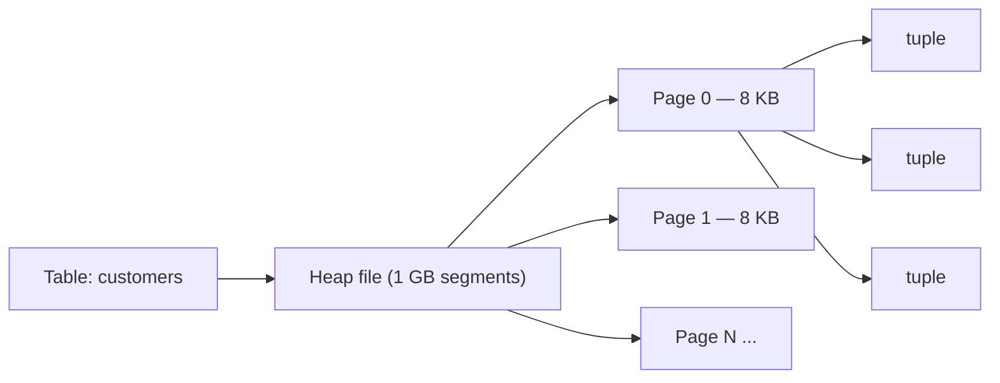
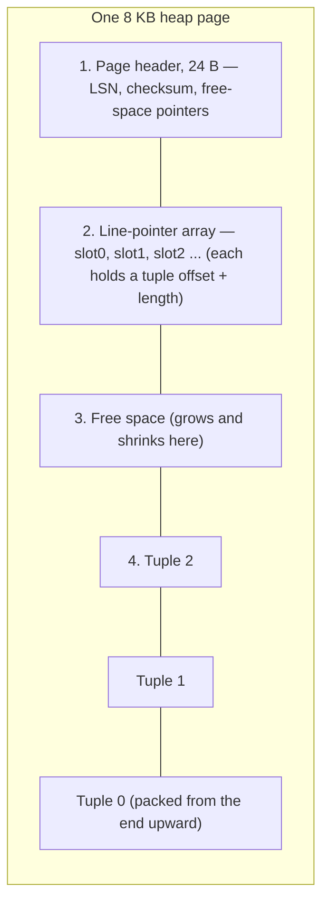
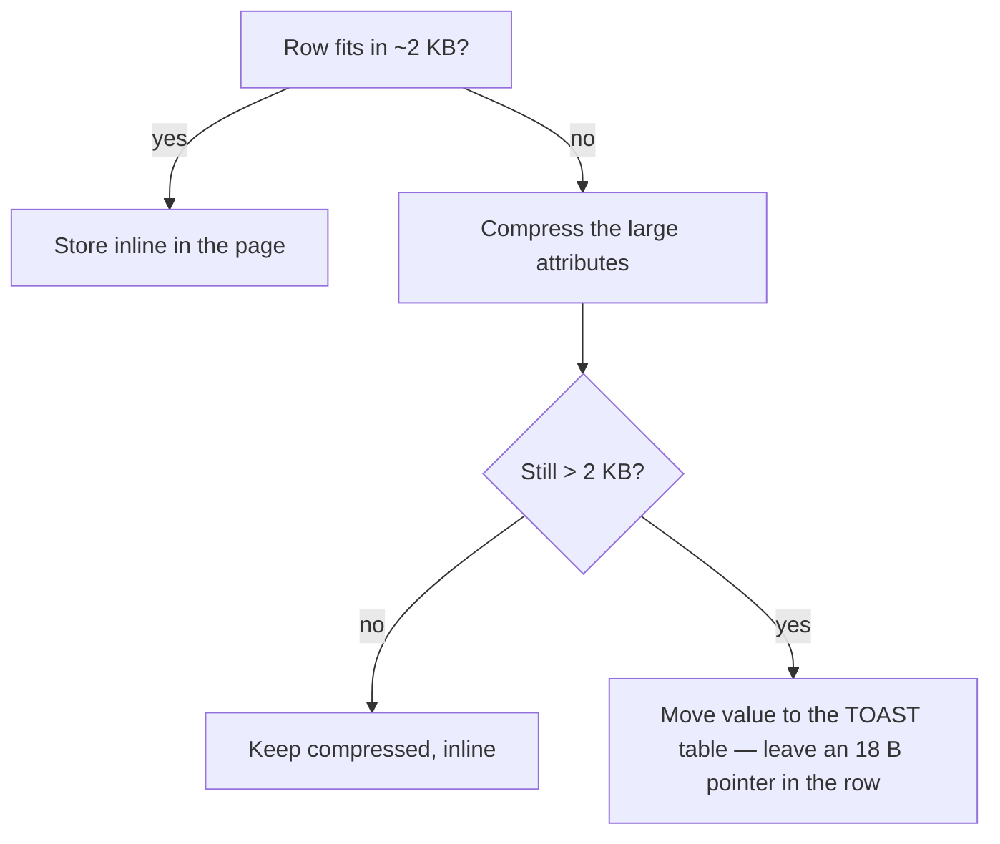

A table is not a magic grid — it's a **heap file**: a flat sequence of fixed-size **pages**
(also called blocks). The database only ever reads and writes whole pages, never single
rows. Let's *see* that hierarchy, then zoom inside one page.

## From table to bytes



| Unit | Typical size | Notes |
|------|:---:|------|
| Page / block | **8 KB** (Postgres) | the unit of I/O and caching — `SHOW block_size;` |
| Heap file | up to **1 GB** per segment | one table = one or more segment files |
| Tuple | variable | one physical row version, lives entirely inside one page |

## Inside one page (the "slotted page")

A page is filled from **both ends**: a header and a growing array of **line pointers** at the
top, the actual **tuples** packed upward from the bottom, and shrinking **free space** in the
middle. Line pointers give each row a stable slot number even when tuples move.



:::key
A row's physical address is its **`ctid` = (page number, slot number)**. Indexes and MVCC
point at rows by `ctid`. Because callers reach a tuple *through* its line pointer, the tuple
can be moved within the page (to compact free space) without breaking any pointer to it.
:::

```sql
-- ctid exposes each row's (page, slot) location
SELECT ctid, id, name FROM customers LIMIT 3;
--  ctid  | id | name
-- (0,1)  |  1 | Ada     ← page 0, slot 1
-- (0,2)  |  2 | Bo       ← page 0, slot 2
-- (0,3)  |  3 | Cara
```

## Inside one tuple (row layout)

| Part | Size (Postgres) | Purpose |
|------|:---:|---------|
| Tuple header | 23 B | `xmin` / `xmax` (MVCC version stamps), `ctid` of next version, info flags |
| Null bitmap | 1 bit / column | which columns are `NULL` (omitted entirely if the row has no NULLs) |
| Padding | — | align the data to a word boundary |
| Column data | varies | the values themselves, stored in column order |

:::senior
The 23-byte header is why **narrow tables waste a lot per row** and why MVCC "updates" are
really *insert a new tuple version + mark the old one dead*. `xmin`/`xmax` stamp which
transactions can see each version — storage layout and transaction isolation are the same
mechanism.
:::

## Reading a row: disk → buffer → tuple

Nothing is read from disk directly into your query. A page is first pulled into a **buffer
pool** frame (shared RAM), *then* the row is located inside it. Watch one read:

```walkthrough
title: Fetching row ctid (42,3)
code: |
  1  locate page P from the row's ctid = (page, slot)
  2  search the buffer pool's frames for page P
  3  on a miss, read P from disk into a free frame, pin it
  4  follow the page's line-pointer array to the tuple, return it
steps:
  - text: 'The row `ctid = (42,3)` means **page 42, slot 3**. First, is page 42 already cached? These boxes are the buffer-pool frames (each holds one page).'
    array: ['p7', 'p3', 'free', 'p9']
    line: 1
  - text: 'Scan the 4 frames for page 42 — it is **not here**. That is a buffer-pool **miss**.'
    array: ['p7', 'p3', 'free', 'p9']
    line: 2
  - text: 'Read page 42 from disk into the empty frame (slot 2) and **pin** it so it cannot be evicted mid-read.'
    array: ['p7', 'p3', 'p42', 'p9']
    highlight: [2]
    line: 3
  - text: 'Now walk that page''s **line-pointer array** to slot 3''s offset, copy out the tuple, and unpin. The row is returned — all further reads of page 42 are now cache hits.'
    array: ['p7', 'p3', 'p42', 'p9']
    sorted: [2]
    pointers: { 2: 'row' }
    line: 4
```

## Oversized values: TOAST

A tuple must fit in one 8 KB page, and Postgres wants at least ~4 tuples per page — so a value
bigger than roughly **2 KB** can't stay inline. **TOAST** (The Oversized-Attribute Storage
Technique) compresses it and, if still too big, moves it to a companion table, leaving a small
pointer in the row.



````tabs
tabs:
  - label: Storage strategies
    body: |
      | Strategy | Compress? | Out-of-line? | Default for |
      |----------|:---:|:---:|------|
      | `PLAIN` | no | no | fixed-width types (`int`, `bool`) |
      | `MAIN` | yes | last resort | prefer inline, compressed |
      | `EXTENDED` | yes | yes | `text`, `bytea`, `jsonb` (the default) |
      | `EXTERNAL` | no | yes | text you slice a lot (faster substring) |
  - label: Inspect sizes
    body: |
      `pg_column_size` reports the on-disk size of a value after any compression:
      ```sql
      SELECT pg_column_size(profile_json) AS bytes
      FROM users ORDER BY bytes DESC LIMIT 5;
      ```
      A big gap between `length(text)` and `pg_column_size` means TOAST compressed it.
````

:::gotcha
Reading a TOASTed column means an **extra fetch** from the hidden TOAST table. A `SELECT *`
that drags along a huge `jsonb` you don't need can be far slower than selecting the columns
you actually use — even though "it's just one row."
:::

## Terms to remember

```flashcards
title: Storage vocabulary
cards:
  - front: 'Page (block)'
    back: 'The fixed-size unit of I/O and caching — **8 KB** in Postgres. The DB reads/writes whole pages, never single rows.'
  - front: 'Heap file'
    back: 'A table''s data on disk: an unordered sequence of pages, split into 1 GB segment files.'
  - front: 'Tuple'
    back: 'One physical row version stored inside a page (header + null bitmap + column data).'
  - front: '`ctid`'
    back: 'A row''s physical address = **(page number, slot number)**. How indexes and MVCC point at rows.'
  - front: 'Line pointer (item id)'
    back: 'An entry in the page''s slot array holding a tuple''s offset + length — indirection that lets tuples move within a page.'
  - front: 'Buffer pool'
    back: 'Shared RAM holding cached pages in fixed **frames**. Every page access goes through it.'
  - front: 'TOAST'
    back: 'The Oversized-Attribute Storage Technique: compress and/or move values over ~2 KB out of the main row.'
```

## Check yourself

```quiz
title: Storage & pages
questions:
  - q: 'What is the default page (block) size in PostgreSQL?'
    options:
      - '512 B'
      - text: '8 KB'
        correct: true
      - '64 KB'
      - '1 MB'
    explain: 'Postgres uses **8 KB** pages by default (`SHOW block_size;`). All I/O and caching happen in whole pages of this size.'
  - q: 'A row''s `ctid` value `(42, 3)` identifies what?'
    options:
      - 'Transaction 42, savepoint 3'
      - text: 'Page 42, slot (line pointer) 3'
        correct: true
      - 'Column 42, byte offset 3'
    explain: '`ctid` is the physical address: **page number, then slot number** within that page''s line-pointer array.'
  - q: 'When does a large `text`/`jsonb` value get pushed out to a TOAST table?'
    options:
      - 'Always, for any variable-length type'
      - text: 'When the row still exceeds ~2 KB after the DB tries compressing it'
        correct: true
      - 'Only when you run VACUUM'
    explain: 'TOAST first **compresses**; only if the row is still too big to keep ~4 tuples per 8 KB page does it move the value out-of-line and leave a pointer.'
```

:::note
Reading a row is never "just grab the row." It is: find the page → get that page into the
buffer pool → follow the slot array to the tuple → maybe fetch TOASTed columns. Every layer
here exists to make that path fast and to pack rows densely on disk.
:::
