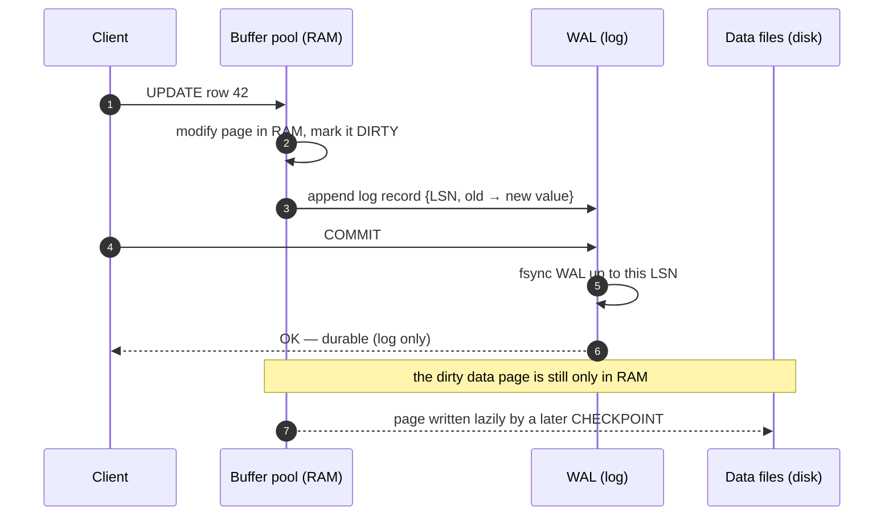
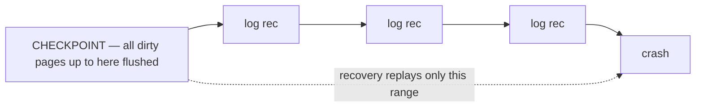

How does a database survive being killed mid-write and lose nothing that it promised? One
rule: **write the log record before the data page**. That is *write-ahead logging*, and it's
what makes `COMMIT` both fast and durable.

:::key
**The WAL rule:** the log record describing a change must reach durable storage **before** the
modified data page does. A `COMMIT` waits only for the small, sequential **log** to be
flushed — never for the random data-page writes.
:::

## The write path

The data page is changed **in RAM** and marked dirty; only the tiny log record is forced to
disk at commit. The heavy data-page write happens later, in the background.



Why this is fast: WAL writes are **sequential appends** to one file, and many concurrent
commits' fsyncs are batched (**group commit**). Random writes to scattered data pages are the
expensive part — and WAL defers them.

## Redo vs undo

A log record can carry two things: the **new** value (to re-apply a change) and the **old**
value (to take it back).

| Log info | Answers | Powers |
|----------|---------|--------|
| **Redo** (new value) | "how do I re-apply this?" | replaying committed work lost from cache after a crash |
| **Undo** (old value) | "how do I take this back?" | `ROLLBACK`, and removing uncommitted work during recovery |

:::senior
Postgres keeps **redo** in WAL and gets "undo" for free from **MVCC** — the old row version is
still there until vacuumed, so a rollback just abandons the new version. Oracle and MySQL's
InnoDB instead keep an explicit **undo log**. Same durability goal, two different designs.
:::

## Checkpoints bound recovery

WAL grows forever unless something says "everything up to here is safely on disk." A
**checkpoint** flushes all dirty pages up to a point and records that LSN. Recovery then only
replays WAL **from the last checkpoint**, not the entire history.



**Trade-off:** frequent checkpoints mean shorter recovery but more constant I/O; rare
checkpoints mean less I/O but a longer restart. Tuned via `checkpoint_timeout` /
`max_wal_size`.

## Crash recovery: replay the log

After a crash, the database restarts and reruns the log from the last checkpoint. Classic
**ARIES** recovery does three passes:

| Phase | Direction | Does |
|-------|-----------|------|
| **Analysis** | forward from checkpoint | rebuild which transactions were in flight and which pages were dirty |
| **Redo** | forward | re-apply **every** logged change ("repeat history") to restore the exact pre-crash state |
| **Undo** | backward | roll back changes of transactions that never committed |

```walkthrough
title: Recovery — redo committed, undo the rest
code: |
  1  start at the last checkpoint's LSN
  2  for each log record forward:
  3     re-apply its change to the page (REDO)
  4  roll back any transaction that has no COMMIT (UNDO)
steps:
  - text: 'Recovery starts at the **checkpoint**, LSN 100. Everything at or before it is already safely on disk, so we skip it. The boxes are WAL records by LSN.'
    array: [100, 101, 102, 103, 104]
    highlight: [0]
    pointers: { 0: 'ckpt' }
    line: 1
  - text: 'LSN 101: transaction **T1** modified a page. **Redo** it — re-apply the new value.'
    array: [100, 101, 102, 103, 104]
    highlight: [1]
    pointers: { 1: 'T1' }
    line: 3
  - text: 'LSN 102: **T2** modified a page. Redo it too. We replay history exactly, in order.'
    array: [100, 101, 102, 103, 104]
    highlight: [2]
    sorted: [1]
    pointers: { 2: 'T2' }
    line: 3
  - text: 'LSN 103: **T1 COMMIT**. T1''s work is confirmed durable and kept.'
    array: [100, 101, 102, 103, 104]
    highlight: [3]
    sorted: [1, 2]
    pointers: { 3: 'T1 ✔' }
    line: 3
  - text: 'LSN 104: **T2** changed a page but there is **no T2 COMMIT** in the log → **undo** it. Recovery done: committed work restored, uncommitted work rolled back.'
    array: [100, 101, 102, 103, 104]
    highlight: [4]
    sorted: [1, 2, 3]
    pointers: { 4: 'T2 ✗' }
    line: 4
```

## Durability knobs

```sql
SHOW wal_level;            -- minimal | replica | logical
SHOW synchronous_commit;   -- on = fsync WAL before COMMIT returns
CHECKPOINT;                -- force a checkpoint now
SELECT pg_current_wal_lsn();  -- current position in the log
```

:::gotcha
`synchronous_commit = off` returns from `COMMIT` **before** the WAL fsync. It's much faster,
but a crash can lose the last fraction of a second of committed transactions. Crucially it
**never corrupts** the database (the WAL rule still holds) — you only lose recent commits.
Turning off `fsync` entirely, by contrast, *can* corrupt: never do it on real data.
:::

## Terms to remember

```flashcards
title: WAL vocabulary
cards:
  - front: 'Write-ahead logging (WAL)'
    back: 'Log a change durably **before** writing the data page. Foundation of durability and crash recovery.'
  - front: 'LSN'
    back: 'Log Sequence Number — the monotonically increasing byte position of a record in the WAL.'
  - front: 'Redo'
    back: 'Log info (the new value) used to **re-apply** committed changes during recovery.'
  - front: 'Undo'
    back: 'Log info (the old value) used to **roll back** uncommitted changes (ROLLBACK / recovery cleanup).'
  - front: 'Checkpoint'
    back: 'Flush all dirty pages up to a point and record it, so recovery only replays WAL after that point.'
  - front: 'fsync'
    back: 'The OS call that forces buffered writes to physical storage. Commit durability = fsync of the WAL.'
  - front: 'Group commit'
    back: 'Batching many concurrent commits into one WAL fsync to amortize the expensive flush.'
  - front: 'ARIES'
    back: 'The standard recovery algorithm: Analysis → Redo (repeat history) → Undo.'
```

## Check yourself

```quiz
title: WAL & recovery
questions:
  - q: 'Under the WAL rule, what must reach durable storage first?'
    options:
      - 'The modified data page'
      - text: 'The log record describing the change'
        correct: true
      - 'They are written together atomically'
    explain: 'Log **before** data. The data page can stay dirty in RAM long after commit — the durable log record is enough to reconstruct it after a crash.'
  - q: 'What does a checkpoint do for crash recovery?'
    options:
      - 'Deletes all WAL so recovery is instant'
      - text: 'Bounds recovery — replay only needs to start from the last checkpoint, not the whole log'
        correct: true
      - 'Locks the database until the next commit'
    explain: 'A checkpoint flushes dirty pages and records the LSN, so recovery replays WAL only from that point forward. It shortens restart time at the cost of steady background I/O.'
  - q: 'A `COMMIT` (with `synchronous_commit = on`) returns after the fsync of what?'
    options:
      - 'All modified data files'
      - text: 'The WAL, up to the transaction''s commit record'
        correct: true
      - 'The entire buffer pool'
    explain: 'Commit forces only the **WAL** to disk. The dirty data pages are written later by the checkpointer/background writer — that indirection is what makes commits cheap.'
```

:::note
WAL turns "make every change durable to disk immediately" (slow, random writes) into "make one
small sequential log durable" (fast). Durability and crash recovery fall out of the same log.
:::
