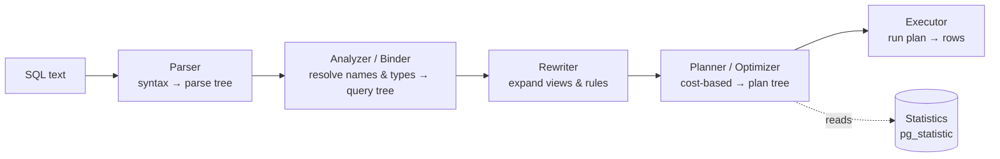
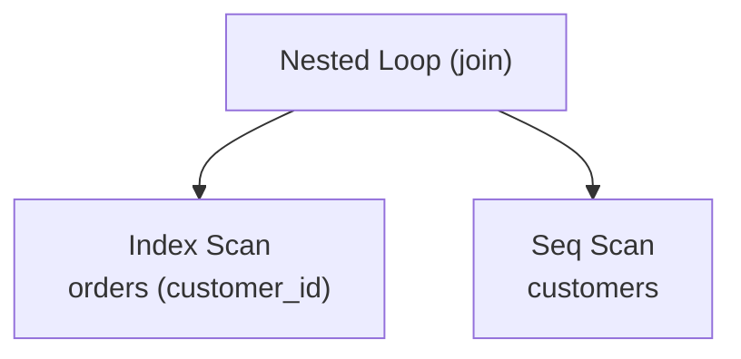

SQL is **declarative**: you say *what* rows you want, not *how* to get them. Turning that text
into an execution strategy is a pipeline, and the interesting stage is the **optimizer** —
which picks a plan by estimating cost from statistics, without ever running the query.

## The pipeline



| Stage | Input → output | Job |
|-------|----------------|-----|
| **Parser** | SQL text → parse tree | check **syntax**; build a raw tree (no meaning yet) |
| **Analyzer / Binder** | parse tree → query tree | resolve table & column **names and types**; check they exist and are permitted |
| **Rewriter** | query tree → query tree | expand **views**, apply rules (e.g. row-level security) |
| **Planner / Optimizer** | query tree → plan tree | choose the **cheapest** physical plan: join order, scan & join methods |
| **Executor** | plan tree → rows | run the plan, pulling rows up the tree |

:::note
Parsing and binding fail fast on typos and unknown columns. By the time the optimizer runs,
the query is known-valid — its only job is choosing the **fastest correct** way to run it.
There is exactly one right answer set, but many plans that produce it.
:::

## The cost-based optimizer

The optimizer enumerates equivalent physical plans and keeps the one with the lowest
**estimated cost**. Cost is a prediction from **statistics** — not a measurement.

| Statistic (`pg_stats`) | Meaning | Used to estimate |
|------------------------|---------|------------------|
| `n_distinct` | number of distinct values in a column | join & `GROUP BY` cardinality |
| `most_common_vals` (MCV) | frequent values and their frequencies | selectivity of `col = x` |
| `histogram_bounds` | value distribution in buckets | range selectivity `col < x` |
| `null_frac` | fraction of NULLs | `IS NULL` selectivity |
| `correlation` | physical vs logical row order | index-scan cost |

```text
cost ≈ pages_read × seq_page_cost  +  rows_processed × cpu_tuple_cost
rows_processed = selectivity × table_cardinality
```

A single mis-estimated **row count** is the number-one cause of a bad plan — it cascades into
wrong join methods and orders.

```walkthrough
title: Choosing a scan by cost
code: |
  1  estimate selectivity from statistics
  2  enumerate candidate physical plans
  3  ask the cost model for each plan's cost
  4  keep the cheapest plan
steps:
  - text: 'Query is `WHERE id = 42` on a 1,000,000-row table. Statistics say ~5 rows match → **selectivity ≈ 0.000005**. The boxes are each candidate plan''s estimated cost.'
    array: [1000, 8, 25]
    pointers: { 0: 'Seq', 1: 'Index', 2: 'Bitmap' }
    line: 1
  - text: '**Seq Scan** reads every page and filters — cost ≈ 1000, basically fixed no matter how few rows match.'
    array: [1000, 8, 25]
    highlight: [0]
    pointers: { 0: 'Seq' }
    line: 3
  - text: '**Index Scan** walks the B-tree straight to ~5 rows — cost ≈ 8. This estimate only works because statistics predicted "~5 rows."'
    array: [1000, 8, 25]
    highlight: [1]
    pointers: { 1: 'Index' }
    line: 3
  - text: '**Bitmap Scan** is the middle option for medium selectivity — cost ≈ 25 here.'
    array: [1000, 8, 25]
    highlight: [2]
    pointers: { 2: 'Bitmap' }
    line: 3
  - text: 'Cheapest wins → the planner picks the **Index Scan**. If the statistics were stale and it guessed "500,000 rows," it would have chosen the Seq Scan instead — the classic bad-plan trap.'
    array: [1000, 8, 25]
    sorted: [1]
    pointers: { 1: 'chosen' }
    line: 4
```

## The plan tree and the executor

The optimizer's output is a tree of **physical operators**. The executor uses the **iterator
(volcano) model**: calling `next()` on the top operator pulls one row, which pulls rows from
its children on demand — no operator materializes everything unless it must.



## Reading a real plan

````tabs
tabs:
  - label: EXPLAIN
    body: |
      Shows the chosen plan with **estimated** cost and rows — without running it.
      ```sql
      EXPLAIN SELECT * FROM customers WHERE id = 42;
      -- Index Scan using customers_pkey on customers
      --   (cost=0.42..8.44 rows=1 width=64)
      --   Index Cond: (id = 42)
      ```
  - label: EXPLAIN ANALYZE
    body: |
      Actually **runs** the query and shows **actual** rows and timing next to the estimates.
      ```sql
      EXPLAIN ANALYZE SELECT * FROM customers WHERE id = 42;
      -- Index Scan ... (cost=0.42..8.44 rows=1 ...)
      --                (actual time=0.03..0.03 rows=1 loops=1)
      ```
      A big **estimated-vs-actual rows** gap points straight at stale statistics.
  - label: Refresh stats
    body: |
      ```sql
      ANALYZE customers;   -- recompute statistics
      SELECT * FROM pg_stats WHERE tablename = 'customers';
      ```
````

:::gotcha
Most "the optimizer chose a terrible plan" cases are really **stale statistics** after a big
data change. When `EXPLAIN ANALYZE` shows estimated rows wildly different from actual rows,
run `ANALYZE` before you reach for query hints or rewrites.
:::

:::senior
The optimizer's search space explodes with join count, so it doesn't try every plan — Postgres
switches to a **genetic** search past ~12 joins (`geqo`). "Why is this plan slow?" is usually
answered by *bad cardinality estimates*, not a bad cost model. Fixing the estimate (better
stats, extended statistics, a rewrite that's easier to estimate) fixes the plan.
:::

## Terms to remember

```flashcards
title: Query-processing vocabulary
cards:
  - front: 'Parser'
    back: 'Checks **syntax** and builds a raw parse tree — no name resolution yet.'
  - front: 'Analyzer / Binder'
    back: 'Resolves table & column **names and types**, checks existence and permissions → query tree.'
  - front: 'Rewriter'
    back: 'Rewrites the query tree: expands views and applies rules (e.g. row-level security).'
  - front: 'Planner / Optimizer'
    back: 'Chooses the **cheapest** physical plan (join order, scan/join methods) using cost estimates.'
  - front: 'Executor'
    back: 'Runs the plan tree, pulling rows on demand via the iterator (volcano) model.'
  - front: 'Cardinality'
    back: 'The estimated number of rows a step produces. Bad cardinality = bad plan.'
  - front: 'Selectivity'
    back: 'Fraction of rows a predicate keeps (0–1). cardinality = selectivity × table size.'
  - front: 'Statistics (ANALYZE)'
    back: 'Column distribution data (MCV, histogram, n_distinct…) the optimizer uses to estimate cost.'
```

## Check yourself

```quiz
title: Query processing
questions:
  - q: 'Which stage decides join order and which scan/join methods to use?'
    options:
      - 'The parser'
      - text: 'The planner / optimizer'
        correct: true
      - 'The executor'
    explain: 'The **optimizer** turns a validated query tree into the cheapest physical plan tree. The executor just runs whatever plan it''s handed.'
  - q: 'A cost-based optimizer estimates a plan''s cost primarily from what?'
    options:
      - 'Running the query and timing it'
      - text: 'Table & column statistics (row counts, value distributions)'
        correct: true
      - 'The order the tables appear in the FROM clause'
    explain: 'It **predicts** cost from statistics without executing the query. That''s why stale statistics — not the cost model — cause most bad plans.'
  - q: 'How does `EXPLAIN ANALYZE` differ from plain `EXPLAIN`?'
    options:
      - text: 'It actually executes the query and reports actual rows and timing'
        correct: true
      - 'It only formats the output more nicely'
      - 'It rewrites the query to be faster'
    explain: '`EXPLAIN` shows the estimated plan without running it; `EXPLAIN ANALYZE` runs it and shows **actual** rows/time beside the estimates — the gap reveals estimation errors.'
```

:::key
Pipeline: **parse → analyze/bind → rewrite → plan/optimize → execute.** The optimizer is
cost-based and driven by **statistics**; keep them fresh with `ANALYZE`, and read plans with
`EXPLAIN (ANALYZE)`.
:::
