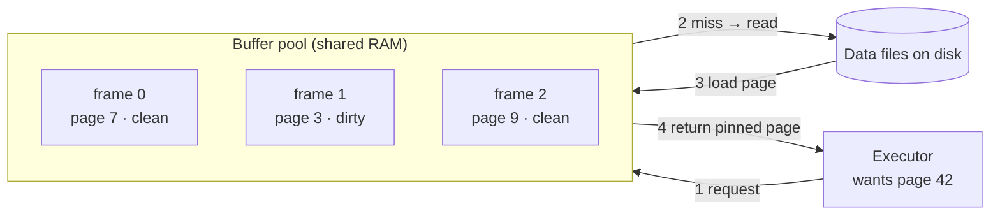

RAM is on the order of **100,000× faster** than a disk seek, so the whole game is: keep the
hot pages in memory and touch the disk as little as possible. The **buffer pool** is that
cache — a fixed set of RAM **frames**, each holding one page. Every page a query reads or
writes passes through it.

## The buffer pool



Each frame tracks a little bookkeeping:

| Frame | Page | Dirty? | Usage count | Pinned? |
|:---:|:---:|:---:|:---:|:---|
| 0 | 7 | clean | 3 | no |
| 1 | 3 | **dirty** | 5 | yes (in use) |
| 2 | 9 | clean | 0 | no ← eviction candidate |

- **Dirty** = modified in RAM but not yet written to disk.
- **Pinned** = a query is using it right now; it cannot be evicted.
- **Usage count** = how "hot" the page is; drives eviction.

## Eviction: which page leaves?

When the pool is full and a new page must load, one resident page has to go. **True LRU**
(evict the least-recently-used) is accurate but needs a lock-protected list touched on *every*
access — a scalability killer. Real databases **approximate** LRU with the **CLOCK
(second-chance)** algorithm.

````tabs
tabs:
  - label: LRU
    body: |
      Evicts the strictly least-recently-used page. Accurate, but every access must reorder a
      shared list under a lock → heavy contention on a busy system.
  - label: CLOCK (second chance)
    body: |
      Frames sit in a ring; each has a reference bit. A "hand" sweeps around:
      - ref bit = 1 → clear it to 0 and move on (a **second chance**),
      - ref bit = 0 → **evict** this one.

      O(1), almost lock-free, and a close LRU approximation. Postgres uses a **clock-sweep**
      variant with a small usage counter instead of a single bit.
````

## Watch the CLOCK hand evict a page

```walkthrough
title: CLOCK / clock-sweep eviction
code: |
  1  while looking for a victim:
  2     if frame[hand].ref == 0: evict frame[hand]; stop
  3     frame[hand].ref = 0        # spend its second chance
  4     hand = (hand + 1) % N      # advance the hand
steps:
  - text: 'The pool is full and we need a free frame. The boxes are **reference bits**; the pointer is the clock **hand**. It starts at slot 0.'
    array: [1, 1, 0, 1]
    highlight: [0]
    pointers: { 0: 'hand' }
    line: 1
  - text: 'Slot 0 ref bit = **1** → not a victim. Give it a **second chance**: clear the bit to 0 and advance.'
    array: [0, 1, 0, 1]
    highlight: [0]
    pointers: { 1: 'hand' }
    line: 3
  - text: 'Slot 1 ref bit = **1** → clear to 0 and advance again.'
    array: [0, 0, 0, 1]
    highlight: [1]
    pointers: { 2: 'hand' }
    line: 3
  - text: 'Slot 2 ref bit = **0** → **victim found!** If its page is dirty, flush it first (WAL rule), then evict.'
    array: [0, 0, 0, 1]
    highlight: [2]
    pointers: { 2: 'hand' }
    line: 2
  - text: 'Load the requested page into slot 2 and set its ref bit to 1. The hand rests here, ready for next time. Pages that were recently used (their bit was 1) survived — that''s the LRU approximation.'
    array: [0, 0, 1, 1]
    sorted: [2]
    pointers: { 2: 'loaded' }
    line: 2
```

## Cache hit ratio

The single best health metric for the pool: what fraction of page requests were served from
RAM without a disk read.

```text
hit ratio = blks_hit / (blks_hit + blks_read)
```

```sql
SELECT round(sum(blks_hit) * 100.0
           / nullif(sum(blks_hit + blks_read), 0), 2) AS hit_pct
FROM pg_stat_database;
```

For an OLTP working set you generally want **> 99%**. A falling ratio usually means the working
set outgrew `shared_buffers` — the cache is thrashing.

## Dirty pages & flushing

An evicted or committed page that was modified is **dirty** until it's written back. Three
actors do that writing:

| Writer | When | Why |
|--------|------|-----|
| **Background writer** | continuously, a trickle | keep clean frames ready so foreground queries never wait to evict |
| **Checkpointer** | at each checkpoint | bound crash-recovery time; let old WAL be recycled |
| **A backend** | last resort, if eviction finds only dirty frames | forced write **on the query's critical path** — a latency spike |

:::gotcha
The WAL rule reaches in here: a dirty data page can **never** be flushed before its WAL record
is durable. So under write pressure the buffer pool can stall waiting on WAL — a slow disk for
the log slows down *everything*, not just commits.
:::

:::senior
`shared_buffers` is usually sized to **~25% of RAM**, not more. The OS page cache *also* caches
file pages, so a giant buffer pool double-caches the same data and wastes memory. The DB's
clock-sweep pool plus the OS cache act as a **two-tier cache** — leave room for the second
tier.
:::

## Terms to remember

```flashcards
title: Buffer & caching vocabulary
cards:
  - front: 'Buffer pool'
    back: 'A fixed region of shared RAM caching disk pages in **frames**. Every page access goes through it.'
  - front: 'Frame'
    back: 'One page-sized slot in the buffer pool, plus bookkeeping (dirty bit, usage count, pin count).'
  - front: 'Pin / reference count'
    back: 'A page in active use is **pinned** (ref count > 0) and cannot be evicted until released.'
  - front: 'Dirty page'
    back: 'A cached page modified in RAM but not yet written back to disk.'
  - front: 'LRU'
    back: 'Least-Recently-Used eviction — accurate but needs per-access, lock-protected bookkeeping.'
  - front: 'CLOCK / clock-sweep'
    back: 'A cheap LRU approximation: a hand sweeps a ring, giving pages a second chance via a reference bit/counter.'
  - front: 'Cache hit ratio'
    back: '`blks_hit / (blks_hit + blks_read)` — fraction of page requests served from RAM. Aim > 99% for OLTP.'
  - front: 'Background writer'
    back: 'Trickles dirty pages to disk in the background so foreground queries rarely have to flush during eviction.'
```

## Check yourself

```quiz
title: Buffer pool & eviction
questions:
  - q: 'Why do databases approximate LRU with the CLOCK algorithm instead of using true LRU?'
    options:
      - 'CLOCK evicts more accurately than LRU'
      - text: 'True LRU''s per-access, lock-protected bookkeeping doesn''t scale; CLOCK approximates it in O(1) with little locking'
        correct: true
      - 'CLOCK never has to write dirty pages'
    explain: 'Every access under true LRU must reorder a shared list under a lock — a contention bottleneck. CLOCK gets close to LRU behaviour with a cheap reference bit and a sweeping hand.'
  - q: 'During a CLOCK sweep, a frame whose reference bit is **1** is…'
    options:
      - 'evicted immediately'
      - text: 'given a second chance — its bit is cleared to 0 and the hand moves on'
        correct: true
      - 'pinned permanently'
    explain: 'Only a frame found with ref bit **0** is evicted. A bit of 1 means "recently used," so it''s cleared and skipped — that''s the "second chance" that mimics recency.'
  - q: 'A cache hit ratio of 99% means what?'
    options:
      - '99% of the database fits in RAM'
      - text: '99% of page requests were served from the buffer pool without a disk read'
        correct: true
      - '99% of queries returned successfully'
    explain: 'Hit ratio = `blks_hit / (blks_hit + blks_read)`. It measures requests satisfied from cache, not how much data or how many queries succeeded.'
```

:::key
The buffer pool caches pages in RAM frames; a full pool evicts a **victim** chosen by a cheap
LRU approximation (**CLOCK / clock-sweep**). Watch the **hit ratio** (> 99% for OLTP), and
remember dirty pages must respect the WAL rule before they can be flushed.
:::
