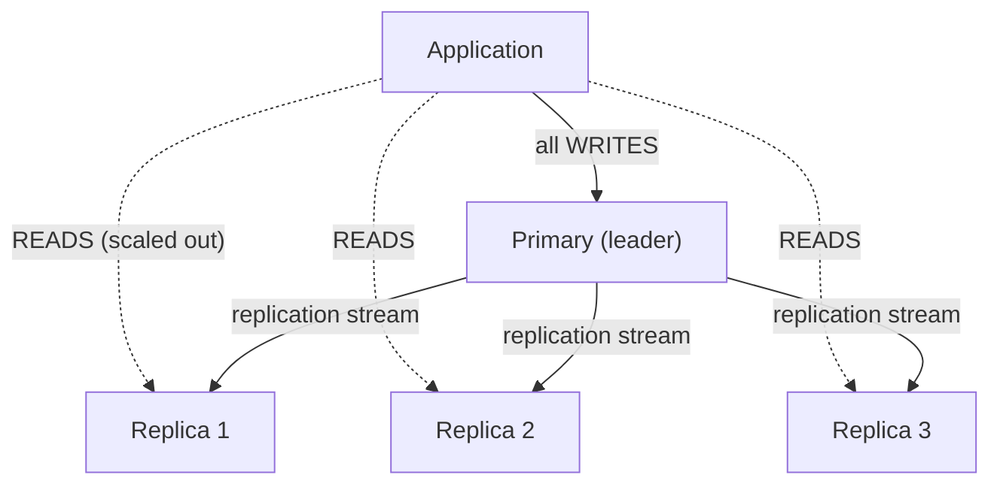
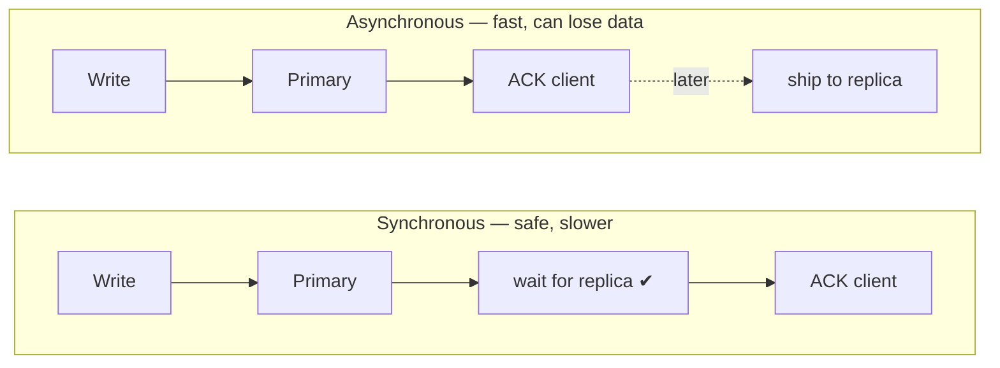
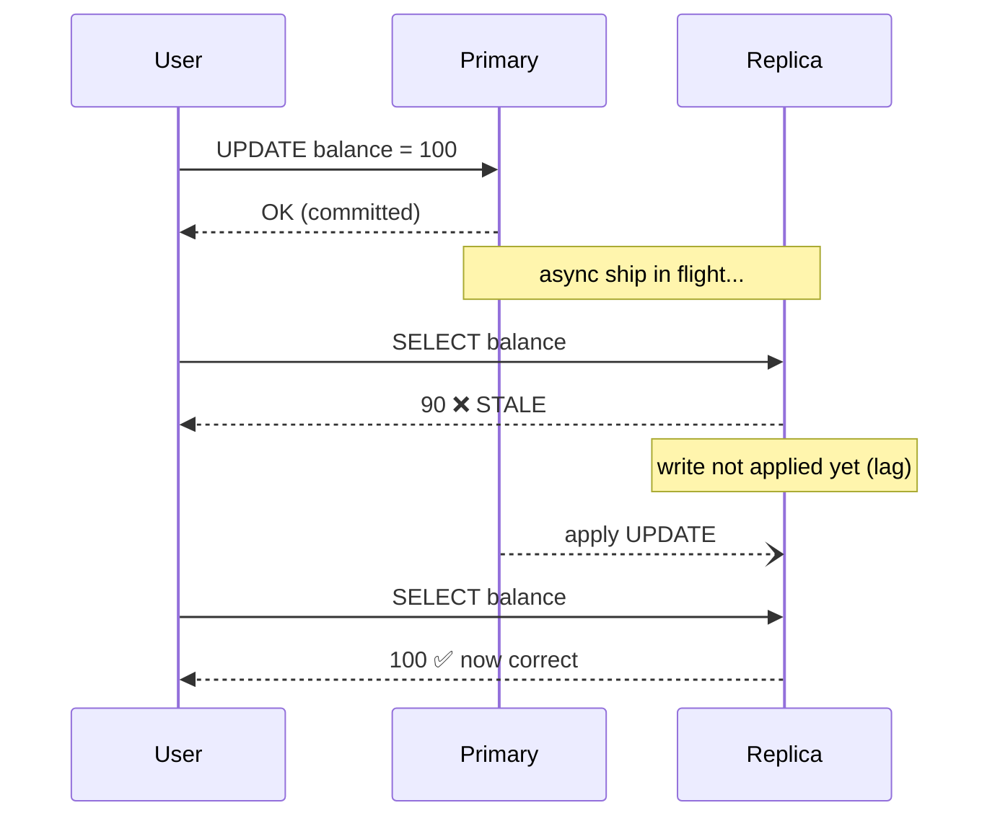
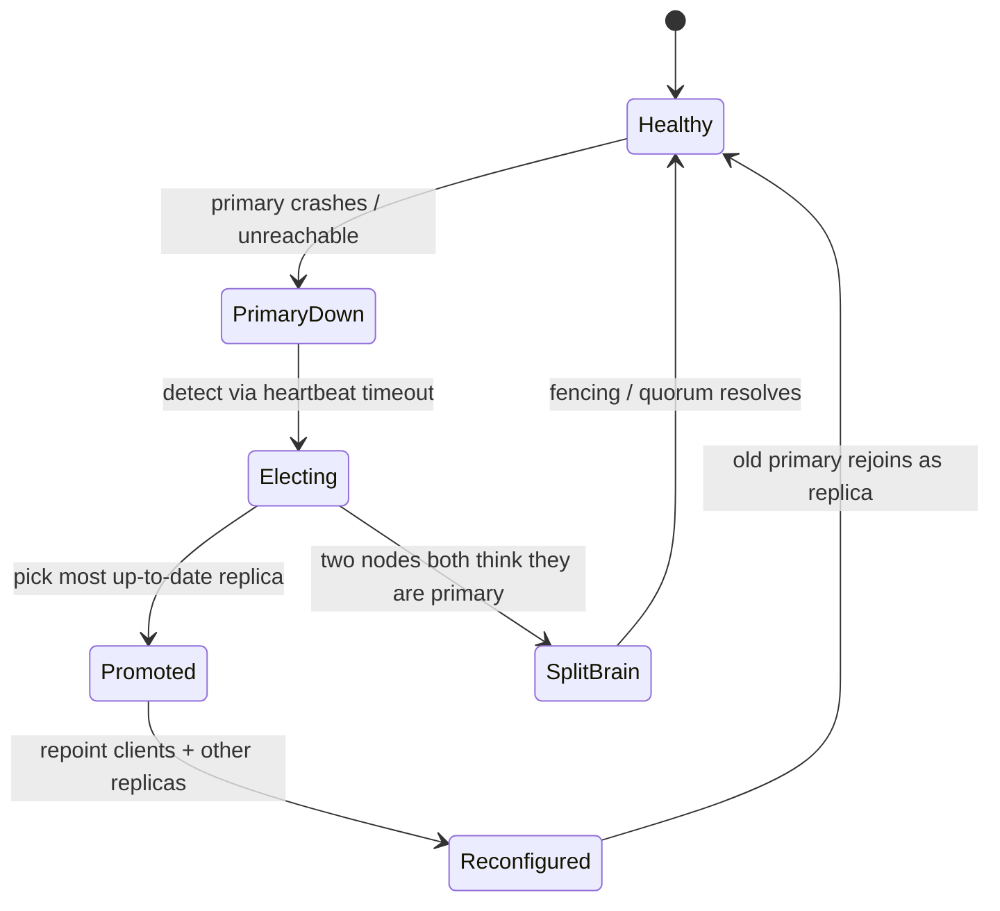

**Replication** keeps copies of your data on more than one machine. You do it for two reasons: **survive a node dying** (availability) and **serve more reads** (scale). The catch is the copies drift out of sync — and that drift is where every interview question lives.

## The topology

One node accepts writes (the **primary**, a.k.a. leader/master). It streams its changes to one or more **replicas** (followers). Reads can be served by *any* node.



:::key
**Writes go to one place; reads fan out.** This asymmetry is the whole point — most workloads are read-heavy, so adding replicas multiplies read capacity without touching the write path.
:::

## Synchronous vs asynchronous

The knob that matters: **does the primary wait for replicas before acknowledging a write?**

| | **Synchronous** | **Asynchronous** |
|---|---|---|
| Primary waits for replica ack? | ✅ yes (≥1 replica) | ❌ no — acks immediately |
| Write latency | Higher (network round-trip) | Low |
| Data loss on primary crash | **None** (replica has it) | **Possible** (unshipped writes lost) |
| Stale reads on replica | Rare | **Common** (that's the lag) |
| If a replica is slow/down | Writes **stall** | Writes unaffected |



:::senior
Real systems rarely go fully synchronous to *all* replicas — one slow follower would freeze every write. The practical middle ground is **semi-synchronous**: wait for **one** replica to confirm (durability), let the rest catch up asynchronously (throughput). Postgres `synchronous_commit` and MySQL semi-sync do exactly this.
:::

## Watch replication lag create a stale read

**Replication lag** is the delay between a write committing on the primary and that change appearing on a replica. During that window, a read routed to the replica sees **old data**.



The classic user-visible bug: **"I updated my profile, refreshed, and my change was gone."** The refresh hit a lagging replica.

:::gotcha
Lag is not constant. A big batch write, a long-running transaction, or a network blip can spike it from milliseconds to **minutes**. Never assume "replication is basically instant" — always design for the lag being arbitrarily large, and **monitor it** (`SHOW REPLICA STATUS` / `pg_stat_replication`).
:::

### Read-your-writes: the fix

If a user must see their own writes immediately, you need **read-your-writes consistency**. Common tactics:

- **Read from the primary** for a short window after that user writes (e.g. route their next few seconds of reads to the leader).
- **Track a write timestamp/LSN** per user and only read from a replica that has caught up past it.
- Keep the just-written value in a **session cache** and serve it locally.

## Failover

When the primary dies, a replica must be **promoted** to become the new primary. This is the availability payoff — but it is the riskiest moment in the system.



The hard parts an interviewer probes:

- **Data loss window** — with async replication, writes the dead primary never shipped are simply **gone** (or must be discarded when it rejoins).
- **Split-brain** — if the old primary was only *network-partitioned* (not dead) and keeps taking writes, you now have **two primaries** diverging. Prevented by **quorum / consensus** (Raft, ZooKeeper) and **fencing** (STONITH — refuse the old primary).
- **Detection lag** — too-eager failover flaps on a transient blip; too-slow means downtime. Tuned via heartbeat timeouts.

:::note
Failover can be **automatic** (an orchestrator like Patroni, Orchestrator, or a managed RDS/Aurora control plane) or **manual**. Automatic is faster but risks flapping and split-brain; it must be paired with a consensus layer to decide *who* is primary.
:::

## Terminology recall

```flashcards
title: Replication terms
cards:
  - front: 'Replication lag'
    back: 'Delay between a write committing on the **primary** and appearing on a **replica**. Causes **stale reads**.'
  - front: 'Semi-synchronous replication'
    back: 'Primary waits for **at least one** replica to confirm, then acks. Balances durability against write latency.'
  - front: 'Split-brain'
    back: 'Two nodes both believe they are primary (usually after a partition) and accept diverging writes. Prevented by quorum + **fencing**.'
  - front: 'Read-your-writes consistency'
    back: 'Guarantee that a user always sees their **own** most recent write, even when reads are served by lagging replicas.'
  - front: 'Failover'
    back: 'Promoting a replica to primary after the primary fails. Riskiest moment: possible data-loss window and split-brain.'
```

## Check yourself

```quiz
title: Replication intuition
questions:
  - q: 'With **asynchronous** replication, the primary crashes right after acking a write it had not yet shipped. What happens to that write?'
    options:
      - text: 'It may be permanently lost'
        correct: true
      - 'It is automatically recovered from a replica'
      - 'The client is guaranteed an error, so no data is lost'
    explain: 'Async acks before shipping, so a crash in that window loses un-replicated writes. This is the durability price of low write latency.'
  - q: 'A user updates their profile then immediately re-reads it and sees the OLD value. Most likely cause?'
    options:
      - 'The database is corrupted'
      - text: 'The read hit a replica that has not applied the change yet (replication lag)'
        correct: true
      - 'The write silently failed'
    explain: 'Classic stale read from replication lag. Fix with read-your-writes: route that user to the primary briefly, or pin reads to a caught-up replica.'
  - q: 'Why do production systems usually avoid fully SYNCHRONOUS replication to every replica?'
    options:
      - 'It uses too much disk'
      - text: 'A single slow or down replica would stall every write'
        correct: true
      - 'It is impossible to implement'
    explain: 'Waiting for all replicas makes the slowest one your write latency floor. Semi-sync (wait for one) is the common compromise.'
  - q: 'What mechanism prevents SPLIT-BRAIN during automatic failover?'
    options:
      - 'Larger replicas'
      - 'Asynchronous replication'
      - text: 'Quorum / consensus plus fencing of the old primary'
        correct: true
    explain: 'A majority must agree on the new primary, and the old one is fenced (refused) so it cannot keep accepting writes and diverge.'
```

:::key
Primary takes **writes**, replicas serve **reads**. **Async** = fast but can lose writes and serves stale reads; **sync/semi-sync** = durable but slower. **Replication lag** causes stale reads (fix with read-your-writes). **Failover** promotes a replica but risks a data-loss window and split-brain — solved with quorum + fencing.
:::
