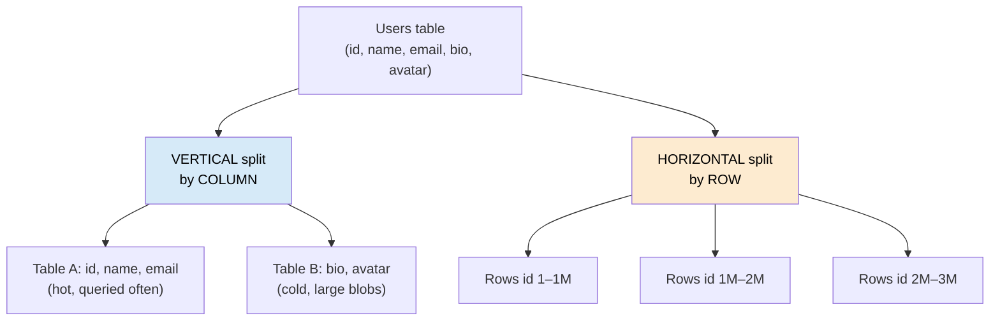
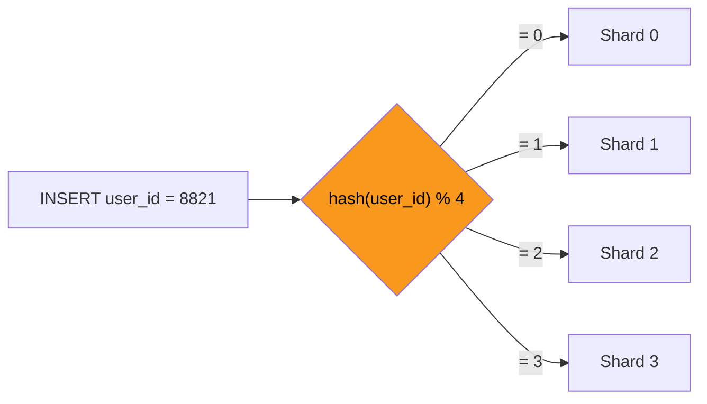
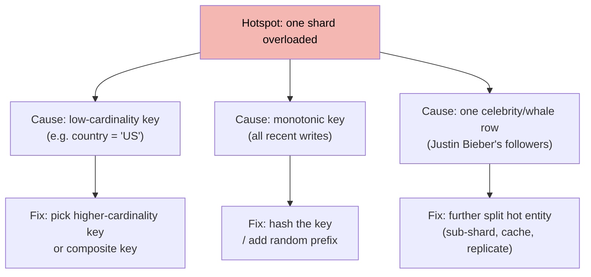
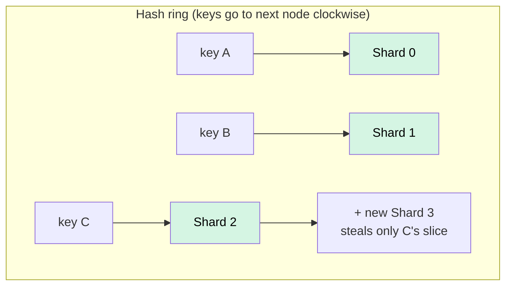

Replication copies the *whole* dataset to every node — great for reads, useless once the data or the **write** volume outgrows one machine. **Partitioning** splits the data into pieces so each node holds only a slice. When those slices live on *different servers*, we call it **sharding**.

## Two axes of splitting



| | **Vertical partitioning** | **Horizontal partitioning (sharding)** |
|---|---|---|
| Splits by | **Columns** | **Rows** |
| Each piece has | Some columns, all rows | All columns, some rows |
| Solves | Wide rows; separate hot/cold or large columns | Table too big / too many writes for one node |
| Example | Move `avatar BLOB` to its own table | Rows `1–1M` on shard A, `1M–2M` on shard B |
| Scaling limit | Still one server's worth of rows | **Scales writes horizontally** across servers |

:::note
"Partitioning" often means *within one database* (Postgres declarative partitions, splitting a table into sub-tables). "Sharding" means those partitions live on **separate database servers**. Same idea, different blast radius.
:::

## Sharding: route each row by its shard key

A **shard key** (partition key) is the column whose value decides which shard a row lives on. Every query ideally carries it so the router knows exactly where to go.



Three ways to map a key to a shard:

- **Hash-based** — `hash(key) % N`. Spreads load evenly; **kills range scans** (adjacent keys scatter).
- **Range-based** — `A–M → shard 0`, `N–Z → shard 1`. Great for range queries; **prone to hotspots** (everyone named "S", or all *recent* timestamps, pile onto one shard).
- **Directory/lookup** — a lookup table maps key → shard. Most flexible (rebalance by editing the map); the directory becomes a dependency to keep available.

### Trace one row to its shard

```walkthrough
title: Routing INSERT user_id = 8821 with hash % 4
code: |
  shard = hash(user_id) % NUM_SHARDS   // NUM_SHARDS = 4
  route_to(shard)
steps:
  - text: 'We shard 4 ways. These boxes are the four shards, each holding a slice of users.'
    array: ['S0', 'S1', 'S2', 'S3']
    line: 1
  - text: 'Compute `hash(8821)` → suppose it yields **58223**. Now take `58223 % 4`.'
    array: ['S0', 'S1', 'S2', 'S3']
    line: 1
  - text: '`58223 % 4 = 3` → the row belongs on **Shard 3**. Every future query for user 8821 hashes to the same shard.'
    array: ['S0', 'S1', 'S2', 'S3']
    highlight: [3]
    pointers: { 3: '8821' }
    line: 2
  - text: 'A different user, id 100, hashes elsewhere → lands on **Shard 1**. Load spreads across all four.'
    array: ['S0', 'S1', 'S2', 'S3']
    highlight: [1]
    sorted: [3]
    pointers: { 1: '100', 3: '8821' }
    line: 2
```

## Choosing the shard key (the whole ballgame)

The shard key determines whether you scale smoothly or build a distributed traffic jam. Weigh three things: **even distribution**, **query locality** (can most queries hit one shard?), and **cardinality**.

| Shard key strategy | Distribution | Range queries | Hotspot risk | Good for |
|---|---|:---:|:---:|---|
| **Hash of high-cardinality id** (`user_id`) | Even ✅ | Bad ❌ | Low | Point lookups by that id |
| **Range of a natural key** (`last_name`) | Uneven ⚠️ | Good ✅ | Medium | Alphabetical / range scans |
| **Timestamp / auto-increment** | Terrible ❌ | Good ✅ | **Severe** (all writes on newest shard) | *Avoid as the sole key* |
| **Tenant / customer id** (multi-tenant) | Depends on tenant sizes | Good within tenant ✅ | High if one whale tenant | SaaS — keeps a tenant's data co-located |
| **Composite** (`tenant_id` + hash) | Even ✅ | Within tenant | Low | Best of both — locality *and* spread |

:::gotcha
**A monotonically increasing shard key (timestamp, auto-increment id) is the classic hotspot bug.** Every new write targets the single "newest" shard while the others sit idle — you sharded and got *zero* write scaling. Hash the key, or prefix it with something high-cardinality.
:::

## Hotspots

A **hotspot** is one shard receiving a disproportionate share of traffic. Causes and cures:



## Rebalancing: consistent hashing

Naive `hash(key) % N` has a fatal flaw: **change `N` and almost every key moves.** Going from 4 → 5 shards remaps ~80% of your data — a migration nightmare.

**Consistent hashing** places both shards and keys on a ring; a key belongs to the next shard clockwise. Adding a shard only steals keys from its immediate neighbor, so **only ~1/N of keys move**.



:::senior
Real consistent-hashing rings use **virtual nodes** — each physical shard owns *many* points on the ring. This smooths distribution (no single huge arc) and makes removing a node spread its load across *all* survivors instead of dumping it on one neighbor. It is how Dynamo, Cassandra, and most consistent-hash caches actually work.
:::

:::gotcha
Sharding taxes queries. A query **without** the shard key becomes a **scatter-gather**: hit *every* shard and merge — slow and fan-out-heavy. **Cross-shard JOINs and transactions** are worst of all (no single node has both rows). Design so your hot queries carry the shard key, and dread the ones that do not.
:::

## Check yourself

```quiz
title: Sharding intuition
questions:
  - q: 'Vertical partitioning splits a table by ___ ; horizontal partitioning (sharding) splits it by ___.'
    options:
      - text: 'columns ; rows'
        correct: true
      - 'rows ; columns'
      - 'indexes ; keys'
    explain: 'Vertical = fewer columns per piece (split hot/cold or wide columns). Horizontal = fewer rows per piece, spread across servers — the one that scales writes.'
  - q: 'You shard orders by an auto-incrementing `order_id`. Why does write throughput barely improve?'
    options:
      - 'Auto-increment is slow'
      - text: 'Every new order targets the single newest shard — a hotspot — while other shards idle'
        correct: true
      - 'Auto-increment keys cannot be hashed'
    explain: 'Monotonic keys concentrate all new writes on one shard. Hash the key (or use a composite key) to spread writes across all shards.'
  - q: 'Going from 4 shards to 5 with plain `hash(key) % N`, roughly how much data must move?'
    options:
      - 'About 1/5 of keys'
      - 'None'
      - text: 'The vast majority of keys (the modulus changes for almost everything)'
        correct: true
    explain: 'Changing N in `hash % N` remaps almost every key. Consistent hashing limits movement to ~1/N, which is why it is the standard for rebalancing.'
  - q: 'A query that does NOT include the shard key must be answered by...'
    options:
      - 'the primary only'
      - text: 'a scatter-gather across all shards, then a merge'
        correct: true
      - 'the directory service'
    explain: 'Without the shard key the router cannot localize the query, so it fans out to every shard and merges results — the main tax of sharding.'
```

:::key
**Vertical** = split columns; **horizontal/sharding** = split rows across servers (scales writes). The **shard key** decides everything: pick one that is high-cardinality (even spread) yet keeps hot queries on one shard. Avoid **monotonic keys** (hotspots). Use **consistent hashing** to rebalance while moving only ~1/N of the data. Queries missing the shard key become slow **scatter-gathers**.
:::
