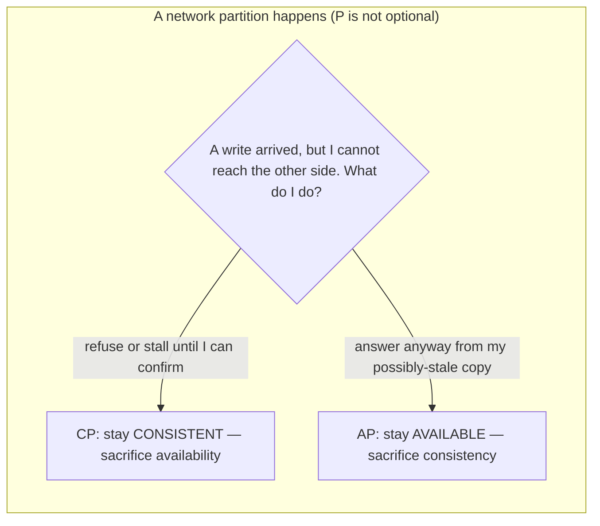
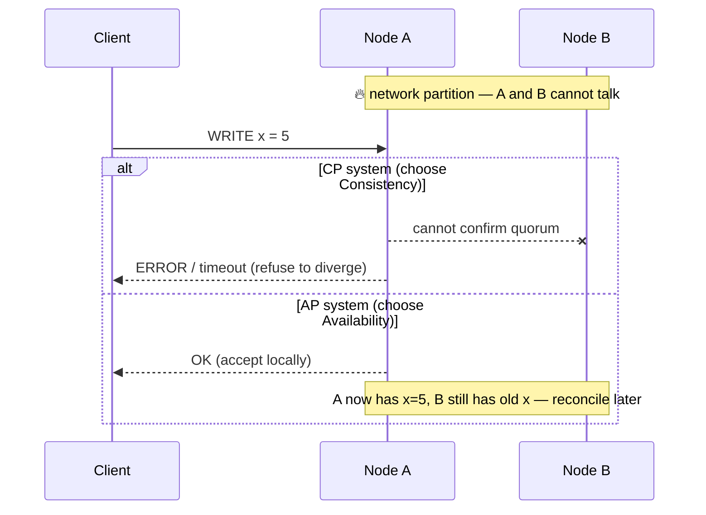
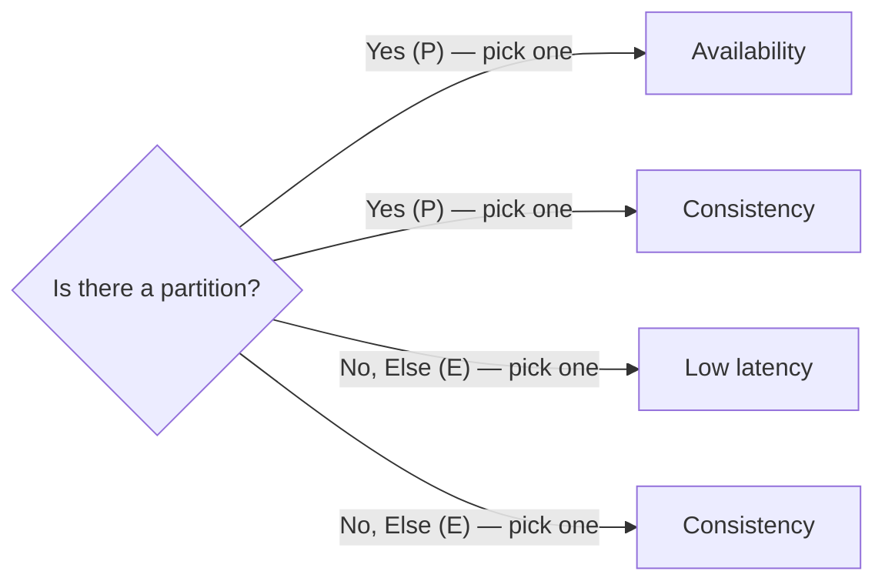
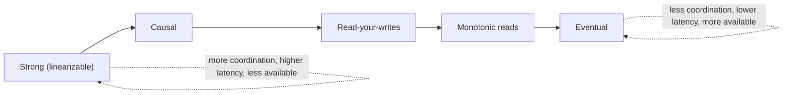

Once data lives on more than one node, the network *will* fail between them. The **CAP theorem** tells you what you are forced to give up when it does — and it is the single most misquoted result in distributed systems.

## CAP: pick 2 of 3 (but really, pick 1 of 2)

- **C**onsistency — every read sees the most recent write (a single, up-to-date value).
- **A**vailability — every request gets a non-error response.
- **P**artition tolerance — the system keeps working when the network between nodes drops messages.



:::key
**Partition tolerance is not a choice** — on real networks, partitions happen, so a distributed system must tolerate them. That collapses CAP to a binary: **during a partition, do you sacrifice C or A?** "CA" systems (consistent + available but not partition-tolerant) are effectively single-node databases.
:::

### See the choice play out



## Which systems are CP, which are AP?

| System | CAP lean | Why |
|---|:---:|---|
| Single-node RDBMS (Postgres, MySQL) | **CA*** | No partitions *within* one node; not distributed |
| ZooKeeper / etcd / Consul | **CP** | Refuses reads/writes without quorum — correctness first |
| HBase, MongoDB (default) | **CP** | Primary-based; on partition the minority side stops serving writes |
| Cassandra, DynamoDB, Riak | **AP** | Stay writable on any node; reconcile with quorums / conflict resolution |
| A bank ledger / leader election | **needs CP** | A wrong balance or two leaders is unacceptable |
| Shopping cart, feed, metrics, DNS | **fine with AP** | Temporary staleness is cheap; downtime is not |

\* "CA" only in the sense that a lone node never partitions from itself. The moment you replicate it, you must re-answer C-vs-A.

## PACELC: the honest refinement

CAP only speaks about the (rare) partition. **PACELC** covers the other 99% of the time:

> **P**artition → **A** or **C**; **E**lse (normal operation) → **L**atency or **C**onsistency.



| System | PACELC | Reading |
|---|---|---|
| DynamoDB / Cassandra | **PA/EL** | Available under partition; fast (eventually consistent) otherwise |
| MongoDB | **PC/EC** | Consistent under partition (minority stops serving writes); consistent from primary otherwise |
| Spanner / etcd | **PC/EC** | Consistent always — pays latency for it |

:::senior
PACELC is the better interview lens because **partitions are rare but the latency-vs-consistency trade is constant.** Every "should this read hit the primary or a replica?" decision is really an *ELC* choice: pay a round-trip for a fresh value, or answer fast from a possibly-stale copy. Framing it this way signals you understand the day-to-day cost, not just the textbook edge case.
:::

## Consistency models: a ladder, not a switch

"Consistent" is not binary. These are the rungs from strongest (most guarantees, most coordination) to weakest (fastest, least coordination):

| Model | Guarantee | Analogy / cost |
|---|---|---|
| **Strong (linearizable)** | Every read returns the latest write; system behaves like one copy | Needs coordination/quorum on every op → slowest |
| **Sequential** | All nodes see writes in one global order consistent with each process's program order | Slightly cheaper than linearizable |
| **Causal** | Cause-before-effect order preserved (a reply never appears before its message) | Preserves "makes sense" ordering without global sync |
| **Read-your-writes** | You always see *your own* latest writes | Session-scoped; fixes the "my edit vanished" bug |
| **Monotonic reads** | Once you have seen a value, you never see an *older* one | No "time travel" backwards for a session |
| **Eventual** | If writes stop, all replicas *eventually* converge | Weakest; fastest, most available; may read stale |



:::gotcha
**"Eventual consistency" does not mean "eventually correct".** It means *if writes stop*, replicas converge — with no promise of *when*, and no promise about *which* write wins a conflict unless you define one (last-write-wins by timestamp, CRDTs, vector clocks, or app-level merge). Never say "eventual consistency" without also stating the **conflict-resolution** rule.
:::

## Check yourself

```quiz
title: CAP & consistency
questions:
  - q: 'The most accurate reading of CAP for a real distributed system is:'
    options:
      - 'Freely pick any 2 of Consistency, Availability, Partition tolerance'
      - text: 'Partitions are unavoidable, so during one you must choose Consistency OR Availability'
        correct: true
      - 'You can have all three with enough hardware'
    explain: 'Because partitions will happen, P is mandatory. The real, unavoidable choice is C-vs-A *during* a partition.'
  - q: 'A leader-election / config service (ZooKeeper, etcd) should be:'
    options:
      - text: 'CP — refuse to serve rather than risk two leaders / stale config'
        correct: true
      - 'AP — stay available even if answers diverge'
      - 'Neither — it does not need consensus'
    explain: 'Coordination systems must be consistent: two "leaders" or conflicting config is a correctness disaster, so they sacrifice availability under partition.'
  - q: 'What does PACELC add over CAP?'
    options:
      - 'A third option besides C and A'
      - text: 'The Else clause: even with NO partition, you trade Latency vs Consistency'
        correct: true
      - 'A way to avoid partitions entirely'
    explain: 'PACELC keeps CAP for the partition case and adds the far more common no-partition case, where the trade is latency vs consistency.'
  - q: '"Read-your-writes" consistency guarantees that...'
    options:
      - 'all nodes agree instantly'
      - text: 'a user always sees their own most recent writes'
        correct: true
      - 'reads never return newer data than expected'
    explain: 'Read-your-writes is a session guarantee that fixes the "I saved it but it vanished on refresh" stale-replica bug — weaker (and cheaper) than global strong consistency.'
  - q: '"Eventual consistency" specifically promises that:'
    options:
      - 'reads are always correct within 1 second'
      - text: 'if writes stop, all replicas eventually converge to the same value'
        correct: true
      - 'the newest write always wins automatically'
    explain: 'It only promises convergence *if writes cease*, with no time bound and no built-in winner — you must define conflict resolution (LWW, CRDTs, vector clocks, merges).'
```

:::key
Partitions are inevitable, so CAP reduces to **C or A during a partition**: **CP** (etcd, ZooKeeper — refuse to diverge) vs **AP** (Cassandra, Dynamo — stay writable, reconcile later). **PACELC** adds the everyday truth: with no partition you still trade **Latency vs Consistency**. Consistency is a **ladder** — strong → causal → read-your-writes → eventual — trading coordination/latency for availability, and eventual consistency always needs a stated **conflict-resolution** rule.
:::
