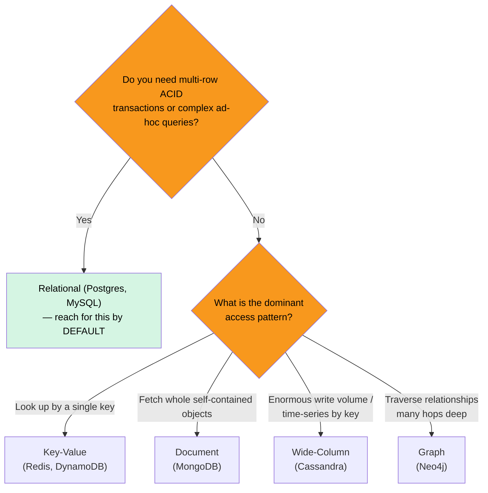

"NoSQL" is not one thing — it is four different data models that each drop the relational rulebook for a specific payoff (usually **horizontal scale** or a **shape** that relational tables model awkwardly). The interview skill is matching the *access pattern* to the model.

## The families at a glance

| Family | Data shape | Query by | Scales | Sweet spot |
|---|---|---|---|---|
| **Relational** | Rows in typed, related tables | Anything (SQL, joins) | Mostly vertical | Complex queries, transactions, integrity |
| **Key-Value** | `key → opaque blob` | The key, only | Horizontal ✅ | Caches, sessions, feature flags |
| **Document** | Self-contained JSON docs | Key + fields inside the doc | Horizontal ✅ | Content, catalogs, per-object data |
| **Wide-Column** | Rows keyed by (partition, cluster) | The partition key + range | Horizontal ✅✅ | Huge write volume, time-series |
| **Graph** | Nodes + edges | Traversals / relationships | Vertical-ish | Social, fraud, recommendations |

## See the same-ish data in each model

````tabs
tabs:
  - label: Relational
    body: |
      **Normalized** into related tables; the DB enforces types, keys, and referential integrity. You assemble views with **JOINs** at read time.
      ```sql
      -- users and their orders live in separate tables
      SELECT u.name, o.total
      FROM users u
      JOIN orders o ON o.user_id = u.id
      WHERE u.id = 42;
      ```
      | users.id | name |   | orders.id | user_id | total |
      |:---:|:---|---|:---:|:---:|:---:|
      | 42 | Ada | | 900 | 42 | 50 |
      | 43 | Bo | | 901 | 42 | 20 |

      **Strengths:** ad-hoc queries, multi-row **ACID** transactions, no data duplication. **Cost:** joins and schema get expensive to shard.
  - label: Key-Value
    body: |
      A giant distributed hash map: `key → value`. The store knows **nothing** about the value's contents, so it is blazing fast but you can only look up by key.
      ```text
      SET session:abc123  '{"user":42,"exp":1699999999}'
      GET session:abc123
      -> {"user":42,"exp":1699999999}
      ```
      **Strengths:** O(1) lookups, trivial to shard (hash the key), perfect for **caches, sessions, rate-limit counters**. **Cost:** no queries on the value, no relationships. Examples: **Redis**, **DynamoDB**, Memcached.
  - label: Document
    body: |
      Stores self-contained **JSON/BSON documents**. Related data is **embedded** instead of joined — one read returns the whole object. Schema is flexible per document.
      ```json
      {
        "_id": 42,
        "name": "Ada",
        "orders": [
          { "id": 900, "total": 50 },
          { "id": 901, "total": 20 }
        ]
      }
      ```
      **Strengths:** matches object/aggregate shape, no joins for the common read, easy horizontal scale. **Cost:** duplication, and cross-document consistency is on you. Examples: **MongoDB**, Couchbase, Firestore.
  - label: Wide-Column
    body: |
      Rows are grouped by a **partition key** (which node) and sorted by a **clustering key** (order within the partition). Built for **massive write throughput** and queries along the clustering order.
      ```sql
      -- Cassandra: model the table around ONE query
      CREATE TABLE events_by_user (
        user_id  uuid,        -- partition key -> which node
        ts       timestamp,   -- clustering key -> sorted within partition
        event    text,
        PRIMARY KEY (user_id, ts)
      );
      SELECT * FROM events_by_user
      WHERE user_id = ? AND ts > ?;   -- fast: single partition, range scan
      ```
      **Strengths:** linear write scaling, time-series, tunable consistency. **Cost:** you must design the table per query — **no ad-hoc joins or arbitrary WHEREs**. Examples: **Cassandra**, HBase, ScyllaDB, Bigtable.
  - label: Graph
    body: |
      First-class **nodes** and **edges**. Relationships are stored directly, so traversing them is cheap — the opposite of an ever-deepening SQL self-join.
      ```text
      (Ada)-[:FOLLOWS]->(Bo)-[:FOLLOWS]->(Cara)
      ```
      ```cypher
      // friends-of-friends in one traversal
      MATCH (me:User {id:42})-[:FOLLOWS]->()-[:FOLLOWS]->(fof)
      RETURN fof.name;
      ```
      **Strengths:** deep/variable-length relationship queries (social graphs, fraud rings, recommendations). **Cost:** hard to shard, niche. Examples: **Neo4j**, Neptune, JanusGraph.
````

## Choosing: a decision tree



:::senior
The honest default is **"relational until proven otherwise."** A single Postgres instance handles far more scale than most people assume, gives you transactions and ad-hoc queries for free, and even speaks JSON (`jsonb`) when you want document-style flexibility. Reach for NoSQL when you have a *specific* reason: a proven write/scale ceiling, a genuinely non-relational shape, or an access pattern one model nails. "We might go viral" is not a reason.
:::

:::gotcha
NoSQL is **schema-flexible, not schema-free.** You still have a schema — it just moves out of the database and into *every piece of application code* that reads the data. And most NoSQL stores force you to **model around your queries up front**: get the access pattern wrong and there is no cheap `JOIN` or new index to bail you out later.
:::

## Terminology recall

```flashcards
title: SQL vs NoSQL terms
cards:
  - front: 'Denormalization (in NoSQL)'
    back: 'Deliberately **duplicating** data (e.g. embedding orders in the user doc) so a read needs no join. Trades write cost + duplication for fast reads.'
  - front: 'Partition key vs clustering key (wide-column)'
    back: '**Partition key** decides which node holds the row. **Clustering key** sets the sort order *within* that partition, enabling range scans.'
  - front: 'Why is a graph DB faster than SQL for deep relationships?'
    back: 'Edges are stored directly on nodes (index-free adjacency), so a traversal is a pointer hop — not an ever-deeper self-JOIN that explodes with each level.'
  - front: 'When is a key-value store the right choice?'
    back: 'When every access is a lookup by a single known key: caches, sessions, feature flags, counters. No querying the value, no relationships.'
  - front: '"Schema-less" — true or false?'
    back: 'Misleading. The schema still exists; it just shifts from the database to the application code that must interpret every document.'
```

## Check yourself

```quiz
title: Picking a data model
questions:
  - q: 'You need multi-row ACID transactions and lots of ad-hoc reporting queries. Best default?'
    options:
      - 'Key-value store'
      - text: 'A relational database'
        correct: true
      - 'Wide-column store'
    explain: 'Transactions + arbitrary joins/queries are exactly what relational databases are built for. Do not reach for NoSQL without a specific reason.'
  - q: 'A social network needs "friends-of-friends-of-friends" queries. Which model fits best?'
    options:
      - 'Document'
      - text: 'Graph'
        correct: true
      - 'Key-value'
    explain: 'Deep, variable-length relationship traversals are the graph database sweet spot; in SQL they become progressively more painful self-joins.'
  - q: 'Which store is designed for the highest sustained WRITE throughput and time-series data keyed by an id?'
    options:
      - text: 'Wide-column (e.g. Cassandra)'
        correct: true
      - 'Relational'
      - 'Graph'
    explain: 'Wide-column stores scale writes near-linearly and are modeled around a partition key + time-sorted clustering key — ideal for event/time-series streams.'
  - q: '"NoSQL is schema-less" is best described as:'
    options:
      - text: 'Misleading — the schema moves from the database into application code'
        correct: true
      - 'Completely true — there is genuinely no schema'
      - 'Only true for graph databases'
    explain: 'The data still has structure; the DB just stops enforcing it, so every reader/writer in your app now owns that responsibility.'
```

:::key
Reach for **relational by default** (transactions, ad-hoc queries, `jsonb` for flexibility). Choose NoSQL for a *specific* access pattern: **key-value** for pure key lookups (caches/sessions), **document** for self-contained objects, **wide-column** for massive writes/time-series, **graph** for deep relationship traversals. All NoSQL families make you **model around your queries** up front — and "schema-less" just means the schema lives in your code.
:::
