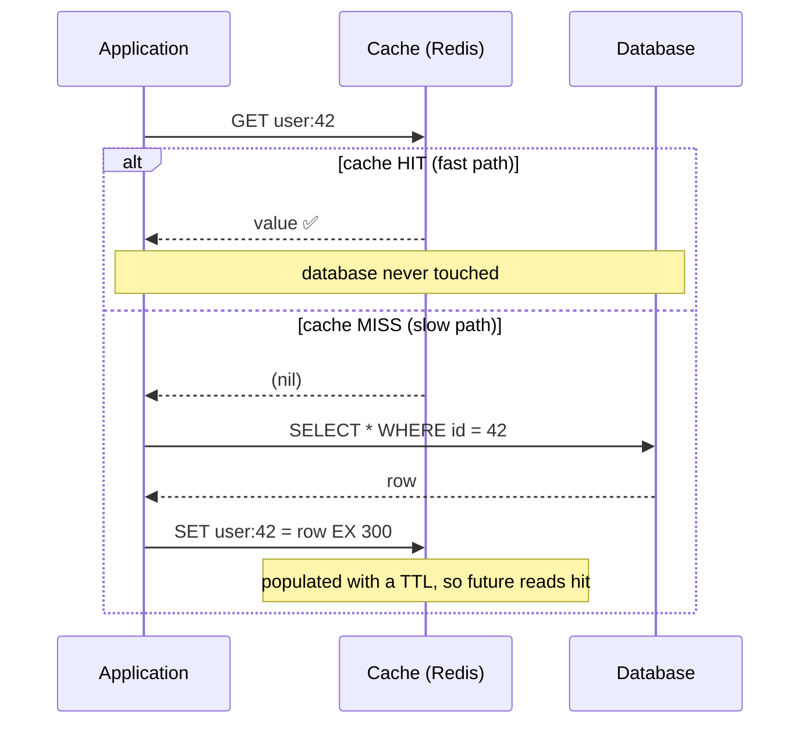
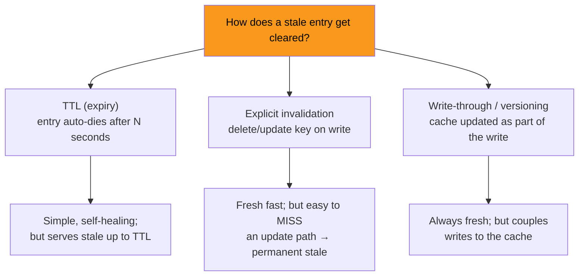
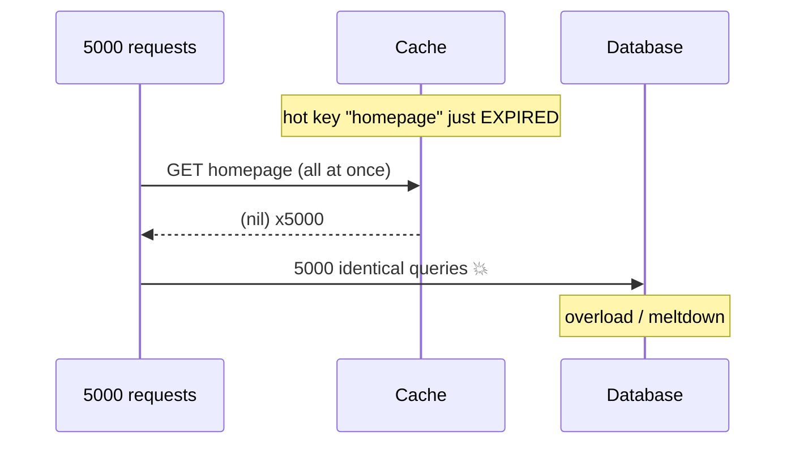

A **cache** is a small, fast store in front of a slow one, holding the hot subset of data. It is the highest-leverage scaling move you have — a good cache turns a millisecond database hit into a microsecond memory hit and absorbs the bulk of read traffic. The price is a second copy of the truth, and *keeping two copies agreeing* is where the difficulty lives.

## Cache-aside: hit vs miss

**Cache-aside** (lazy loading) is the default pattern: the *application* owns the cache. Check it first; on a miss, load from the DB and populate it.



```sql
-- The cache-aside read, in pseudo-code
value = cache.get(key)
if value is null:            -- MISS
    value = db.query(key)    -- fall back to the slow store
    cache.set(key, value, ttl=300)   -- populate for next time
return value
```

:::note
Cache-aside only caches what is actually requested (**lazy**), so the cache stays small and a cache outage degrades to "slow", not "broken". Its weakness: the **first** request for each key always misses, and stale data lingers until the TTL or an explicit invalidation clears it.
:::

## The four strategies

The strategies differ on **who** talks to the DB and **when** writes propagate.

````tabs
tabs:
  - label: Cache-aside
    body: |
      **App** manages the cache. Reads check cache → fall back to DB → populate. Writes go to the DB and **invalidate** the key.
      ```text
      READ:  cache → (miss) → DB → set cache
      WRITE: DB → cache.delete(key)
      ```
      - ✅ Simple, resilient (cache down = slow, not broken), caches only hot keys.
      - ❌ First read always misses; risk of stale between DB write and invalidation.
      - **Most common** general-purpose pattern.
  - label: Read-through
    body: |
      The **cache library** sits inline and loads from the DB on a miss itself — the app only ever calls the cache.
      ```text
      READ: app → cache → (miss, cache loads from DB) → app
      ```
      - ✅ App code is simpler (no manual populate); loading logic centralized.
      - ❌ Still first-miss latency; needs a cache that supports a loader (Caffeine, DAX).
  - label: Write-through
    body: |
      Every write goes **through the cache**, which synchronously writes to the DB before acking. Cache and DB are always in sync.
      ```text
      WRITE: app → cache → DB (synchronous) → ack
      ```
      - ✅ Cache never stale; reads after a write are warm.
      - ❌ Every write pays cache **and** DB latency; caches data that may never be read.
  - label: Write-back
    body: |
      Write to the **cache only** and ack immediately; flush to the DB **asynchronously** (batched) later. Fastest writes.
      ```text
      WRITE: app → cache → ack   ...later...   cache → DB (batched)
      ```
      - ✅ Absorbs write bursts, coalesces repeated writes to the same key.
      - ❌ **Data loss** if the cache dies before flush; DB is temporarily behind. (a.k.a. write-behind)
````

| Strategy | Write path | On cache crash | Best for |
|---|---|---|---|
| **Cache-aside** | DB, then invalidate key | Degrades to slow | General read-heavy workloads |
| **Read-through** | (same as aside, via lib) | Degrades to slow | Centralizing load logic |
| **Write-through** | Cache → DB (sync) | No data loss | Read-after-write freshness |
| **Write-back** | Cache now, DB later (async) | **Risk of data loss** | Write-heavy, burst-absorbing |

## Invalidation — the genuinely hard part

> "There are only two hard things in Computer Science: cache invalidation and naming things." — Phil Karlton

Every cache entry is a bet that the source of truth has not changed. Three ways to settle the bet:



- **TTL** — cheap and self-healing: even if you forget to invalidate, staleness is bounded by the TTL. Short TTL = fresher but more misses; long TTL = fewer misses but staler. The default lever.
- **Explicit (event-driven)** — delete/update the key when the data changes. Fresh, but you must find and invalidate on **every** write path — miss one and that key is stale forever.
- **Prefer `delete` over `update`** on write: deleting lets the next read repopulate from the DB; updating the cache directly races with concurrent DB writes and can leave the *wrong* value cached.

:::gotcha
**The dual-write race.** "Write DB, then delete cache" is not atomic — if the delete fails (or another request repopulates the cache *between* your DB write and delete), the cache is now permanently stale. Robust systems invalidate from the **database changelog** (CDC / binlog, e.g. Debezium) so invalidation cannot be skipped, or use short TTLs as a backstop.
:::

### Cache stampede (thundering herd)

A hot key expires; suddenly **thousands** of concurrent requests all miss and hammer the database at once — often enough to take it down right when traffic is highest.



Fixes: **single-flight / request coalescing** (only one caller recomputes, others wait), **locking** (first miss takes a lock and populates), **stale-while-revalidate** (serve the old value while one worker refreshes), and **jittered / probabilistic early expiry** (spread refreshes so keys do not all expire together).

:::senior
Decide your **failure mode** deliberately. When the cache (Redis) is unreachable, do you **fail open** — send all traffic to the DB and risk overloading it — or **fail closed** and return errors? For a cache fronting a fragile DB, uncontrolled fail-open *is* the outage. Add a circuit breaker and load-shedding so a cache blip does not cascade into a database meltdown. Decide this on a whiteboard, not during the incident.
:::

## Redis in one breath

**Redis** is the default distributed cache: in-memory, single-threaded (atomic commands), with data structures beyond strings (hashes, sorted sets, `INCR` counters), `EXPIRE` TTLs, pub/sub, and Lua for atomic multi-step ops. Eviction is bounded by `maxmemory` + a policy (commonly `allkeys-lru`).

```text
SET  user:42  "{...}"  EX 300     -- value with a 300s TTL
INCR ratelimit:ip:1.2.3.4          -- atomic counter (rate limiting)
TTL  user:42                       -- seconds left before expiry
```

## Check yourself

```quiz
title: Caching intuition
questions:
  - q: 'In the cache-aside pattern, what happens on a cache MISS?'
    options:
      - 'Return null to the caller'
      - text: 'Load from the database, populate the cache, then return the value'
        correct: true
      - 'The cache blocks until another request fills it'
    explain: 'Cache-aside falls back to the DB on a miss and populates the cache so subsequent reads hit. The first read for each key always misses.'
  - q: 'Which strategy risks LOSING data if the cache node crashes?'
    options:
      - 'Cache-aside'
      - 'Write-through'
      - text: 'Write-back (write-behind)'
        correct: true
    explain: 'Write-back acks after writing only to the cache and flushes to the DB later; a crash before the flush loses those writes. Write-through writes to the DB synchronously, so no loss.'
  - q: 'A hot key expires and thousands of requests simultaneously miss and hit the DB. This is a...'
    options:
      - 'dual write'
      - text: 'cache stampede / thundering herd'
        correct: true
      - 'split-brain'
    explain: 'The stampede floods the origin. Mitigate with single-flight/locking, stale-while-revalidate, and jittered TTLs so keys do not expire together.'
  - q: 'On a write, why prefer DELETING the cache key over UPDATING it in place?'
    options:
      - 'Deleting is faster'
      - text: 'A concurrent write can race an in-place update and leave the wrong value cached; delete forces a fresh reload from the DB'
        correct: true
      - 'Updating is not supported by Redis'
    explain: 'Deleting lets the next read repopulate from the source of truth, avoiding the race where an in-place update caches a stale/wrong value.'
  - q: 'What is the simplest safety net that BOUNDS staleness even if you forget to invalidate a key?'
    options:
      - text: 'A TTL (expiry) on the entry'
        correct: true
      - 'A bigger cache'
      - 'Write-back caching'
    explain: 'A TTL guarantees the entry self-expires, so a missed invalidation only serves stale data up to the TTL rather than forever.'
```

:::key
**Cache-aside** (check cache → DB on miss → populate) is the default. **Write-through** = sync to DB (always fresh, slower writes); **write-back** = async to DB (fast, risks loss). **Invalidation** is the hard part: prefer **delete-on-write + TTL backstop**, invalidate from the DB changelog to avoid the dual-write race, and defend hot keys against **stampedes** with single-flight and jittered expiry. Decide cache-down behavior (fail open vs closed) up front.
:::
