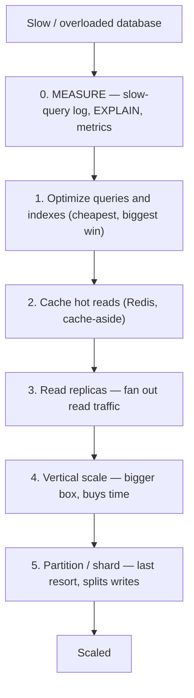
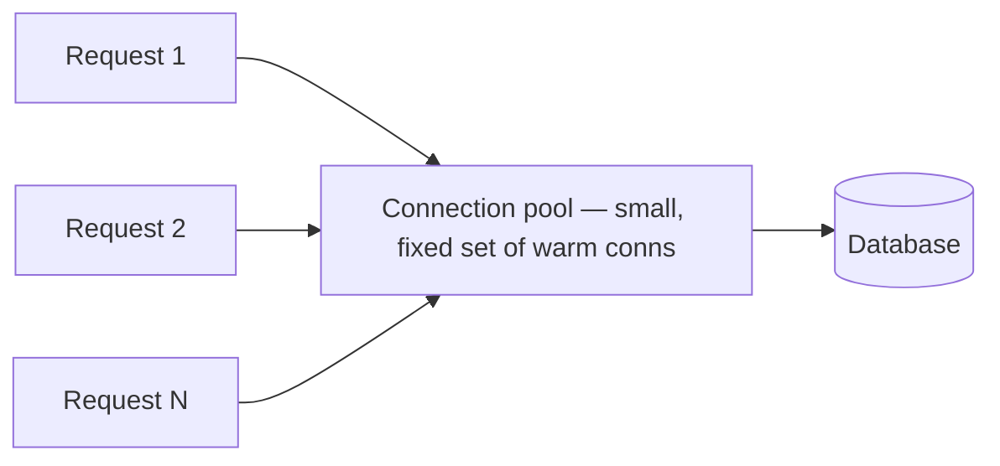
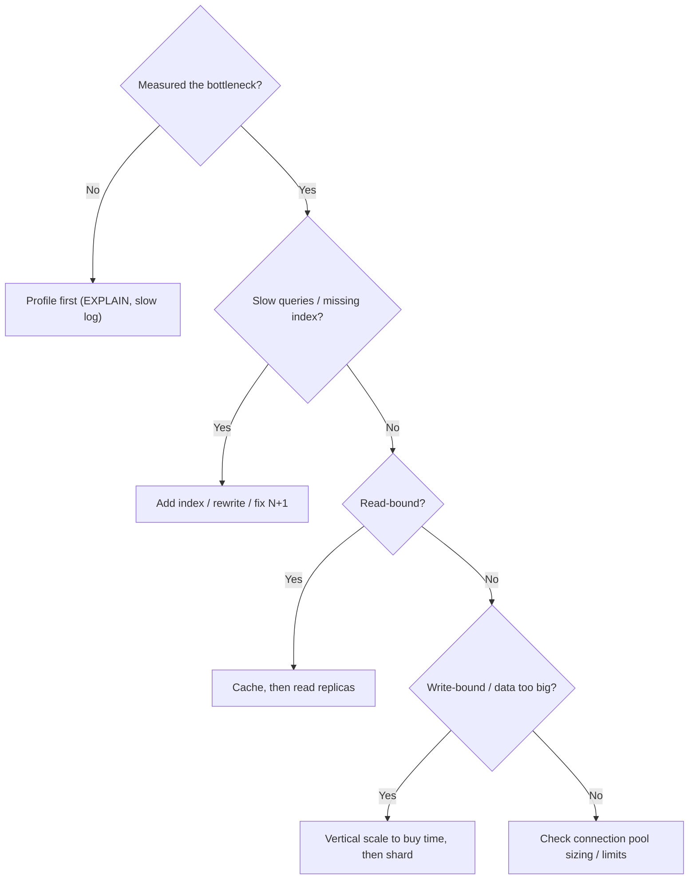

The senior signal in a scaling interview is **restraint and ordering**: knowing that sharding is the *last* resort, not the first, and climbing the cheap rungs before the expensive, irreversible ones. This is the ladder.

## The ladder — climb in order

Each rung is more work and less reversible than the one below it. Exhaust the cheap rungs first.



:::key
**Do NOT start at the bottom of the list.** Reaching for sharding when an unindexed query or a missing cache is the real problem adds enormous complexity and solves nothing. Always **measure first**, then climb from cheapest to costliest.
:::

## What each rung buys you

| Rung | Move | Effort | Scales | Reversible? |
|---|---|:---:|---|:---:|
| **0** | Measure (EXPLAIN, slow log, metrics) | Trivial | — finds the real bottleneck | ✅ |
| **1** | Add/fix **indexes**, rewrite queries, fix N+1 | Low | Reads **and** writes (less work per query) | ✅ |
| **2** | **Cache** hot reads (Redis) | Low–Med | Reads (absorbs the majority) | ✅ |
| **3** | **Read replicas** | Medium | Reads (fan-out) | ✅ mostly |
| **4** | **Vertical scale** (bigger instance) | Low | Everything, briefly — hits a ceiling | ✅ |
| **5** | **Partition / shard** | **High** | **Writes** + storage, horizontally | ❌ hard to undo |

### Rung 1 — indexes and query hygiene first

The most common "we need to scale" is really "we have an unindexed query." A missing index turns an O(log n) lookup into an O(n) full scan; adding it can cut a query 1000x for the cost of one `CREATE INDEX`.

```sql
-- Diagnose before you scale: does this hit an index or scan the table?
EXPLAIN ANALYZE SELECT * FROM orders WHERE customer_id = 42;

-- Seq Scan on orders  (cost=... rows=2_000_000)   <- full table scan, bad
CREATE INDEX idx_orders_customer ON orders (customer_id);
-- Index Scan using idx_orders_customer            <- now a lookup, good
```

Also fix the **N+1 query** pattern (1 query for a list + N queries for each item — batch or join instead) and pull only the columns you need. These cost nothing but code.

:::senior
"Scaling" and "distributed" are not synonyms. Rungs 1–2 (indexes, caching) routinely deliver 10–100x on a **single node** and buy you years. The reflex to jump straight to a distributed architecture is how teams turn a one-week index fix into a six-month sharding project — and inherit cross-shard joins, rebalancing, and eventual consistency they never needed.
:::

### Rungs 2–3 — offload reads

Most workloads are **read-heavy**, so shed reads before touching writes:

- **Cache (rung 2)** hot, expensive, or repeated reads in Redis — the single biggest lever for read-heavy traffic.
- **Read replicas (rung 3)** fan the remaining reads across followers, leaving the primary for writes. (Now you inherit **replication lag** — see the Replication topic.)

### Rung 5 — partition/shard only when writes are the wall

You have climbed to sharding only when the **write** volume or **data size** genuinely exceeds one primary — because caching and replicas do nothing for write throughput. Sharding splits writes across nodes but costs you cross-shard joins, rebalancing, and operational weight (see Partitioning & Sharding).

## Connection pooling — the quiet prerequisite

Opening a DB connection is expensive (TCP + TLS + auth), and every connection consumes memory and a backend process/thread on the database. A **connection pool** keeps a small set of warm connections and lends them out.



:::gotcha
**Bigger pools are usually slower.** A database has finite CPUs and disks; flood it with connections and you get lock contention and context-switching, not throughput. A good starting size is often **under ~20** (roughly `cores × 2 + effective_spindles`) even for busy services. The pool should be the **backpressure point** that protects the DB — the real bottleneck — not a firehose pointed at it. This bites hardest with **serverless / many-instance** deployments: 100 instances × a 20-connection pool = 2000 connections and an instantly-overwhelmed database. Front them with a proxy pooler (**PgBouncer**, RDS Proxy).
:::

## Putting it together



```flashcards
title: Playbook recall
cards:
  - front: 'The scaling ladder, in order?'
    back: '**Measure → indexes/query fixes → cache → read replicas → vertical scale → shard.** Cheap and reversible first.'
  - front: 'The only rung that scales WRITE throughput horizontally?'
    back: '**Partitioning/sharding** — caching and replicas offload reads only.'
  - front: 'Rule-of-thumb connection pool size?'
    back: 'Small — roughly `cores × 2 + effective_spindles`, often **under ~20**. The pool is the backpressure point protecting the DB.'
  - front: 'Why is sharding "last resort"?'
    back: 'It''s **hard to reverse** and buys cross-shard joins, rebalancing, and distributed-transaction pain — only worth it when writes/data outgrow one primary.'
  - front: 'Serverless app + per-instance pools = ?'
    back: 'Connection explosion (100 instances × 20 conns = 2000). Front the DB with a **proxy pooler** (PgBouncer, RDS Proxy).'
```

## Check yourself

```quiz
title: Scaling playbook
questions:
  - q: 'A read-heavy app''s database is slow. What should you try FIRST?'
    options:
      - 'Shard the database'
      - text: 'Measure, then check for missing indexes / slow queries'
        correct: true
      - 'Add read replicas immediately'
    explain: 'Always measure first. A missing index is the most common and cheapest cause; sharding is the last resort, not the first.'
  - q: 'Caching and read replicas do NOT help with which problem?'
    options:
      - 'Too many reads'
      - text: 'Too many WRITES (write throughput exceeds one primary)'
        correct: true
      - 'Repeated expensive read queries'
    explain: 'Both offload READS. When writes are the wall, you need partitioning/sharding to spread writes across nodes.'
  - q: 'Why can a LARGER connection pool make a database SLOWER?'
    options:
      - 'Connections use disk space'
      - text: 'The DB has finite CPU/disk; too many concurrent connections cause contention and context-switching'
        correct: true
      - 'Pools cache stale data'
    explain: 'Beyond the DB''s real concurrency limit, more connections add contention, not throughput. Keep pools small; let them be the backpressure point.'
  - q: 'Which rung is the MOST expensive and hardest to reverse, so it comes last?'
    options:
      - 'Adding an index'
      - 'Adding a cache'
      - text: 'Partitioning / sharding'
        correct: true
    explain: 'Sharding brings cross-shard joins, rebalancing, and eventual consistency. Exhaust indexing, caching, and replicas first.'
```

:::key
Climb the ladder in order: **measure → index/query fixes → cache → read replicas → (vertical scale) → shard.** The early rungs are cheap, reversible, and often 10–100x on a single node; **sharding is the irreversible last resort** for when *writes* outgrow one primary. Keep **connection pools small** — they protect the database rather than flood it.
:::
