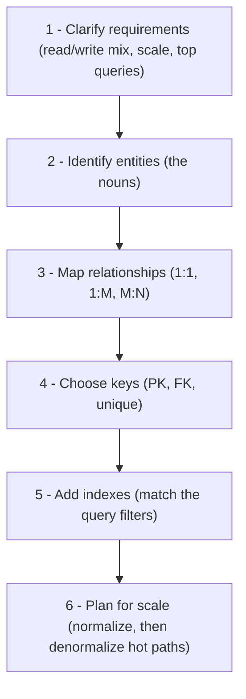
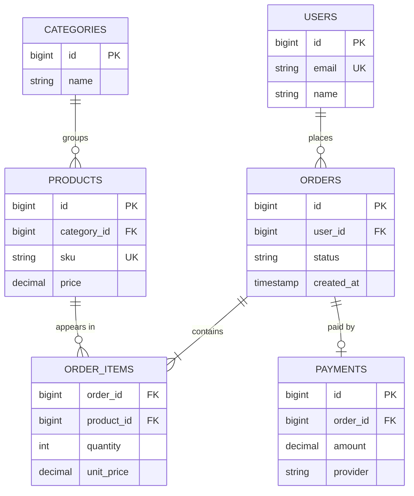

When an interviewer says *"design the schema for an e-commerce site"*, they are testing a
**process**, not trivia. Walk this six-step path out loud and you will never freeze.

## The framework



| Step | Ask yourself | E-commerce answer |
|---|---|---|
| **1. Requirements** | Read or write heavy? Scale? Which queries must be fast? | "orders for a user", "products in a category", "log in by email" |
| **2. Entities** | What are the core nouns? | User, Category, Product, Order, OrderItem, Payment |
| **3. Relationships** | 1:1, 1:M, or M:N for each pair? | User **1:M** Order; Order **M:N** Product via OrderItem |
| **4. Keys** | A PK per table, an FK per link, natural uniques | surrogate `id` PKs; `users.email` UNIQUE |
| **5. Indexes** | Index what you **filter, join, or sort** on | `orders(user_id)`, `products(category_id)` |
| **6. Scale** | Normalize first; denormalize only proven hot reads | cache `orders.total_amount`; add read replicas |

## The worked schema



### Reading the crow's-foot notation

The `||`, `o`, and `{` marks on each line encode the cardinality of both ends:

- `||--||` — exactly one to exactly one
- `||--o{` — one to *zero-or-many*
- `||--|{` — one to *one-or-many*
- `||--o|` — one to *zero-or-one*

## The one relationship everyone gets wrong: M:N

A product appears in many orders, and an order contains many products. You **cannot** put a
list of product ids in a column. Resolve every many-to-many with a **junction table**
(`ORDER_ITEMS`) whose primary key is the pair of foreign keys:

```sql
CREATE TABLE order_items (
  order_id   BIGINT REFERENCES orders(id),
  product_id BIGINT REFERENCES products(id),
  quantity   INT NOT NULL,
  unit_price DECIMAL(10,2) NOT NULL,     -- snapshot: price at purchase time
  PRIMARY KEY (order_id, product_id)     -- composite key
);
```

## Keys and indexes

| Table | Primary key | Foreign keys | Unique |
|---|---|---|---|
| `users` | `id` | — | `email` |
| `categories` | `id` | — | — |
| `products` | `id` | `category_id` → `categories` | `sku` |
| `orders` | `id` | `user_id` → `users` | — |
| `order_items` | `(order_id, product_id)` | both columns | — |
| `payments` | `id` | `order_id` → `orders` | — |

| Query you must serve | Index that serves it |
|---|---|
| "all orders for a user" | `orders(user_id)` |
| "items in an order" | `order_items(order_id)` (PK left prefix) |
| "products in a category" | `products(category_id)` |
| "log in by email" | `users(email)` unique |
| "a user's recent orders" | composite `orders(user_id, created_at)` |

:::senior
**Normalize first, denormalize deliberately.** Third normal form keeps every fact in one
place, which eliminates update anomalies. Only after measuring do you denormalize a hot read
path — e.g. store `orders.total_amount` instead of re-summing `order_items` on every page
view — and you then own the job of keeping it in sync. Reach for read replicas before
sharding, and shard by `user_id` (the natural access key) when a single box no longer fits.
:::

:::gotcha
Three schema smells interviewers pounce on: (1) a comma-separated `product_ids` column
instead of a junction table; (2) storing money as `FLOAT` — use `DECIMAL` to avoid rounding
drift; (3) over-indexing — every index speeds reads but **slows writes** and costs storage,
so index for real queries, not "just in case".
:::

## Check yourself

```quiz
title: Schema design judgement
questions:
  - q: 'A product can be in many orders and an order can hold many products. How do you model this?'
    options:
      - text: 'A junction table order_items(order_id, product_id, …)'
        correct: true
      - 'A comma-separated product_ids column on orders'
      - 'Duplicate the whole order row once per product'
    explain: 'A many-to-many needs an associative (junction) table whose composite key is the two foreign keys; it is also the natural home for per-line data like quantity and price.'
  - q: 'Which index best serves "show all orders for a given user"?'
    options:
      - text: 'orders(user_id)'
        correct: true
      - 'orders(id)'
      - 'users(id)'
    explain: 'You filter orders by the foreign key user_id, so index that column. The primary key orders(id) does not help a lookup by user.'
  - q: 'When is it right to denormalize, e.g. store orders.total?'
    options:
      - text: 'On a read-heavy hot path, after measuring, accepting you must keep it in sync'
        correct: true
      - 'Always — joins are slow, so avoid them'
      - 'Never — it violates 3NF and is always wrong'
    explain: 'Denormalization is a deliberate trade: faster reads in exchange for redundancy you must maintain. Normalize by default; denormalize a proven bottleneck.'
```

:::key
Say the steps out loud: **requirements to entities to relationships to keys to indexes to
scale.** Every M:N becomes a junction table, index your foreign keys and query filters,
store money as `DECIMAL`, and normalize before you denormalize.
:::
