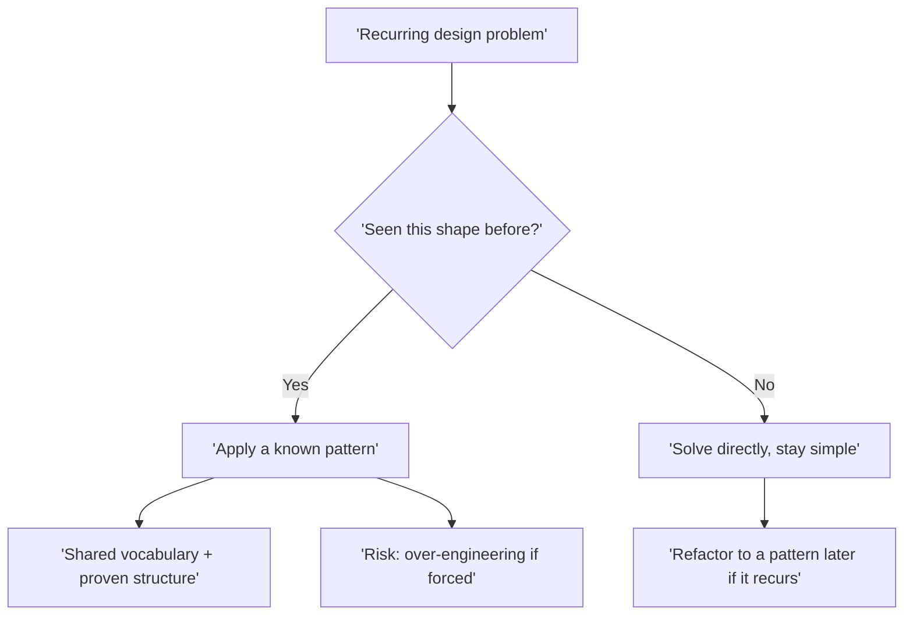

A **design pattern** is a named, reusable solution to a problem that shows up again and again in
object-oriented design. It is not code you copy — it is a **recipe**: a description of the roles,
their relationships, and the trade-offs, that you adapt to your situation.

Patterns give teams a **shared vocabulary**. Saying *"let us wrap this in an Adapter"* or *"make
that a Strategy"* communicates a whole design in two words.

## Where they came from

Patterns were popularised in 1994 by the **"Gang of Four" (GoF)** — Gamma, Helm, Johnson, and
Vlissides — in *Design Patterns: Elements of Reusable Object-Oriented Software*. Their catalog of
**23 patterns** is still the canonical reference.



## The pattern template

Every GoF pattern is documented with the same anatomy. Learn the template once and every pattern
reads the same way.

| Section | Question it answers |
|--|--|
| **Intent** | What problem does this solve, in one sentence? |
| **Motivation** | A concrete scenario where it helps |
| **Participants** | The classes/objects and their roles |
| **Structure** | A UML class diagram of those roles |
| **Collaborations** | How the participants talk to each other |
| **Consequences** | The trade-offs — what you gain and what you pay |

:::tip
When you read a new pattern, jump straight to **Intent** and **Consequences** first. Intent tells
you *if* it fits your problem; Consequences tells you the *price* — that pair decides whether to use it.
:::

## When NOT to use a pattern

Patterns are tools, not trophies. Forcing them creates **pattern soup** — code so abstracted that
the simple thing is buried under factories, strategies, and decorators nobody needed.

| Do reach for a pattern | Do not reach for a pattern |
|--|--|
| The problem genuinely recurs | You are guessing about future needs (YAGNI) |
| The abstraction earns its keep | A plain function or `if` would do |
| It makes the code easier to change | It only makes the code look sophisticated |
| The team recognises the vocabulary | It adds indirection with no payoff |

:::warning
**Over-engineering** is the most common misuse. A pattern that abstracts a change that never comes
is pure cost: more classes, more indirection, harder onboarding. Prefer the simplest thing that
works, then refactor **toward** a pattern when the pain is real.
:::

:::senior
Seniors treat patterns as a *destination you refactor to*, not a starting blueprint. Write the
direct solution first; when duplication or a real axis of change appears, *then* introduce the
pattern the code is already asking for. Patterns are a common language for design, not a checklist
to satisfy.
:::

## Recall the essentials

```flashcards
title: Pattern basics
cards:
  - front: 'What is a design pattern?'
    back: 'A **named, reusable solution** to a recurring design problem — a recipe you adapt, not code you copy.'
  - front: 'Who are the "Gang of Four"?'
    back: 'Gamma, Helm, Johnson, Vlissides — authors of the 1994 book cataloguing **23** patterns.'
  - front: 'Which template sections decide if a pattern fits?'
    back: '**Intent** (does it solve my problem?) and **Consequences** (what does it cost?).'
  - front: 'What is "pattern soup"?'
    back: 'Over-applying patterns until simple logic is buried in needless abstraction — a form of over-engineering.'
  - front: 'When should you introduce a pattern?'
    back: 'When a problem **genuinely recurs** and the abstraction makes change easier — refactor *toward* it, do not force it up front.'
```

## Check yourself

```quiz
title: Foundations check
questions:
  - q: 'What is a design pattern, most precisely?'
    options:
      - 'A library you import to solve a problem'
      - text: 'A named, reusable solution recipe for a recurring design problem'
        correct: true
      - 'A specific block of Java code you copy and paste'
    explain: 'A pattern describes roles and relationships you adapt — it is not concrete code or a library.'
  - q: 'You add three layers of factories for a value that has only ever had one form. This is most likely:'
    options:
      - 'Good forward-thinking design'
      - text: 'Over-engineering — pattern soup with no payoff'
        correct: true
      - 'Required by the Gang of Four'
    explain: 'Abstracting a change that never comes is pure cost. Prefer the simplest thing and refactor toward a pattern when the need is real.'
  - q: 'Which two template sections best tell you whether to use a pattern?'
    options:
      - 'Motivation and Collaborations'
      - text: 'Intent and Consequences'
        correct: true
      - 'Structure and Participants'
    explain: 'Intent says whether it fits your problem; Consequences says what it costs. Together they make the call.'
```

:::key
A design pattern is a **named, reusable recipe** for a recurring problem, documented as
Intent → Participants → Structure → Consequences, and giving teams a shared vocabulary. The 23
**GoF** patterns are the canon. Use one only when the problem truly recurs — forcing patterns
causes **over-engineering** and **pattern soup**.
:::
