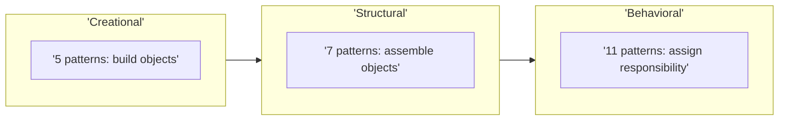

The Gang of Four grouped their 23 patterns by **what the pattern is mostly about**. Get the three
buckets straight and the whole catalog becomes navigable.

| Category | Concerned with | Mnemonic |
|--|--|--|
| **Creational** | *How objects get created* | "Make it" |
| **Structural** | *How objects are composed* | "Connect it" |
| **Behavioral** | *How objects interact and share responsibility* | "Coordinate it" |

## The mind map

```mermaid
flowchart TD
    G['23 GoF Patterns'] --> C['Creational — how objects are made']
    G --> S['Structural — how objects are composed']
    G --> B['Behavioral — how objects interact']

    C --> C1['Factory Method']
    C --> C2['Abstract Factory']
    C --> C3['Builder']
    C --> C4['Prototype']
    C --> C5['Singleton']

    S --> S1['Adapter']
    S --> S2['Bridge']
    S --> S3['Composite']
    S --> S4['Decorator']
    S --> S5['Facade']
    S --> S6['Flyweight']
    S --> S7['Proxy']

    B --> B1['Chain of Responsibility']
    B --> B2['Command']
    B --> B3['Interpreter']
    B --> B4['Iterator']
    B --> B5['Mediator']
    B --> B6['Memento']
    B --> B7['Observer']
    B --> B8['State']
    B --> B9['Strategy']
    B --> B10['Template Method']
    B --> B11['Visitor']
```



## The full catalog



| Pattern | Category | Intent (one line) |
|--|--|--|
| Factory Method | Creational | Defer instantiation to subclasses via a creation method |
| Abstract Factory | Creational | Create families of related objects without naming concretes |
| Builder | Creational | Assemble a complex object step by step |
| Prototype | Creational | Create new objects by cloning an existing one |
| Singleton | Creational | Guarantee one instance with a global access point |
| Adapter | Structural | Make an incompatible interface fit an expected one |
| Bridge | Structural | Split an abstraction from its implementation so both vary |
| Composite | Structural | Treat individual objects and trees of them uniformly |
| Decorator | Structural | Add responsibilities to an object dynamically by wrapping |
| Facade | Structural | Offer one simple entry point to a complex subsystem |
| Flyweight | Structural | Share fine-grained objects to save memory |
| Proxy | Structural | Stand in for another object to control access to it |
| Chain of Responsibility | Behavioral | Pass a request along a chain until someone handles it |
| Command | Behavioral | Wrap a request as an object you can queue, log, or undo |
| Interpreter | Behavioral | Represent a grammar and evaluate sentences in it |
| Iterator | Behavioral | Traverse a collection without exposing its structure |
| Mediator | Behavioral | Centralise how a set of objects communicate |
| Memento | Behavioral | Capture and restore an object's state without breaking encapsulation |
| Observer | Behavioral | Notify dependents automatically when a subject changes |
| State | Behavioral | Alter behavior when internal state changes |
| Strategy | Behavioral | Swap interchangeable algorithms at runtime |
| Template Method | Behavioral | Fix an algorithm's skeleton, let subclasses fill steps |
| Visitor | Behavioral | Add operations to a type hierarchy without changing it |

:::tip
Counts worth memorising: **5 creational, 7 structural, 11 behavioral = 23**. Behavioral is the
biggest bucket because "how objects collaborate" is the richest source of recurring problems.
:::

:::note
Some patterns blur the lines. **Strategy** and **State** share an identical class diagram but differ
in *intent* (swappable algorithm vs. state-driven behavior) — a favourite interview trap.
:::

## Recall the categories

```flashcards
title: Category recall
cards:
  - front: 'Creational patterns are about...'
    back: '**How objects are created** — Factory Method, Abstract Factory, Builder, Prototype, Singleton (5).'
  - front: 'Structural patterns are about...'
    back: '**How objects are composed** — Adapter, Bridge, Composite, Decorator, Facade, Flyweight, Proxy (7).'
  - front: 'Behavioral patterns are about...'
    back: '**How objects interact / share responsibility** — 11 patterns incl. Observer, Strategy, Command, Iterator.'
  - front: 'How many patterns in each bucket?'
    back: '**5** creational, **7** structural, **11** behavioral = **23** total.'
  - front: 'Decorator vs. Proxy — same shape, different intent?'
    back: 'Both wrap an object. **Decorator** adds behavior; **Proxy** controls access.'
```

## Check yourself

```quiz
title: Categories check
questions:
  - q: 'Which category is Builder in?'
    options:
      - text: 'Creational'
        correct: true
      - 'Structural'
      - 'Behavioral'
    explain: 'Builder is about *how an object is constructed* — step by step — so it is creational.'
  - q: 'How many behavioral patterns are there in the GoF catalog?'
    options:
      - '5'
      - '7'
      - text: '11'
        correct: true
    explain: '5 creational + 7 structural + 11 behavioral = 23. Behavioral is the largest group.'
  - q: 'A pattern''s main job is to compose objects into larger structures. It is most likely:'
    options:
      - 'Creational'
      - text: 'Structural'
        correct: true
      - 'Behavioral'
    explain: 'Structural patterns are about composition and assembly — how objects and classes are wired together.'
```

:::key
The GoF split 23 patterns into **Creational** (make it — 5), **Structural** (connect it — 7), and
**Behavioral** (coordinate it — 11). The category tells you the pattern's *primary concern*; the
intent line tells you the specific problem it solves.
:::
