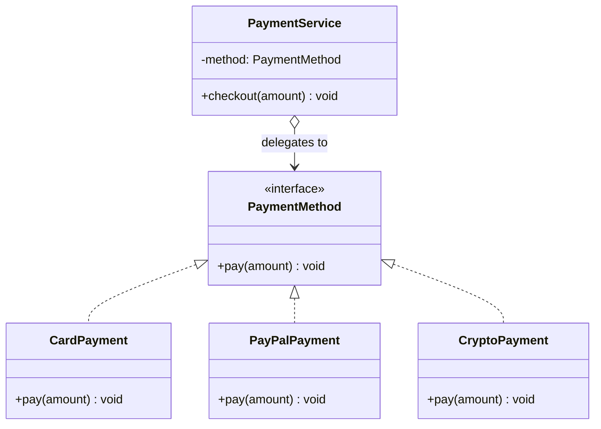

Patterns are not magic — they are the **same few principles** applied over and over. Learn the
principles and you can often *derive* a pattern instead of memorising it.

## Encapsulate what varies

The single most important idea: find the part of your system that **changes**, and isolate it
behind a stable interface so the rest of the code never has to change with it.



`PaymentService` depends only on the **stable** `PaymentMethod` interface. Adding `CryptoPayment`
touches **zero** existing code — the thing that varies (how you pay) is encapsulated behind the
interface. That is exactly the shape of **Strategy**.

## The four core principles

| Principle | What it says | What it buys you |
|--|--|--|
| **Program to an interface, not an implementation** | Depend on abstract types, not concrete classes | Swap implementations freely; easy to test/mock |
| **Favor composition over inheritance** | Assemble behavior from parts (has-a) rather than deep class trees (is-a) | Flexible at runtime; avoids fragile, rigid hierarchies |
| **Encapsulate what varies** | Isolate the changing part behind a stable interface | Change is local; the rest of the system is untouched |
| **Open/Closed** | Open for extension, closed for modification | Add new behavior via new classes, not by editing tested code |

:::tip
These are three of the "first principles" from the opening of the GoF book, plus **Open/Closed**
from SOLID. Almost every pattern is a specific way to honour one or more of them.
:::

## Composition over inheritance, concretely

Inheritance locks behavior in at compile time and explodes into subclass combinations
(`FlyingDuck`, `RubberDuck`, `FlyingRubberDuck`...). Composition lets an object **hold** the varying
behavior and even swap it at runtime — the core insight behind Strategy, Decorator, State, and more.

````tabs
tabs:
  - label: Inheritance (rigid)
    body: |
      Two independent behaviours (fly, quack) force a subclass per combination — and behaviour
      is welded in at compile time.
      ```java
      class Duck { void fly() { } void quack() { } }
      class RubberDuck extends Duck {
        @Override void fly()   { /* can't fly — override to nothing */ }
        @Override void quack() { /* squeak */ }
      }
      // MallardDuck, DecoyDuck, RobotDuck... each re-overrides the same two axes.
      ```
  - label: Composition (flexible)
    body: |
      The varying behaviours become injected parts. New combination = new wiring, not a new class.
      ```java
      interface FlyBehavior   { void fly(); }
      interface QuackBehavior { void quack(); }

      class Duck {
        private FlyBehavior fly;
        private QuackBehavior quack;
        Duck(FlyBehavior f, QuackBehavior q) { this.fly = f; this.quack = q; }
        void setFly(FlyBehavior f) { this.fly = f; }   // swappable at runtime
        void perform() { fly.fly(); quack.quack(); }
      }

      Duck rubber = new Duck(() -> { }, () -> System.out.println("squeak"));
      ```
````

## Mapping principles to patterns

When an interviewer asks *"which SOLID principle does pattern X serve?"*, this is the map:

| Principle | Patterns that embody it |
|--|--|
| **S**ingle Responsibility | Facade (orchestration only), Command (one action per object), Visitor (operation split from structure) |
| **O**pen/Closed | Strategy, Decorator, Factory Method, Chain of Responsibility — extend by adding a class |
| **L**iskov Substitution | Every pattern with a shared interface depends on it — a Decorator that breaks its component's contract breaks the stack |
| **I**nterface Segregation | Command (`execute()`/`undo()` only), Iterator (`hasNext`/`next` only) |
| **D**ependency Inversion | Dependency Injection, Abstract Factory, Bridge — high-level code depends on abstractions |

:::gotcha
Composition is not free: each delegation layer adds an object, an indirection, and a place for a
`null` to hide. And inheritance is not evil — **Template Method** uses it deliberately because the
*skeleton* genuinely is an is-a relationship. The principle says *favor* composition, not *always*.
:::

:::senior
When you see a pattern, ask *"which principle is this protecting?"* Decorator and Strategy both pick
**composition over inheritance**; Factory Method serves **program to an interface**; Template Method
is one of the few that leans on inheritance deliberately. Naming the principle makes the pattern's
trade-offs obvious.
:::

## Check yourself

```quiz
title: Principles check
questions:
  - q: 'Your class references `ArrayList` everywhere instead of `List`. Which principle is violated?'
    options:
      - text: 'Program to an interface, not an implementation'
        correct: true
      - 'Open/Closed'
      - 'Favor composition over inheritance'
    explain: 'Depending on the concrete `ArrayList` instead of the `List` interface makes swapping or mocking the implementation hard.'
  - q: 'What does "encapsulate what varies" tell you to do?'
    options:
      - 'Make every field private'
      - text: 'Isolate the changing part behind a stable interface so the rest of the code is untouched'
        correct: true
      - 'Always use inheritance to share code'
    explain: 'Find what changes, put it behind a stable abstraction, and the surrounding code stops changing with it.'
  - q: 'Adding a feature by writing a new class rather than editing an existing, tested one honours:'
    options:
      - 'The Singleton principle'
      - text: 'The Open/Closed principle'
        correct: true
      - 'Program to an implementation'
    explain: 'Open for extension, closed for modification — extend via new code instead of altering proven code.'
```

:::key
Patterns encode a few reusable ideas: **program to an interface**, **favor composition over
inheritance**, **encapsulate what varies**, and **open/closed**. Encapsulating what varies behind a
stable interface (as in the payment example) is the seed of Strategy — and of most patterns. Learn
the principles and the patterns follow.
:::
