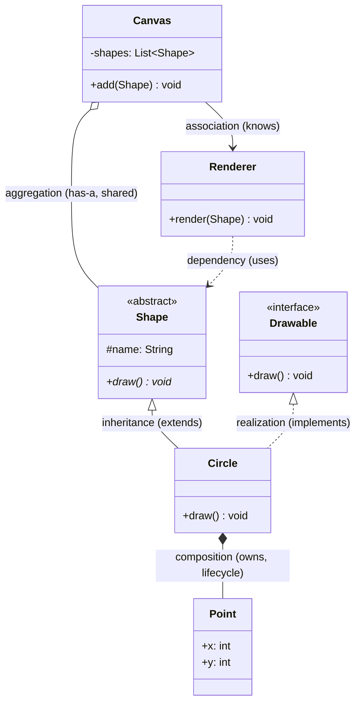
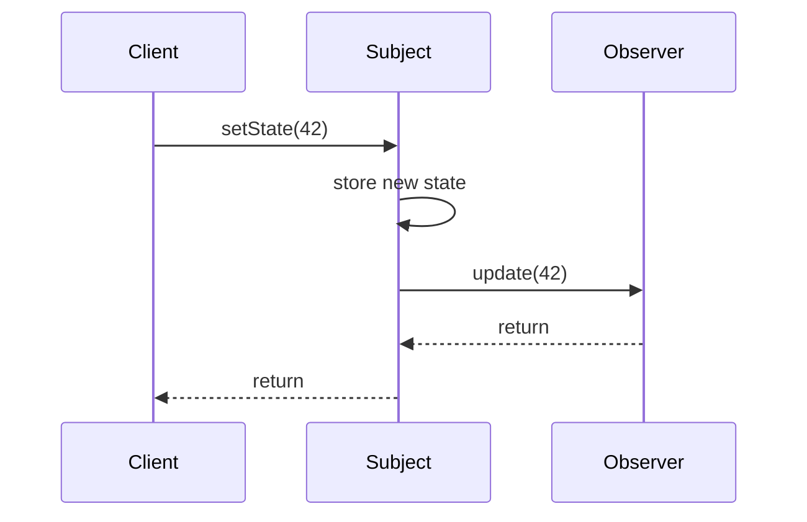

Every GoF pattern is drawn as a **UML class diagram**. Learn to read one and you can absorb a new
pattern from its picture in seconds. Four things carry the meaning: **visibility**, **arrows**,
**class kind**, and **multiplicity**.

## Visibility markers

Each member is prefixed with its access level:

| Marker | Meaning | Java |
|--|--|--|
| `+` | public | `public` |
| `-` | private | `private` |
| `#` | protected | `protected` |
| `~` | package | package-private |
| _italics_ / `*` | abstract | `abstract` |
| underline | static | `static` |

## One diagram, every arrow

This reference diagram uses **every** relationship arrow you will meet in a pattern. Match each
arrow to the legend below it.



### Arrow legend

| Arrow | Name | Reads as | Lifetime |
|--|--|--|--|
| `<|--` | Inheritance | subclass **extends** superclass | — |
| `<|..` | Realization | class **implements** interface | — |
| `-->` | Association | one class **knows / references** another | independent |
| `..>` | Dependency | one class **uses** another (param, local) | transient |
| `o--` | Aggregation | **has-a**, but the part can outlive the whole | independent |
| `*--` | Composition | **owns-a**; the part dies with the whole | coincident / bound (dies with the whole) |

:::tip
The point of the hollow triangle (`<|`) always sits on the **more general** type (the parent or
interface). Solid line = *is-a* (inheritance); dashed line = *implements* or *uses*.
:::

## Interface vs. abstract class

Both appear at the top of pattern diagrams. Tell them apart by the stereotype and the arrow:

| | Interface | Abstract class |
|--|--|--|
| Stereotype | `<<interface>>` | `<<abstract>>` (or italic name) |
| Arrow into it | `<|..` (dashed) | `<|--` (solid) |
| Holds state? | No (constants only) | Yes — fields, constructors |
| Method bodies? | `default`, `static`, and `private` methods can have bodies | Can mix abstract + concrete |

## Multiplicity

Numbers near the ends of an association say **how many** objects participate.

| Notation | Meaning |
|--|--|
| `1` | exactly one |
| `0..1` | zero or one (optional) |
| `*` or `0..*` | zero or more |
| `1..*` | one or more |

So `Canvas "1" o-- "*" Shape` reads: *one Canvas aggregates many Shapes.*

## Reading a sequence diagram

Class diagrams show **structure**; behavioral patterns (Observer, Command, Chain of
Responsibility) also come with a **sequence diagram** showing *who calls whom, in what order*.
Three rules decode any of them:

1. **Time flows downward.** Each vertical line is one object's lifeline.
2. **Solid arrow = call, dashed arrow = return.** `A->>B: doWork()` then `B-->>A: result`.
3. **A message to yourself** (`S->>S: state = x`) is internal work.



Read it as a sentence: *the client sets state; the subject stores it, then calls each observer
before returning.* If you can narrate the diagram aloud, you understand the pattern's collaboration.

:::gotcha
Interviewers often test **aggregation vs composition**. The diamond sits on the **whole** (owner)
side, not the part. Hollow diamond (`o--`) = the part can outlive the whole (a `Shape` survives its
`Canvas`); filled diamond (`*--`) = the part dies with the whole (a `Point` belongs to one
`Circle`). If lifetime is independent, it is aggregation — no matter how "owned" it feels.
:::

## UML notation flashcards

```flashcards
title: UML notation drill
cards:
  - front: 'What does `+` before a member mean?'
    back: '**public** visibility.'
  - front: 'What does `#` before a member mean?'
    back: '**protected** visibility.'
  - front: '`A <|-- B`'
    back: '**Inheritance** — B extends A (solid line, hollow triangle on the parent A).'
  - front: '`A <|.. B`'
    back: '**Realization** — B implements interface A (dashed line, hollow triangle).'
  - front: '`A --> B`'
    back: '**Association** — A holds a reference to / knows B.'
  - front: '`A ..> B`'
    back: '**Dependency** — A uses B transiently (parameter or local variable).'
  - front: '`A o-- B`'
    back: '**Aggregation** — A has-a B, but B can outlive A (shared).'
  - front: '`A *-- B`'
    back: '**Composition** — A owns B; B is destroyed with A.'
  - front: 'Multiplicity `1..*`'
    back: '**One or more** instances participate.'
  - front: 'Interface vs abstract class arrow?'
    back: 'Interface: dashed `<|..`. Abstract class: solid `<|--`.'
```

## Check yourself

```quiz
title: Reading UML check
questions:
  - q: 'You see `Order *-- LineItem`. What does the filled diamond tell you?'
    options:
      - 'Order uses LineItem transiently'
      - text: 'Composition — LineItems are owned by the Order and die with it'
        correct: true
      - 'LineItem inherits from Order'
    explain: 'A filled diamond (`*--`) is composition: a strong whole-part bond with a shared lifetime.'
  - q: 'A dashed line with a hollow triangle (`<|..`) pointing at a `<<interface>>` box means:'
    options:
      - 'The class extends another class'
      - text: 'The class implements (realizes) the interface'
        correct: true
      - 'A transient dependency'
    explain: 'Dashed + hollow triangle = realization: the class implements that interface.'
  - q: 'What does the `-` in `-instance: Singleton` mean?'
    options:
      - 'Static'
      - text: 'Private visibility'
        correct: true
      - 'Abstract'
    explain: '`-` marks a private member; static is shown by underlining, abstract by italics.'
```

:::key
Read a pattern diagram in four passes: **visibility** (`+ - #`), **class kind** (`<<interface>>` vs
`<<abstract>>`), **arrows** (solid triangle = extends, dashed triangle = implements, `-->` knows,
`..>` uses, `o--` aggregates, `*--` owns), and **multiplicity** (`1`, `*`, `1..*`). Those four
signals carry the entire design.
:::
