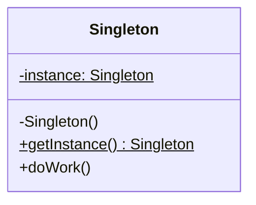

**Singleton** guarantees a class has exactly **one instance** and gives everyone a single global
point of access to it. It is the most-asked pattern — and the most-abused.

## Structure



A **private constructor** (nobody else can `new` it) plus a **static accessor** that returns the
one shared instance.

## Five ways to implement it

Ordered best → most caveats. Prefer the top two.

````tabs
tabs:
  - label: Enum (best)
    body: |
      Thread-safe and serialization-safe for free — Josh Bloch's recommended approach.
      ```java
      public enum Config {
        INSTANCE;
        public void load() { /* ... */ }
      }
      // Config.INSTANCE.load();
      ```
  - label: Bill Pugh holder
    body: |
      Lazy and thread-safe with **no synchronization** — the JVM loads the holder once, on first use.
      ```java
      public class Config {
        private Config() {}
        private static class Holder { static final Config I = new Config(); }
        public static Config get() { return Holder.I; }
      }
      ```
  - label: Double-checked lock
    body: |
      Lazy with minimal locking. The field **must be `volatile`** or a thread can see a half-built object.
      ```java
      public class Config {
        private static volatile Config i;
        private Config() {}
        public static Config get() {
          if (i == null) synchronized (Config.class) {
            if (i == null) i = new Config();
          }
          return i;
        }
      }
      ```
  - label: Eager
    body: |
      Built at class load — simple and safe, but created even if never used.
      ```java
      public class Config {
        private static final Config I = new Config();
        private Config() {}
        public static Config get() { return I; }
      }
      ```
  - label: Lazy + synchronized
    body: |
      Correct but slow — **every** call locks. Fine only if rarely called.
      ```java
      public class Config {
        private static Config i;
        private Config() {}
        public static synchronized Config get() {
          if (i == null) i = new Config();
          return i;
        }
      }
      ```
````

## When to use — and when not to

| Use it for | Avoid it because |
|--|--|
| A genuinely single resource: a registry, config, connection pool, logger | It is **global mutable state** — hidden, implicit dependencies |
| Coordinating access to one shared thing | It makes unit tests hard (cannot swap/mock the instance) |

:::gotcha
Lazy `getInstance()` **without** synchronization is a classic bug — two threads both pass the
`null` check and create two instances. Use `enum`, the Bill Pugh holder, or double-checked
locking with `volatile`.
:::

:::senior
Modern teams rarely hand-roll Singletons: a DI container (e.g. Spring) gives you singleton-scoped
beans **without** global static state, so they stay mockable in tests. Reach for the pattern only
when a true single instance is essential and DI is not available.
:::

## Check yourself

```quiz
title: Singleton check
questions:
  - q: 'Which singleton is thread-safe AND serialization-safe with the least code?'
    options:
      - text: 'An `enum` singleton'
        correct: true
      - 'An eager static field'
      - 'A lazy getter with no synchronization'
    explain: 'A single-element `enum` lets the JVM handle instantiation, thread-safety, and serialization — the recommended approach.'
  - q: 'In double-checked locking, why must the instance field be `volatile`?'
    options:
      - 'To make reads faster'
      - text: 'Without it, reordering can publish a non-null but partially-constructed object'
        correct: true
      - 'It is not actually required'
    explain: 'Without `volatile`, the reference can be published before the constructor finishes, so another thread sees a half-built instance.'
  - q: 'Why do interviewers often call Singleton an anti-pattern?'
    options:
      - 'It uses too much memory'
      - text: 'It is global mutable state that hides dependencies and hurts testability'
        correct: true
      - 'It cannot be made thread-safe'
    explain: 'It is implicitly-accessed global state that couples code to it and makes tests hard to isolate. Prefer dependency injection so instances can be swapped or mocked.'
```

:::key
Singleton = one instance + global access via a private constructor and static accessor. Best
implementation: **`enum`** (or the **Bill Pugh holder** for lazy); double-checked locking needs
**`volatile`**. But it is global state — prefer **dependency injection** where you can.
:::
