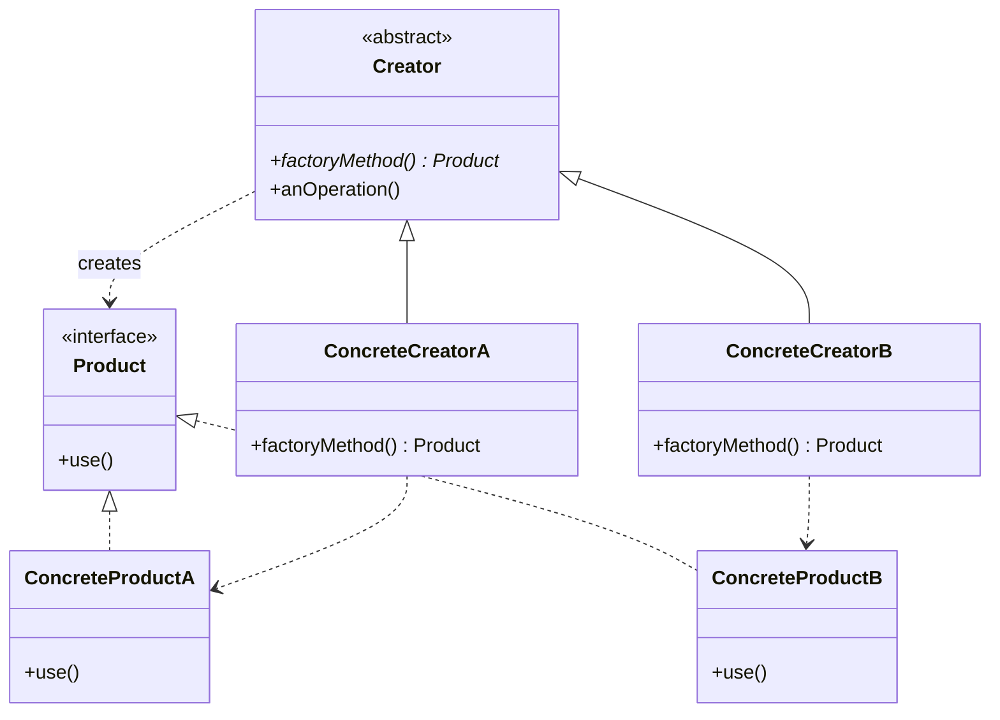

**Factory Method** defines a method for creating an object but lets **subclasses decide which
concrete class** to instantiate. The `Creator` calls its own `createProduct()` hook instead of
`new`-ing a concrete type, so it stays decoupled from what it builds.

## Structure



`Creator.anOperation()` uses the `Product` returned by `factoryMethod()` — but the **subclass**
picks the concrete `Product`. New product? Add a new `ConcreteCreator`; the base logic never changes.

## The problem it solves

Hard-coding `new` couples a class to a concrete type. Factory Method replaces the `new` with an
**overridable hook**, so extending the family needs no edits to existing code (Open/Closed).

````tabs
tabs:
  - label: Direct new (rigid)
    body: |
      The dialog is welded to one button type. Supporting a web button means editing this class.
      ```java
      class Dialog {
        void render() {
          Button b = new WindowsButton(); // hard-coded
          b.onClick();
          b.paint();
        }
      }
      ```
  - label: Factory Method (flexible)
    body: |
      The base defers creation to a hook; each subclass supplies its own product.
      ```java
      abstract class Dialog {
        abstract Button createButton();   // factory method
        void render() {
          Button b = createButton();      // no concrete type here
          b.onClick();
          b.paint();
        }
      }
      class WebDialog extends Dialog {
        Button createButton() { return new HtmlButton(); }
      }
      ```
````

## Factory Method vs. a Simple Factory

| | Simple Factory (idiom) | Factory Method (pattern) |
|--|--|--|
| Mechanism | One method with a `switch`/`if` on a type flag | Subclass **overrides** a creation method |
| Extensibility | Edit the method to add a type | Add a subclass — no edits (Open/Closed) |
| Polymorphism | None | Uses inheritance and dynamic dispatch |

:::note
A **static factory method** like `Integer.valueOf(int)` is a related-but-different idea — it just
names a constructor and can cache. Factory Method (the GoF pattern) is specifically about **subclass
overriding**.
:::

## Real JDK examples

- `Collection.iterator()` — the genuine Factory Method: each collection subclass **overrides** it to
  return its own `Iterator`.
- `Calendar.getInstance()` returns a `GregorianCalendar`, `BuddhistCalendar`, etc. based on locale, so
  callers never see the concrete class — but it is a **static factory method** that branches
  internally, not the GoF pattern (it is often loosely cited as one).
- `NumberFormat.getInstance()` is likewise a static factory method; `URLStreamHandlerFactory`.

:::senior
Factory Method trades a `new` for an extra class per product. Don't reach for it until you actually
have varying products; premature use adds subclass ceremony with no payoff. In modern code a
DI container or a passed-in `Supplier<Product>` often replaces the subclassing.
:::

## Check yourself

```quiz
title: Factory Method check
questions:
  - q: 'What decides which concrete `Product` gets created in the Factory Method pattern?'
    options:
      - 'A `switch` statement inside the creator'
      - text: 'The concrete `Creator` subclass that overrides the factory method'
        correct: true
      - 'The `Product` interface itself'
    explain: 'Each subclass overrides the factory method to return its own product type — that is the whole mechanism.'
  - q: 'Which JDK method is a genuine Factory Method (subclass-overridden) example?'
    options:
      - text: '`Collection.iterator()`'
        correct: true
      - '`Calendar.getInstance()`'
      - '`new ArrayList<>()`'
    explain: '`Collection.iterator()` is overridden by each collection subclass to return its own `Iterator` — subclasses decide the concrete type. `Calendar.getInstance()` is a *static* factory method that branches internally, not the GoF pattern.'
  - q: 'Why does Factory Method support the Open/Closed Principle?'
    options:
      - 'It makes classes final'
      - text: 'New products are added via new subclasses, without modifying existing creator code'
        correct: true
      - 'It removes the need for interfaces'
    explain: 'The base creator is closed for modification but open for extension — a new ConcreteCreator adds a product with no edits.'
```

:::key
Factory Method = an **overridable creation hook**. The base class calls `factoryMethod()`;
subclasses decide the concrete `Product`. Remember `Collection.iterator()`.
:::
