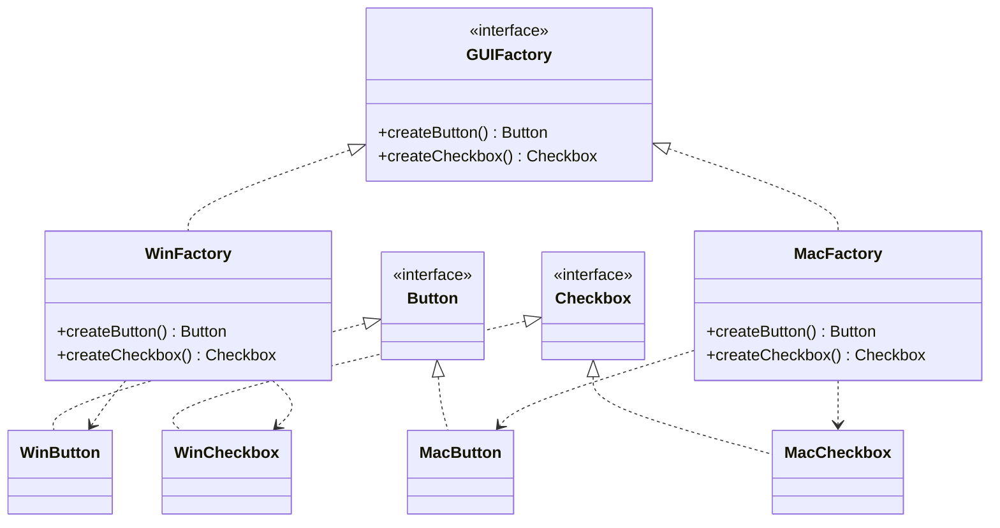

Picture a cross-platform UI where someone constructs a `WinButton` next to a `MacCheckbox`: it
compiles fine and looks broken at runtime. When products come in **families that must match** —
per-OS widgets, per-vendor JDBC objects, per-theme components — scattering `new` calls around the
codebase makes mixed families inevitable. **Abstract Factory** provides an interface for creating
**families of related products** without naming their concrete classes. One factory yields a whole
matching set — pick the factory once, and every product it makes is guaranteed consistent.

## Structure



Client code depends only on `GUIFactory`, `Button`, and `Checkbox`. Swap the concrete factory once
at startup and every product switches together — the family stays internally consistent.

```java
interface GUIFactory {
  Button createButton();
  Checkbox createCheckbox();
}
class MacFactory implements GUIFactory {
  public Button createButton()     { return new MacButton(); }
  public Checkbox createCheckbox() { return new MacCheckbox(); }
}

// Client is blind to concrete types:
void buildUI(GUIFactory f) {
  Button b = f.createButton();
  Checkbox c = f.createCheckbox(); // always matches b
}
```

## Factory Method vs. Abstract Factory

They are often confused. The key difference: **one product vs. a family**.

| | Factory Method | Abstract Factory |
|--|--|--|
| Creates | **One** product | A **family** of related products |
| Mechanism | Inheritance — a subclass overrides one method | Composition — an object with several create methods |
| Interface size | One factory method | Multiple factory methods (one per product) |
| Grows by | Adding a `Creator` subclass | Adding a whole new factory implementation |
| Analogy | A single mold | A kit of matching molds |

:::note
Abstract Factory is frequently **implemented using** Factory Methods — each `createX()` is itself a
factory method. They compose rather than compete.
:::

Selecting the family happens **once**, at the composition root:

```java
GUIFactory factory = System.getProperty("os.name").startsWith("Mac")
    ? new MacFactory()
    : new WinFactory();
buildUI(factory);          // everything downstream is family-consistent
```

## Real JDK and framework examples

- `DocumentBuilderFactory` / `SAXParserFactory` — `newInstance()` returns a factory whose
  `newDocumentBuilder()` produces matching parser objects.
- `javax.xml.transform.TransformerFactory` — same shape for XSLT machinery.
- **`java.sql.Connection`** — creates matching `Statement`, `PreparedStatement`, and
  `CallableStatement` objects that all belong to the same driver family. Swap the JDBC URL from
  Postgres to MySQL and one factory switch changes the entire object family.
- **Spring's `BeanFactory`/`ApplicationContext`** is a giant abstract factory: you ask for beans by
  type and never name construction details; profiles switch whole families (test vs prod wiring).

## When NOT to use it

- **Products don't actually come in families.** If nothing must "match", plain factory methods or
  constructors are enough — an abstract factory with one implementation is pure ceremony.
- **The family axis never changes.** One platform, one vendor, forever? The interface earns nothing.
- **You have a DI container.** Profiles/qualifiers already select consistent object families;
  hand-rolling a parallel factory layer duplicates the container's job.

The over-engineering tell: `AbstractWidgetFactory` → `DefaultWidgetFactory` (the only
implementation) → used in one place. That is three files standing between the reader and `new`.

:::gotcha
Abstract Factory locks the **set of products** at design time. Adding a *new product type* (say a
`Slider`) forces a change to the factory interface and **every** implementation — painful. It is
easy to add a new *family*, hard to add a new *product*. Invert of Visitor: there it is easy to add
operations, hard to add element types — interviewers like pairing these two.
:::

## Check yourself

```quiz
title: Abstract Factory check
questions:
  - q: 'What is the core purpose of Abstract Factory?'
    options:
      - 'To create a single object lazily'
      - text: 'To create families of related products that are guaranteed to match'
        correct: true
      - 'To clone existing objects'
    explain: 'It bundles the creation of related products so a client always gets a consistent set (e.g. all-Mac or all-Windows widgets).'
  - q: 'How does Abstract Factory differ from Factory Method?'
    options:
      - 'Abstract Factory is faster'
      - text: 'Factory Method makes one product via inheritance; Abstract Factory makes a family via composition'
        correct: true
      - 'They are identical'
    explain: 'Factory Method overrides a single creation method in a subclass; Abstract Factory is an object with several creation methods for a related family.'
  - q: 'Which JDK API is an Abstract Factory?'
    options:
      - '`Math.random()`'
      - text: '`DocumentBuilderFactory`'
        correct: true
      - '`String.valueOf()`'
    explain: '`DocumentBuilderFactory.newInstance()` returns a factory that produces a matching set of XML-parsing objects.'
```

:::key
Abstract Factory = a **factory of factories** producing a **matching family** of products.
Easy to add a new family, hard to add a new product. Remember `DocumentBuilderFactory`.
:::
